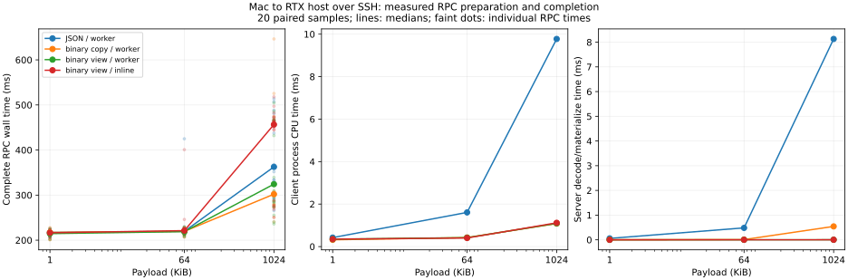

# 7-4：Mac到RTX主机的实际RPC分段

在一条跨主机SSH转发连接中，去掉JSON/base64明显减少了客户端CPU与应用层字节；去掉显式复制、工作线程交接也缩短了对应局部阶段，但本轮没有证明这些小优化稳定缩短完整RPC。网络与SSH路径的波动保留在原始记录中。

## 条件和对照

客户端为本地Apple M2 Max，服务端为rtx-pro的Linux CPU；GPU未使用。服务只监听远端127.0.0.1:30704，通过独立SSH本地转发访问，Compression=no，配置核实未启用ControlMaster复用。SSH加密、转发缓冲、主机TCP栈与跨主机网络均在路径内，不能当作数据中心直连、RDMA或裸链路延迟。

同一持久TCP连接，TCP_NODELAY，一次只有一个在途调用。载荷1 KiB、64 KiB、1 MiB；每轮每种大小使用相同的伪随机字节，四条路径顺序打乱。每条件2次预热、20次正式测量，共264次调用；所有服务端SHA256与客户端预期一致。服务工作是计算载荷摘要并返回结果，不是模型推理。

|路径|客户端|服务端|交接|
|---|---|---|---|
|json_copy_worker|base64＋JSON，拼接头和体|JSON解析与base64解码|Queue＋工作线程＋Event|
|binary_copy_worker|二进制体，拼接头和体|显式转为bytes|同一工作线程|
|binary_view_worker|header/body由sendmsg分散写入|memoryview引用接收缓冲|同一工作线程|
|binary_view_inline|同上|同上|当前连接线程直接计算|

binary_copy→view同时改变客户端拼接／发送API和服务端显式复制；不把完整差异只归因于一个memcpy。memoryview与sendmsg只减少这些用户态物化，不表示内核、SSH或网卡完全零拷贝。worker→inline的载荷和协议保持一致，改变执行线程与交接；线程唤醒观察包含调度和通知，未用内核trace分离具体唤醒指令。

## 实测结果

下表为1 MiB载荷的20次正式测量中位数；阶段中位数不能相加得到总时间中位数。

|路径|完整RPC(ms)|客户端CPU(ms)|服务端解码／物化(ms)|应用请求字节|
|---|---:|---:|---:|---:|
|JSON＋worker|362.599|9.774|8.131|1,398,135|
|binary copy＋worker|302.047|1.085|0.542|1,048,593|
|binary view＋worker|324.333|1.091|0.0024|1,048,593|
|binary view＋inline|456.563|1.119|0.0023|1,048,593|

应用字节包含17-byte实验帧头，排除TCP/IP、SSH封装、重传与链路字节，不能称为网卡流量。二进制避免了base64膨胀；客户端JSON编码中位数8.844ms，二进制路径基本没有这一步。显式拼接约0.100ms降到准备视图约0.009ms；服务端bytes物化约0.542ms降到memoryview建立约0.002ms。



二进制view的工作线程排队加完成通知观察约66微秒，inline约0.6微秒（各阶段中位数之和）。但1 MiB的20个配对中，inline只在7对更快；JSON→binary copy也只有11对更快，配对节省中位数约10.09ms，不能把两组总体中位数相差60.55ms当作稳定因果收益。短1 KiB请求整体仍约215–217ms，已经远大于这些本机阶段。图同时保留单次RPC散点，完整配对差值见[summary.json](results/summary.json)。

**最值得先修改的本次实现环节**是大载荷的JSON/base64：其CPU成本与额外应用字节都有直接证据。若目标是稳定降低完整远程调用延迟，下一项补测应固定实际传输路径，并分离SSH转发与网络波动；这轮不能用几十微秒的线程优化解释几百毫秒的整体等待，也不建议仅据本轮排名更换线程架构。

## 时间边界与原始证据

客户端记录编码、准备／拼接、发送调用、接收等待、结果验证五段；逐请求之和等于完整调用时间。建连、载荷生成、预期SHA计算、日志写入、SSH握手不计入计时。客户端process_time记录Python进程CPU，不包括独立SSH进程。

服务端单独记录接收体、解码、入队、工作开始／结束与完成被连接线程观察的时刻。服务端只在读完帧头后开始body接收计时；发送响应与日志开销没有单独分段。两端monotonic时钟未同步，只比较各自主机的时间差；服务端各阶段与客户端send／wait重叠，不能叠加到客户端总时间，也不将剩余时间命名为纯链路延迟。工作线程摘要计算CPU另外记录。

[client.py](client.py)和[server.py](server.py)各为独立标准库程序。完整Python／系统版本与源码哈希分别保存在results/client和results/server的environment.json；输入种子704、发送计划和逐载荷SHA封存，可按对应版本重建。客户端嵌入的服务端结果与独立服务日志逐项一致。

复现使用新的结果目录。先在RTX主机运行server.py，再在Mac建立转发和运行client.py：

```bash
# RTX主机，先将本目录server.py复制到实验工作目录
python3 server.py --port 30704 --output results/server
# Mac的另一终端；运行完客户端后结束这条转发
ssh -N -o ExitOnForwardFailure=yes -o Compression=no -L 127.0.0.1:30704:127.0.0.1:30704 rtx-pro
# Mac实验目录
python3 client.py --port 30704 --output results/client
# 将远端results/server拷回同一实验results目录后
python3 verify.py
python3 plot.py
```

绘图需要matplotlib；测量只用Python标准库。输出目录存在时程序拒绝覆盖。此次服务端正常退出，自己的SSH转发进程经PID／命令核验后关闭，没有留下监听服务或占用GPU。

[verify.py](verify.py)核对[原始文件清单](results/raw-manifest.json)，[analyze.py](analyze.py)验证264次调用、服务端原始记录、输入与响应身份、事件顺序和客户端阶段之和。所有原始失败／慢调用均应保留；此次没有载荷校验失败。C38的RDMA模型与在途并发计算不在这里重复；本项真实RPC范围完成，最终增补／论文复核仍待全书第一轮结束后执行。
