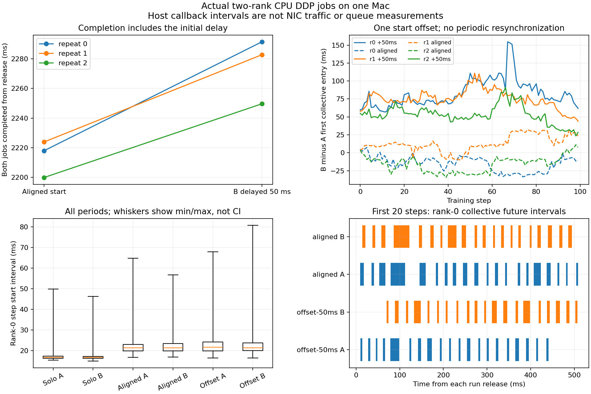

# 7-8：真实训练通信阶段与一次性错峰

本目录完成两个独立两rank CPU DDP作业的真实训练、通信阶段记录和启动错峰对照。三轮中，将作业B一次性延迟50ms后，两作业完成时间均变长，增加2.27%～3.32%；初始错峰没有在训练过程中保持为固定的通信相位。

| 重复 | 同时启动完成时间 | 延迟50ms完成时间 | 后者/前者 |
|---|---:|---:|---:|
| 0 | 2217.899ms | 2291.589ms | 1.03323 |
| 1 | 2223.828ms | 2282.837ms | 1.02654 |
| 2 | 2199.779ms | 2249.643ms | 1.02267 |

完成时间从共同的预定释放时刻算到两个作业所有rank最后一次optimizer更新完成，包含初始50ms延迟，不包含模型加载、预热或检查点写盘。比值中位数1.02654。这是本次三轮观察，不是“错峰普遍无效”的结论，也不支持物理网络拥塞机制的归因。



## 固定工作负载

- 设备：本地Mac M2 Max，实际计算只用CPU；Torch2.14.0、Git `08187d9e0fba026dc8217405802ab5381dc88d90`、Gloo TCP loopback。每worker一个Torch计算线程，Gloo仍有自己的通信线程；没有独占CPU核心或物理网络链路。RTX未参与本轮。
- 两个作业各有两个独立rank，使用不同TCP进程组。模型为两层字节级因果decoder，宽256、4头、1678336参数，FP32；复制3-8的模型代码和固定tinyshakespeare文本，但本目录重新执行DDP训练，不复用其测量结果。来源、commit和SHA在`data/source.json`、`model-origin.json`。
- 两个作业分别固定seed7081/7082；全局batch4、每rank2条、长度128，AdamW学习率3e-4。每作业先执行10个真实预热更新，再执行100个正式更新。三个重复中输入和初始化不变，重复用于观察时间变化，不是三个独立模型质量样本。
- 每轮包含solo-a、solo-b、aligned、offset-50ms四种条件，顺序按预先固定seed打乱，见`formal/order.json`。所有相关rank预热完毕后才设置共同释放时间；除B的初始50ms外，不插入逐周期睡眠或相位校正。
- 正式共12个条件运行、36个worker、1800次作业级更新（3600个rank-step）；不将两个rank的同一次全局更新算作两次独立训练。每rank正式每步AllReduce bucket载荷6713344bytes，不当作实际网卡发送字节。

## 实际测量与数值核验

`train_phase.py`记录每步输入准备、前向、反向、optimizer边界，以及实际DDP通信hook入口、Gloo异步AllReduce future回调进入和除以world size完成的时刻。hook委托真实SUM AllReduce并除以2；保存了执行源码以及安装的DDP/Gloo Python接口源码SHA。

通信区间是主机观察的“提交至future回调”，包括等待、调度与回调延迟，不是物理wire时间，也不是交换机队列。图中的相位定义为同一训练step上B减A的rank0第一次collective入口时刻，不作周期取模，不用最近事件匹配营造稳定相位。首20步示意使用全部原始区间，不生成理想波形。

单独运行A/B的每运行rank0步间隔中位数再取中位为16.678/16.741ms；同时启动和错峰条件对应21.185/21.500ms。错峰实际开始差为49.388～50.283ms，但同step通信入口差在各轮内持续漂移，整个错峰记录范围23.466～154.665ms。共享CPU与调度活动会改变计算和通信阶段，不能由这组记录推断NIC队列降低或网络带宽收益。

所有条件下的完整最终模型、Adam step/一阶矩/二阶矩逐张量与各作业solo参考完全一致，两个rank也相同。同rank的逐步输入偏移和loss跨条件/重复完全相同，`state-checks.json`共11304项通过。`analysis.json`的14448项检查覆盖3600个rank-step的阶段次序、实际通信完成范围、bucket字节数与作业结束边界；独立临时输出重放逐字一致。全部训练loss有限，不由此声称模型已达到某种任务质量。

所有同批作业结束后，才释放检查点和原始日志写盘，避免先完成的作业写盘干扰尚未完成的作业。36个最终完整检查点均保留，不能只用loss相同代替模型/优化器状态核验。资源监控每0.2秒读取本批worker RSS，总和采样峰1583710208bytes；它不包括父控制器和资源tracker，也不是独占内存或精确峰值。每次运行600秒上限、worker RSS合计20GiB限额，仅管理自己创建的进程。所有worker已join且exit0，随后原36个PID查验均不存在。

## 单独运行

训练只需要Python和支持CPU Gloo的上述PyTorch，不依赖NumPy或其他实验目录。绘图另需Matplotlib。现有本地训练解释器为`experiments/tools/collective-cpu-venv/bin/python`；在本目录亦可使用自己安装相同Torch版本的解释器。

```sh
/path/to/torch-python -B run.py --out new-formal
python3 -B analyze.py --run new-formal --out new-analysis.json
/path/to/torch-python -B verify_states.py --run new-formal --out new-state-checks.json
```

输出目录必须不存在，不覆盖正式原件。已有正式结果的图可用`/path/to/matplotlib-python -B plot.py`重画；图中全部观察保留，箱线图须线为最小/最大值，不是置信区间。`smoke/`保留成功短运行，仅作为路径和数值检查，不混入正式100步结果。本轮没有被成功替代的失败启动记录。

原题的割集、反馈队列及100ms教学周期模型归另一个calculations任务，本目录没有执行或修改。这里是小模型CPU训练阶段变体；真实GPU训练通信、物理共享链路、端口队列、ECN反馈及新增链路收益仍待对应设备/工作负载实测，不把CPU loopback变体当作这些要求已完成。
