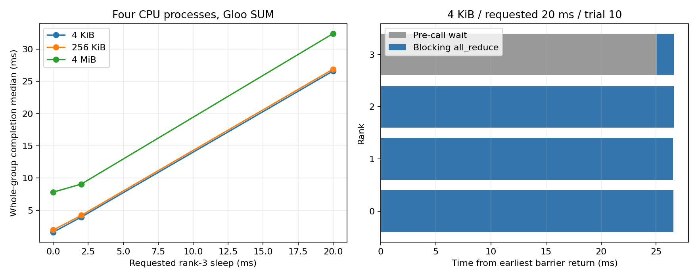

# 7-10：rank 就绪偏差与实际 Gloo 集合通信（局部实测）

本地 Apple M2 Max / 96 GiB、macOS 26.6.2、Python 3.14.7、PyTorch 2.14.0。四个真实 CPU 进程执行 FP32 SUM `all_reduce`，每个进程一个 Torch 计算线程；使用本机 Gloo，未使用 GPU 或 RTX 主机。全部195组（15预热、180正式）结束，780个rank结果逐元素正确。

## 结果

每条件20组；表中全部为逐组指标中位数，单位ms。输入大小指每rank原始张量字节数，不是实际链路传输量。

| 输入 | 请求rank3等待 | 实际到达差 | 全组完成 | 最后到达后的尾段 |
|---|---:|---:|---:|---:|
| 4 KiB | 0 | 0.041 | 1.624 | 1.576 |
| 4 KiB | 2 | 2.542 | 3.953 | 1.407 |
| 4 KiB | 20 | 25.055 | 26.605 | 1.588 |
| 256 KiB | 0 | 0.049 | 1.956 | 1.897 |
| 256 KiB | 2 | 2.545 | 4.219 | 1.680 |
| 256 KiB | 20 | 25.038 | 26.897 | 1.950 |
| 4 MiB | 0 | 0.039 | 7.829 | 7.786 |
| 4 MiB | 2 | 2.538 | 9.071 | 6.529 |
| 4 MiB | 20 | 25.040 | 32.413 | 7.412 |

4 KiB时，最早到达rank的阻塞API时间中位从1.540增至26.562ms，最后到达rank的API时间为1.561／1.580ms（无等待／请求20ms）。调用时间增加大部分来自rank就绪差，不能全记为网络传输变慢。20ms是传给sleep的请求值，实际到达差约25ms；原始时钟记录保留了过度等待，没有用请求值替代测量。



右图按4KiB、20ms条件中最接近全组完成中位的实际样本选择（trial10），不是构造时间线。灰色从屏障返回到调用前，蓝色为阻塞collective API。各rank的时间起点在同一主机，使用mach_absolute_time的perf_counter_ns。

## 可独立复现

在本目录运行，结果目录必须不存在；不导入其他实验代码。macOS使用独立虚拟环境，安装固定版本：

```bash
python3 -m venv .venv
.venv/bin/pip install -r requirements.txt
.venv/bin/python run.py --output results-new
python3 analyze.py --results results-new
```

`analyze.py`默认分析封存的`results/`。分析新运行时传入`--results results-new`；不要覆盖已有封存。图使用Matplotlib（本次3.10.6），执行`python plot.py`，需要另行安装Matplotlib；运行实验本身不依赖NumPy或Matplotlib。`requirements.txt`是实际运行venv的完整freeze。

固定协议见[PROTOCOL.md](PROTOCOL.md)。每大小先5次预热，然后种子710打乱消息大小×请求延迟×20重复。每组先填满rank和trial相关整数，再barrier，rank3按条件sleep，随后实际all_reduce。每个rank逐元素核对`10 + 4*(trial % 13)`；由于输入和期望均为小整数，本组FP32 SUM精确检查没有容差问题。

分析器检查完整计划195组、每组4rank、4独立PID、时间单调、每个结果值、以及原始运行脚本哈希。输出`groups.json`保留逐组事件和指标；`summary.json`保留中位、min和max。所有子进程join正常返回后才写`completion.json`。原始记录为`rank0.jsonl`到`rank3.jsonl`，含PID、CPU时间和实际时刻。

## 解释边界与保留异常

全组完成从最早屏障返回到最晚API返回；不包含进程启动、张量填充和结果检查。到达差为最晚调用前时刻减最早调用前时刻。尾段为最晚API返回减最晚调用前时刻，它仍包含归约、传输、唤醒和调度，不是纯网络耗时，也不能和各中位数直接相加做守恒检查。

Gloo可能在所有rank到齐前推进部分操作；没有逐包或内核跟踪，不能断言它必须全到齐才通信。主机没有CPU亲和性、频率或后台进程隔离；这20组重复只刻画本次环境，不报告跨运行置信区间。未对sleep过度等待作因果归因。消息大小扫描改变载荷，不是改变真实链路速度，未测NCCL、RDMA、物理NIC、跨机、通信算法切换或链路线速。没有实际模型计算，所以不是训练步、模型任务或推理token的性能结果。7-10的模型级／故障／链路速度比较仍待补齐。

首次启动因相对解释器路径多一层而exit127，保留`launch-path-error.log`；当时没有启动worker或产生结果。修正启动命令后本次唯一正式运行成功。运行日志含缺少NumPy初始化警告；本实验使用Torch原生张量，不调用NumPy桥接，结果检查全部通过，没有为消除警告改动测量环境。
