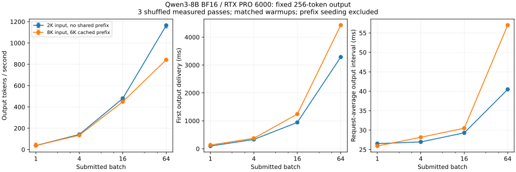

# 8-1：固定 Qwen3-8B 的批量扫描

本实验用真实 vLLM 执行比较 batch=1、4、16、64。两类合成输入分别为2048 token、无共同首块，以及8192 token、共同6144-token前缀；每个请求强制生成256 token。它检验固定工作量下的吞吐、请求等待与实际并发，不能代替自然结束任务的质量评价。

## 实测结果

三轮正式测量共510个请求、130,560个输出token，另有170个预热请求及16个前缀建立请求，全部原始记录分开保存。相同输入在已覆盖的batch和重复运行中输出序列完全一致；这是固定合成输入的数值观察，不等于任务质量通过。

|输入条件|batch|输出token/s（中位数）|三轮范围|TTFT中位数(ms)|请求平均输出间隔(ms)|
|---|---:|---:|---:|---:|---:|
|2K无共享|1|37.31|32.93–37.62|96.27|26.53|
|2K无共享|4|141.73|136.84–143.10|332.68|26.97|
|2K无共享|16|479.33|471.14–493.23|943.57|29.30|
|2K无共享|64|1164.94|1140.84–1167.44|3285.93|40.48|
|8K/6K已缓存|1|37.98|36.69–60.47|133.16|25.91|
|8K/6K已缓存|4|134.70|127.69–138.60|374.64|28.16|
|8K/6K已缓存|16|448.43|447.66–460.26|1241.45|30.49|
|8K/6K已缓存|64|842.39|837.49–849.48|4430.59|57.01|

TTFT和平均输出间隔先求每批请求中位数，再取三轮中位数；误差线仅为三轮最小到最大值，不是置信区间。8K的batch1有一轮明显较快，完整范围保留。



短输入从batch1增加到64，吞吐约37→1,165 token/s，但TTFT约96→3,286 ms；8K已命中6K前缀时，batch64约842 token/s、TTFT约4,431 ms。前缀命中省去已缓存部分的prefill，并未消除后续decode对更长历史的访问；本轮未测DRAM，不能由此给出物理读取倍率。

引擎在各组确实观测到1/4/16/64个活跃请求。两个batch64条件各记录669个不含新prefill、产出64个token的正式迭代（三轮合计），因此并发不是只由提交数推定。没有记录到抢占。两组batch64的占用块峰值分别84.00%和87.52%，这不是整卡显存峰值。当前扫描显示吞吐与单请求延迟的取舍，尚不确定带SLO的最佳到达率。

## 固定条件

RTX PRO 6000 Blackwell Workstation；Qwen3-8B BF16，revision b968826d9c46dd6066d109eabc6255188de91218；vLLM 0.23.0、Torch 2.11.0+cu130。设置24 GiB KV空间、最大64序列、4096-token分块预算、最大长度8448，eager、关闭异步调度，原生采样。其他服务仍驻留，设备非独占。

为了容纳批量64的状态，按用户授权停止原8000端口30B服务，操作前重验了父子PID、模型和端口。操作记录存于results/resource-action.json。原可用显存36,510 MiB，不足以同时放入本次BF16权重、24 GiB KV与工作区。此动作没有修改计算任务；不应将本轮时间与旧批次中不同共享负载下的时间直接作速度排名。

[run.py](run.py)为独立入口，生成并封存完整输入token。短输入的首token随请求编号变化，长输入在6144个共同token之后有不同的首后缀token，避免请求之间共享超出设定的前缀。文本为重复代码审阅说明加编号token，属于长度控制夹具，不是实际Agent会话。

每个条件先做一整批预热；正式三轮中分别打乱八个条件的顺序。每批开始前实际reset_prefix_cache并检查成功；长输入另执行一次6144-token请求建立缓存，记录其开销但不计入测量批次。短输入不建立前缀。所有请求同时提交，引擎可以分块准入，因此以记录的num_running_reqs检查实际活跃数，不将提交批量当作固定每步形状。

吞吐分母是该批开始提交到全部输出完成的客户端墙钟，包含剩余prefill与256-token输出，排除模型加载、预热及长前缀建立。TTFT为提交到首次实际输出交付；请求平均输出间隔为首末交付跨度除以255。后者不是全体ITL的p95。引擎KV使用率是调度器占用块比例，不是整卡显存使用率，也不表示所有缓存块的物理寿命。

## 原始记录与复现

```bash
python run.py --model /path/to/Qwen3-8B --output results
python verify.py
python plot.py
```

运行必须使用新的输出目录，避免覆盖基线。每条请求记录完整输出token、输入哈希、客户端交付事件、引擎指标和实际缓存命中；engine-stats.jsonl保留逐迭代调度记录。分析会检查长度、实际缓存命中与批次完整性，并报告相同输入在不同batch或重复运行时的输出差异，不静默以“贪心”推定数值一致。

## 范围

4090／H100容量和权重／KV读取预测继续由C42计算工作包负责；这里不另实现算例或用RTX时间冒充其他设备。尚未实采权重DRAM读取，吞吐改善不能直接量化为权重流量下降。8K条件依赖已建立的共享前缀，不代表64条互不共享的8K请求均能驻留。自然结束、任务质量与SLO到达率扫描留到相应实验，完整论文增补对照在第一轮全部完成后处理。
