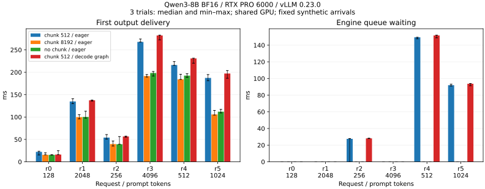
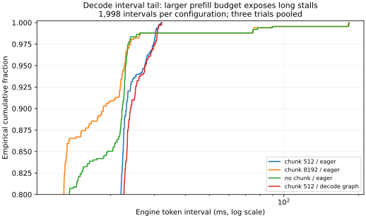

# 8-2 请求调度与等待分布（已完成首组回放，仍有待测项）

本目录负责固定 Qwen3-8B／vLLM 版本的实际请求回放。手排时序和事件模拟归已有计算任务 C42；本目录不重复实现。

已完成四组配置、每组三轮共72次请求的完整 Qwen3-8B BF16 回放，保存输入 token、输出 token、客户端交付事件和引擎调度统计。请求是固定的合成 Chat／代码审阅文本形状，**不是生产轨迹或自主 Agent 的工具执行记录**；这组实验只解释调度与交付时序，不评估答案质量。

## 运行与结果

依赖远端现有 vLLM 0.23.0、Torch 2.11.0+cu130、Transformers 环境。run.py 使用标准 AsyncLLM 接口，在 RTX PRO 6000 Blackwell 上运行。最终四组统一设置 VLLM_USE_FLASHINFER_SAMPLER=0，使用原生采样路径；正式完成记录保存在 results/measured-*。

```bash
python run.py --model /path/to/snapshot --output results/measured-chunk512 --budget 512 --trials 3
python run.py --model /path/to/snapshot --output results/measured-chunk8192 --budget 8192 --trials 3
python run.py --model /path/to/snapshot --output results/measured-nochunk8192 --budget 8192 --no-chunk --trials 3
python run.py --model /path/to/snapshot --output results/measured-graph512 --budget 512 --graph --trials 3
python analyze.py results/measured-chunk512
# 对其余三个目录分别运行 analyze.py 后：
python plot.py
python verify.py
```

每条命令启动新引擎，运行后释放自己的资源。六个请求每隔80 ms到达，输入长度依次128、2048、256、4096、512、1024；Chat形状输出96 token，代码形状输出128 token。关闭前缀缓存，greedy、ignore_eos固定输出长度；不使用聊天模板，完整输入保存在每组 `requests.json`。正式四组所有对应请求的输出 token 序列一致。每组先做两次128输入／16输出预热；三轮间无交叠。预热没有覆盖全部长输入形状，首轮保留在原始结果和范围中。

| 配置 | r3首输出中位数 | r4引擎排队中位数 | 观测KV块占用峰值 |
|---|---:|---:|---:|
| 分块512，eager | 267.79 ms | 149.42 ms | 19.678% |
| 分块8192，eager | 191.57 ms | 0.01 ms | 19.787% |
| 不分块，预算8192，eager | 198.30 ms | 0.01 ms | 19.787% |
| 分块512，decode graph | 282.16 ms | 151.71 ms | 19.678% |

本组请求下，小预算增加后到请求等待，decode graph也没有消除这个等待。不能由此推断小块普遍更差：这里没有饱和到达率扫描，较大预算足以一次容纳单个长提示，默认部分prefill并发限制保持不变。四组按上述顺序执行，未跨配置随机交错；GPU仍有其他服务驻留，因此几毫秒差异不作为稳定胜负。图中误差线是三轮最小／最大值，不是置信区间。



从已经保存的引擎迭代记录进一步核对，每组恰有1,998个后续token间隔，等于三轮实际输出扣除每请求首token后的数量；无需新增回放。按当前安装版本源码，ITL使用该请求相邻EngineCore输出的monotonic时间戳差，包含中间调度等待，不能当作纯kernel时间。剔除预热时只用同为wall-clock的请求arrival_time与迭代iteration_timestamp比较；两种时钟不混减。

| 配置 | ITL中位数 | ITL p95 | 最大ITL |
|---|---:|---:|---:|
| 分块512，eager | 12.936 ms | 27.500 ms | 31.940 ms |
| 分块8192，eager | 12.729 ms | 22.774 ms | 183.066 ms |
| 不分块8192，eager | 12.790 ms | 22.987 ms | 183.232 ms |
| 分块512，decode graph | 13.237 ms | 27.464 ms | 32.138 ms |

三轮合并，分位数使用nearest-rank。大预算的较少长停顿没有进入p95，却出现在分布末端；它减少排队的同时增加最长decode间隔。仅凭TTFT或p95不能说明所有请求体验更好；这也不是已经验证的在线SLO结论。



两条图对照路径都显式关闭 torch.compile，仅改变 `FULL_DECODE_ONLY`。原始日志证实完成图捕获，引擎报告约1秒、0.05 GiB；这是日志的粗粒度值，不是已独立测量的总图缓冲。KV固定预留6 GiB，此时 `gpu_memory_utilization=.30` 不决定KV容量；记录中的峰值是引擎上报的已用块比例，包含预热，不能冒充总显存峰值。

客户端时间来自 `perf_counter`；引擎排队用 `scheduled_ts - queued_ts`，prefill用 `first_token_ts - scheduled_ts`，mean TPOT用首末token跨度除以后续token数。后两项包含调度间隙，不是纯GPU kernel耗时。客户端事件有时一次交付多个token，不能将事件间隔直接当逐token ITL。`engine-stats.jsonl`保留引擎的原始迭代统计与完成请求记录，时间基准不得跨wall-clock和monotonic直接相减。

为腾显存，按用户授权对已重验的8004端口VL-8B服务父进程发送SIGTERM，空闲显存随后约36,510 MiB；具体操作见 `resource-action.json`。其他服务仍驻留；全部本实验进程已退出。`chunk512-eager`／`chunk8192-eager`是接入引擎统计前的探索记录，源码保存在 `runner-initial.py`，不混入正式四组比较。

## 尚未完成的要求

- 同块长不同历史位置的实际逐步工作／执行时间对照。
- Nsight主机提交、图命中／回退与图缓冲独立采集；引擎ITL分布已从原始记录核对，仍需结合GPU trace定位停顿来源。
- 更完整的预热、跨配置交错重复及GPU活动采样，避免用当前共享环境三轮数据宣称微小优势。
- 第8章全文／扩写范围核对与用户要求的第一轮后论文增补复核。

本目录仍是部分交付，不标记实验8-2全部完成。

## 权重核验

使用远端已有 `/home/ubuntu/vllm023-venv/bin/python`，不改动共享环境。模型 revision 固定为 `b968826d9c46dd6066d109eabc6255188de91218`。

```bash
python inspect_model.py /path/to/snapshot --output results/model.json
```

脚本逐个核对 safetensors 文件头、张量索引、数据区连续性和总字节数，并记录每个分片及配置／tokenizer 文件的 SHA256。它不加载模型，不占 GPU 显存；内容哈希用于后续复现实验身份，不代表已与上游发布哈希比对。

第一轮实验全部结束后，仍须按 `../../PROGRESS.md` 的最终复核要求，对照另一 session 的增补与论文证据，补齐必要对照。目录中的准备产物不能提前满足该验收门槛。
