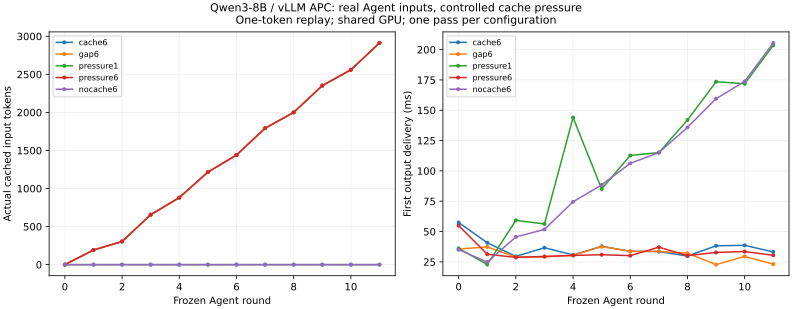

# 8-4：实际 Agent 输入的前缀缓存回放（部分交付）

固定 Qwen3-8B BF16 / vLLM 0.23.0，在 RTX PRO 6000 Blackwell 上回放封存的12轮实际代码 Agent 输入。五组共60个 Agent 请求；两组压力条件各插入33个合成请求。五组每轮生成的一个输出 token 完全一致。6 GiB 缓存累计命中16,304个输入 token；相同干扰下改为1 GiB后命中降为0。

输入来自3-4关闭thinking的真实失败任务，完整 token 序列及来源哈希独立保存在 [inputs/agent-prompts.json](inputs/agent-prompts.json)。本实验每个输入只生成一个 token，工具没有重跑，下一轮直接使用封存历史。因此它测量缓存复用和首输出路径，不测完整 Agent 完成时间或成功率。

## 条件与结果

每组启动新引擎，串行请求，max_model_len=4096、max_num_seqs=1、分块预算512、eager、关闭异步调度，固定随机种子804。使用 Torch 2.11.0+cu130；禁用 FlashInfer sampler 以避开该主机旧 nvcc 的编译错误。GPU上有其他服务，每组只执行一次，未做预热请求或交错重复；首轮启动后的执行成本保留。模型 revision 为 b968826d9c46dd6066d109eabc6255188de91218。

压力条件在相邻Agent请求之间串行执行3个不同的4000-token随机输入；两组压力请求内容和顺序完全相同。随机输入是用于消耗缓存的合成负载，不代表自然业务分布。等待条件每个间隔显式 sleep 0.2 秒，不添加干扰请求。

|配置|KV预算|间隔/干扰|累计命中 / 19,556输入|Agent请求耗时合计(s)|首输出中位数(ms)|完整回放(s)|
|---|---:|---|---:|---:|---:|---:|
|cache6|6 GiB|无|16,304|0.440|35.20|0.444|
|gap6|6 GiB|每轮等待0.2s|16,304|0.374|31.28|2.584|
|pressure1|1 GiB|每轮3个压力请求|0|1.322|113.92|9.596|
|pressure6|6 GiB|每轮3个压力请求|16,304|0.400|30.66|8.633|
|nocache6|6 GiB|关闭APC|0|1.216|97.34|1.220|

引擎日志报告6 GiB可容纳43,680 token，1 GiB为7,280 token。这是配置得到的容量，不是随时间测得的实际占用。命中数直接取每个最终响应的 num_cached_tokens；没有把共同文本长度当作缓存命中。两组压力请求自身总耗时分别8.205与8.158秒，未计入Agent请求耗时，完整回放包含它们、间隔和客户端准备开销。



本轮0.2秒的等待没有改变命中；它不证明任意长间隔都安全，也没有测TTL。相同压力下小容量命中消失，与缓存被干扰请求挤出一致，但没有逐块采集淘汰事件。关闭缓存的负对照同样没有命中。共享GPU的一次顺序实验不足以解释6 GiB三组之间几毫秒的差别。请求全部串行，未测混合到达下的排队改善；命中不等同物理KV驻留时间或整卡显存峰值。

## 复现与验证

[run.py](run.py) 只接受新的输出目录，避免覆盖测量。模型需预先存在；不自动下载。五组命令采用下列参数，其他参数一致：

```bash
python run.py --model /path/to/Qwen3-8B --output results/cache6
python run.py --model /path/to/Qwen3-8B --output results/gap6 --gap 0.2
python run.py --model /path/to/Qwen3-8B --output results/pressure1 --kv-gib 1 --pressure 3
python run.py --model /path/to/Qwen3-8B --output results/pressure6 --pressure 3
python run.py --model /path/to/Qwen3-8B --output results/nocache6 --no-cache
python verify.py
python plot.py
```

[analyze.py](analyze.py) 校验输入/运行源码哈希、每轮token、命中范围、五组配置差异和两组压力输入的一致性。每组 environment.json、requests.jsonl 与根目录五份引擎日志保留原始证据；[汇总](results/summary.json)可重新生成。[verify.py](verify.py)还核对封存文件清单。图已目视检查。

## 未完成范围

仍需真实缓存块驻留/淘汰时间线、混合到达与排队、充分重复及更多Agent轨迹；SGLang Radix/Unified Cache、混合模型可恢复状态边界和论文对照尚未执行。当前不是整项8-4完成。C43前缀收益与容量计算继续由现有calculations任务负责。本轮全部实验结束后，再统一对照另一session增补及论文条件决定补跑，不覆盖本轮基线。
