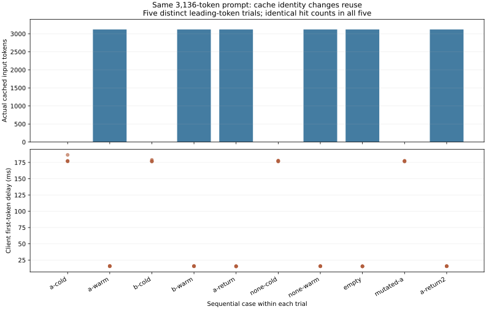

# 8-4：前缀缓存的 salt 身份边界

RTX PRO 6000／vLLM 0.23.0／Qwen3-8B 实际执行50个请求。五轮中，不同非空salt的首次请求均为零命中，同salt复用均命中 **3120／3136** 个输入token。空字符串复用未设置salt的缓存；改变首token后命中归零，恢复原输入后再次命中。相同输入跨salt的单token输出一致。

## 固定条件与输入

执行前方案在 PROTOCOL.md，全部输入和配置独立保存。取原12轮真实Agent轨迹的最后一轮3136token，每轮将首token改为4100+trial，以隔离轮间缓存；首token负对照改为4200+trial。这是保留Agent提示主体的受控扰动，不是重跑工具或任务质量评价。输入来源哈希、完整token列表及每次实际输入哈希均保存。

BF16、eager、单请求、512调度token、6GiB KV池、APC开启；模型固定revision `b968826d9c46dd6066d109eabc6255188de91218`。每请求贪心强制1输出token。安装版本、执行配置、源码哈希见 results/run-v2/raw.json。相同引擎中按预定顺序完成五轮，每轮10个请求，没有重启或缓存重置。

| 每轮顺序 | salt／输入 | 五轮实际命中token | 完成时间中位数 |
|---|---|---:|---:|
| A首次 | A／原输入 | 0 | 177.47 ms |
| A复用 | A／原输入 | 3120 | 15.76 ms |
| B首次 | B／原输入 | 0 | 176.93 ms |
| B复用 | B／原输入 | 3120 | 15.81 ms |
| 返回A | A／原输入 | 3120 | 15.55 ms |
| 未设置首次 | 缺省／原输入 | 0 | 176.99 ms |
| 未设置复用 | 缺省／原输入 | 3120 | 15.70 ms |
| 空字符串 | 空字符串／原输入 | 3120 | 15.52 ms |
| 改首token | A／扰动输入 | 0 | 177.25 ms |
| 再返回A | A／原输入 | 3120 | 15.71 ms |



安装源码的 preprocess.py 和 kv_cache_utils.py 保存于 source-snapshots。前者仅在salt为真值时向下传递，后者在首块的额外键中加入非空salt；后续块沿前缀哈希关联。实测吻合这条入口，不能把空字符串当作独立命名空间。剩余16个输入token未被本次命中指标计入，不用3120推断所有物理块或缓存寿命。

salt只是缓存身份输入，不执行用户认证或授权。此实验未实现服务端租户到salt的绑定，也未验证恶意客户端、adapter、模型版本、持久化重启或多层缓存隔离。它证明当前直接引擎入口的匹配行为，不是完整安全隔离证明。

时间为同引擎固定顺序的五轮观察，没有并发排队；不据小幅热请求差异排名。每次只输出1token，不能当持续decode吞吐。命中并不测量物理驻留峰值或TTL，相关待办仍保留。

## 失败与复核

最终记录器按可空字段序列化 metrics，兼容 disable_log_stats 下的缺省值。预定模型配置与对照由 run-v2 完成，results/run-v2/raw.json 和 results/summary.json 的 status 均为 passed。

analyze.py核对50条覆盖、每轮输入重建哈希、冷／热命中、实际输出与事件，确认未扰动输入跨salt输出一致。图已目视检查。原有服务未停止，GPU任务正常退出，calculations未执行或修改。

```sh
python analyze.py
python plot.py
```

离线分析只需标准库，画图需Matplotlib。实际独立重跑需相同模型缓存与已记录vLLM环境，在本目录使用新输出目录：

```sh
/home/ubuntu/vllm023-venv/bin/python run.py --output results/run-v3
```

程序拒绝覆盖旧目录。对新结果的分析在目录副本中更新读取路径，保留run-v2与manifest。完整8-4仍待SGLang／混合状态等证据，第一轮全部完成后的跨session论文增补复核尚未开始。
