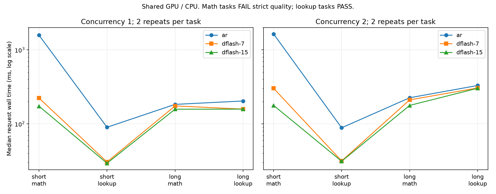

# 实验8-5：Qwen3-8B / DFlash 真实对照（第一轮）

本目录是主实验session授权的独立worker产物。原题要求固定DFlash检查点、草稿/验证/回退与产出记录、块长/输入长度/并发扫描，以及动态预算等扩展。inventory原状态为pending_measurement、evidence为空。本轮仅回填所完成的真实引擎范围，不代表8-5全部完成，不进行跨session最终审计。

主对照已完成：AR-V1、DFlash K7、DFlash K15各8次预热请求、16次正式请求，共48次正式。短输入50/53 token，长输入2276/2279 token。32对DFlash/AR正式输出逐token完全一致；各组全部自然stop，没有128上限截断。严格质量均8/16：四次短math输出95 token，算出719但违反“只输出整数”；四次长math输出709（应719）；八次lookup均输出5837。四个不同输入的重复并不等于16个独立题目。

|同V1 runner，正式阶段|AR|DFlash K7|DFlash K15|
|---|---:|---:|---:|
|调度统计draft次数|0|72|56|
|draft tokens|0|504|840|
|accepted draft tokens（不含bonus）|0|368|376|
|accepted / drafted|不适用|73.02%|44.76%|
|1 + accepted / drafts|不适用|6.11|7.71|
|进程显存采样峰值 MiB|17706|20894|20814|
|构造引擎加载/初始化 wall 秒|7.97|15.69|8.08|

所有进程显存采样低于24GiB；0.5秒采样不能排除采样间短峰，另保留Torch峰值。初始化包括权重载入、引擎内部warmup，正式题集warmup另有事件。DFlash日志中JIT均发生在正式阶段前，K7正式最早统计时间03:02:14.674873 UTC、K15为03:02:31.137728 UTC。加载先后、缓存复用与共享负载使初始化时间不可直接排名。

通过质量的短lookup、并发1：完整请求wall中位AR 90.02ms、K7 30.58ms、K15 29.43ms；长lookup、并发2则为330.30/305.72/303.02ms，其TTFT为254.50/289.25/286.83ms。长输入并发条件下草稿的完整wall变化与首token延迟变化方向不同，不能只报decode收益。每点只有两次重复且固定顺序、GPU/CPU共享，不支持细微差异的稳定排名。失败math计时仍完整展示，不能作为成功任务加速证据。

[分任务时间表](results/table.md)、[结构化汇总](results/summary.json)、[逐请求QA](results/qa.json)、[41项验证与失败原文](results/validation.json)。已视觉检查[时间图](results/wall.png)：双面板按并发分开、纵轴明确log scale、质量失败在图标题注明，无裁切或图例遮挡。图中相邻任务连线仅帮助识别配置，不表示连续变量关系。

本worker的41项产物验证通过，涵盖远端/本地传输hash、官方/安装源码hash、正常退出、请求数、相同输入hash、接受计数守恒、自然stop、TTFT边界、采样显存与token一致性；“验证通过”不代表任务质量全通过。最终GPU状态恢复到初始五个服务、60956MiB使用，没有本worker残留GPU进程。

实验协议见[PROTOCOL.md](PROTOCOL.md)，官方来源与具体阅读范围见[evidence/SOURCES.md](evidence/SOURCES.md)。Target读取既有Qwen3-8B snapshot b968826d9c46dd6066d109eabc6255188de91218，DFlash权重revision 9b41424b7109f9c5413454f481b09a82b85333f4，vLLM 0.23.0 / commit 0fc695fc6d1d82e9a5ac6835ac8e4e1c83703665。原始版本、下载目录与SHA256保存在evidence；没有下载target，也没有执行drafter模型卡的remote code。

同一BF16 target/tokenizer与chat模板（关闭thinking）、贪心温度0、seed42、自然EOS、128输出上限；两类任务（整数运算/文档提取）、短/长输入、并发1/2、每配置一轮预热后两轮正式。输入token保存在inputs.json并由三个配置复用。AR与DFlash K7/K15顺序运行，K表示draft token数，验证包含一个bonus位置。禁用APC、CUDA Graph、异步调度，固定512 prefill预算与1.25GiB KV总预算；草稿会分占此预算，所以实际token容量可能不同。

记录器使用官方StatLoggerBase扩展口，未修改引擎实现。events.jsonl包含提交、逐步可见token、最终输出/stop、调度轮草稿/接受统计、进程GPU内存和Torch峰值。并发时草稿计数是调度轮聚合，未归因到单请求；已接受draft token不含bonus，也不等于最终交付token总数。step wall包含主机工作和完整引擎步，不可称为纯草稿/验证GPU时间。TTFT是本地LLMEngine提交到首次可见token，非HTTP服务端到端。

本机GPU、CPU与其他服务共享，初始GPU五个服务全部保留，主session小型工作也可并行。表中时间含共享争用、固定顺序及记录器开销，不是隔离性能；题集包含4–95个输出token，主要检验质量和停止边界，不代表长文本decode能力。端口18185/18186没有启动监听，使用单进程离线引擎API以保留原始token与统计。所有写缓存重定向授权远端目录，Torch限22GiB、进程显存监控阈值24GiB。

最终各配置使用相同脚本：Transformers 5 显式 return_dict=False，设置官方 VLLM_USE_FLASHINFER_SAMPLER=0，并按 IterationStats 的实际类型序列化。AR 与 DFlash 统一使用 Runner V1 作为主对照；raw/ar-v2 保留成功的 Runner V2 对照。正式记录正常退出，结果与质量检查见 results/validation.json。

复现：远端目录必须为 `/home/ubuntu/ai-infra-book-experiments/ch08/08-05`。首次用 `python3 scripts/download_draft.py` 下载并验证drafter（约1.953GiB，仅远端保存）；运行 `bash scripts/run_baseline_v1.sh`（显式VLLM_USE_V2_MODEL_RUNNER=0），确认成功退出后运行K7与K15。`scripts/run_remaining.sh`提供顺序执行及防覆盖检查。新一轮应先封存旧raw结果，run_engine直接运行会append事件，禁止把多个attempt混成正式组。脚本每次启动重验GPU余量，不足27GiB则退出保留阻断。

本地分析使用目录内私有 `.analysis-venv`（matplotlib），执行 `.analysis-venv/bin/python scripts/analyze.py`。分析只读取已完成传输的数据，生成summary.json、逐请求token/质量QA与图；随后运行 `python3 scripts/verify.py`，最后用 `python3 scripts/seal.py` 封存manifest。独立运行也可在已安装matplotlib的Python环境执行同一脚本。

尚未覆盖：独立GPU kernel级草稿/验证/回退耗时、实际验证行/回退索引跟踪、动态预算与图档位、长输出/代码和开放式任务质量、更高并发及随机采样分布、EAGLE3.1与DFlash2公开记录独立复算、历史草稿变体。不会以n-gram替代论文方法，也不会用吞吐取代这些质量与支持证据。正文、inventory、总进展由主agent统一回填。
