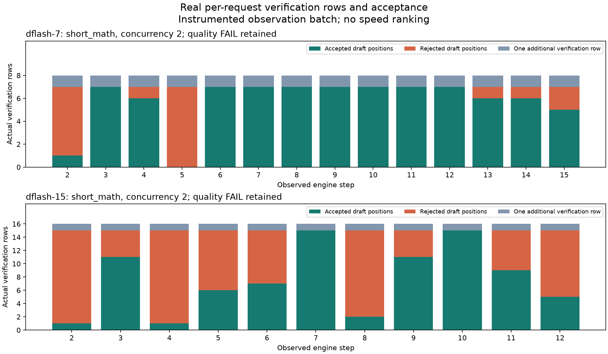
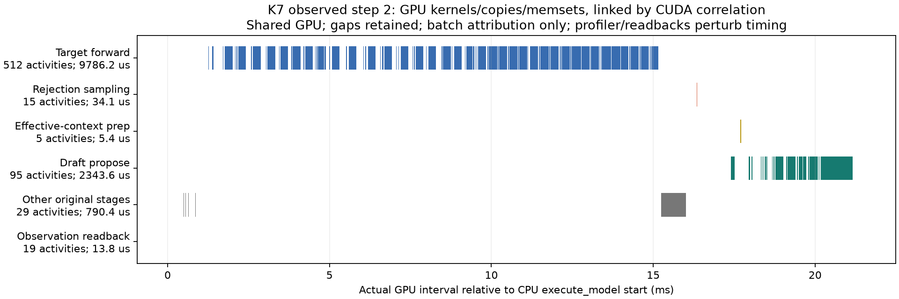

# 8-5 第一轮补充：真实 draft / verify / 有效上下文回退观测

本目录完成用户限定的观测缺口：K7 单并发短 lookup smoke 后，AR-V1、DFlash K7、K15 各四个原输入、两并发，一轮同形状预热及一轮 Torch CPU/CUDA profiler 观测。4个实验进程依次运行并正常退出，均等待退出及传输完成再分析。本补充不改写父目录已封存的性能结论，不代表全8-5完成，不做最终跨session审计。

12个观测请求与对应原参考的完整 token、文本、自然 stop 全部一致；smoke 的 `5837` 与4条原参考一致。质量仍为各组 **2/4**：短math输出了额外推导，长math回答709而非719；lookup均正确。错误答案没有被记作任务成功或加速成功。详细输出见 [requests.json](results/requests.json)。

|观测批证据（非性能排名）|AR-V1|K7|K15|
|---|---:|---:|---:|
|观测完整请求数|4|4|4|
|含真实draft的请求×验证step数|0|18|14|
|进入spec sampler但draft为0的请求行|0|2|1|
|实际验证draft token数|0|126|210|
|接受draft token数，不含bonus|0|92|94|
|出现首拒绝的请求×step数|0|10|12|
|spec sampler logits行数合计，含每请求额外一行|0|146|225|
|实际CUDA kernel记录数|53,631|15,881|13,902|
|实际GPU copy记录数|4,680|1,049|877|
|进程显存采样峰值 MiB|17,718|19,924|20,814|

这些接受计数来自逐请求实际张量；另与官方 scheduler 聚合统计独立校验守恒，未将聚合统计强行拆给请求。行数146/225包含上述2/1条零draft行，不能简单把所有行都称为K+1块。完整记录保存于 [steps.json](results/steps.json)（35条 sampler 请求行）、[forward-rows.json](results/forward-rows.json)（包括AR和chunked prefill实际行/positions）、[proposals.json](results/proposals.json)（所有真实proposal，含未被后续调度使用的末尾草稿）。每条保留内部request ID与可核验的外部映射，batch shape明确标注为batch，不按请求分摊GPU耗时。

真实回退例子：K7 step2 的 `short_math` 当轮 draft 是 `[12564,220,18,22,22,220,16]`，target argmax首个不同位置为零基索引1，fallback token=400。sampler返回有效 `[12564,400]`，后面为-1；接受长度1，设备计算的拒绝数6，原context seq_len=61，DFlash后续有效context=55。K15同一步也在索引1拒绝，拒绝数14，context从69修正到55。两者实际target batch input分别 `[16]`、`[32]`，验证logits分别 `[16,151936]`、`[32,151936]`，两个请求各占8/16行。后续有效context是实际 `new_cad.seq_lens-(K+1)`，不是只按接受率推算的故事。

该图显示原质量失败的short_math，明确保留失败标签。额外验证行不意味着该行一定被交付；greedy首拒绝后取target fallback，只有全接受才取末尾bonus。内部候选可能越过EOS，外部交付仍由自然stop截断，所以内部accepted不等于最终输出长度。

[BOUNDARIES.md](BOUNDARIES.md) 固定安装源码与函数含义。原源码/hash在 [source/](source/)，每次启动原函数原文/hash在 `raw/<mode>/original-functions.json`。独立wrapper见 [instrument.py](scripts/instrument.py)，runner写路径与流程差异见 [runner.diff](scripts/runner.diff)。只对本实验进程包装原函数，不改模型或分支，不写共享依赖。

Torch profiler采集CPU范围和真实CUDA kernel/copy/memset；GPU duration按CUDA correlation回连runtime/driver调用，再匹配最内层函数范围。额外设备读回及核验argmax归入 `observation_readback`。CPU inclusive范围、GPU实际活动时长之和分别保存在 [summary.json](results/summary.json)，逐GPU活动名、类别、时间戳与correlation见 [gpu-activities.json](results/gpu-activities.json)。CPU提交/等待时间没有被冒充GPU时间，GPU活动时长之和也不是请求wall。

时间线是两请求验证batch，横轴保留GPU真实执行间隙；微秒级小kernel在毫秒视野很窄，左侧同时给出活动数与duration之和，不人为扩宽。验证阶段为target forward；后续拒绝采样、有效context准备、下一次draft分开显示。图QA已检查：两张图无裁切、图例不遮挡数据，质量失败与观测扰动标签可见。

真实 `rejection_greedy_sample_kernel` 在K7/K15各出现17/13次，GPU duration之和26.525/20.800μs；`eagle_prepare_inputs_padded_kernel` 各17/13次，12.192/9.344μs。`copy_and_expand_dflash_inputs_kernel` 各26/23次，42.464/37.791μs。这些是有同步、profiler、共享负载扰动的本批活动证据，**不能据此排名稳定加速**。函数range还含其他kernel，不等同这个单kernel。K7/K15分别还有104/92个GPU活动未落入已包装范围，完整保留为unattributed；没有任意摊入draft/verify/rollback。

验证完成：24个raw文件远端/本地SHA256全部一致；主分析283项通过，独立raw复核1182项通过，包含proposal→scheduled draft匹配、输出前缀、原输入hash、请求ID映射、logits行守恒、-1尾部、官方aggregate守恒及质量失败保留。见 [checks.json](results/checks.json)、[independent-checks.json](results/independent-checks.json)、[transfer-check.json](transfer-check.json)。独立检查首次有3项ID语义失败，原记录保留在 [independent-checks-attempt-01.json](results/independent-checks-attempt-01.json)：execute_model入口尚未更新input_batch，首步仍含上轮warmup ID；实际forward/sampler/proposer使用更新后的ID。已按源码修正校验范围，未改原始记录、未因此重跑。

资源与复现：使用指定vLLM0.23 Python、固定Qwen3-8B缓存和已下载DFlash revision，未再次下载。原inputs.json只读且hash相同；greedy/no-thinking/自然stop/128上限、KV1.25GiB、eager、APC-off、async-off、FLASH_ATTN与AR强制V1均延续原协议。所有写缓存改到本目录，CPU affinity限制4个CPU，线程池4，Torch分配上限22GiB、进程采样24GiB守护。0.5秒显存采样不保证捕捉瞬时尖峰。启动及退出nvidia-smi与/proc见 [preflight.txt](preflight.txt)、[postflight.txt](postflight.txt)：最终只有原五服务，60956MiB，无本worker残留。CPU/GPU共享，不能称为隔离性能。

原始trace全部保留在本地及远端 `kernel-trace/raw/`，raw约361MiB；本地新增目录约409MiB，低于1GiB。Nsight Systems已知可用，但本批Torch/CUPTI已获得真实CUDA活动，未额外复跑Nsight。`scripts/launch.sh` 防覆盖；现有四个输出名称再次执行会拒绝，切勿删旧目录重跑。仅离线重分析可运行 `python3 scripts/analyze.py`、`python3 scripts/verify_independent.py`，图使用父目录既有分析Python，缓存写本目录。

仍未覆盖：物理KV字节清零或页释放的完整索引为 **unknown**。已检查的实现通过拒绝kernel、token索引与effective seq_len控制有效前缀，没有单独暴露一个物理“rollback事务”API；不能编造独立KV撤销kernel。未包装范围的CPU阶段归属、并发单请求GPU耗时也不宣称已知。动态预算/图档位、长输出和更广题集、更高并发、随机采样、EAGLE3.1/DFlash2复算等不属于本有界批。本补充由主agent统一回填正文及总进展；未执行/复制/修改calculations，未联系其owner，未git提交，未派生agent。
