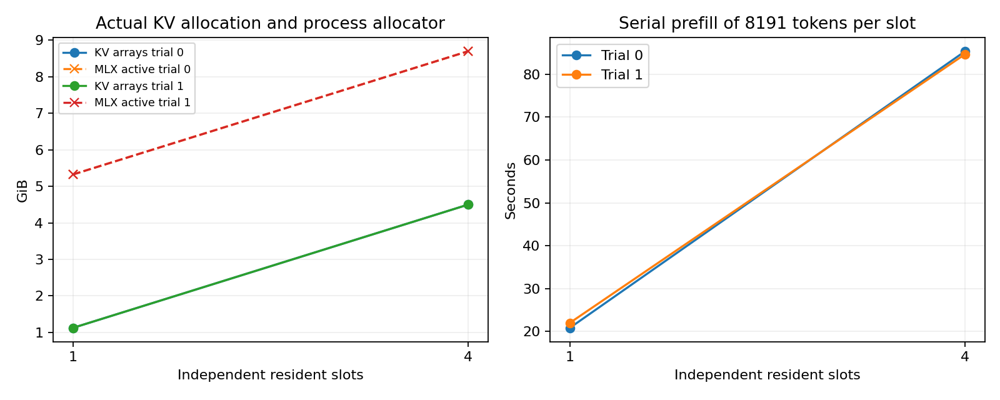

# 8-7 Mac Qwen3-8B 实际生成与独立 KV 槽（小模型变体）

官方Qwen/Qwen3-8B-MLX-4bit，固定revision383413e909f3bc5303ce195ebbdf0339c5a1a2a3，在M2 Max96GiB实际加载并生成。MLX0.32.2、mlx-lm0.31.3、Transformers5.16.1；完整环境与模型配置保留。不是235B/R1、vLLM卸载或完整8-7所有变体。

## 实际结果

14次生成均自然stop，11次通过严格答案检查。短提示3/4通过：最后一题输出`63 - 5 = 58`及Markdown答案，违反仅整数格式。两次4槽长提示均3/4通过，最后一题都直接答`63`（应为58），属于算术错误；错误未改写或重试。两次1槽题0均通过。

| 独立槽数 | 每槽已填充token | 实际KV分配GiB | MLX active GiB | 两次串行prefill秒 |
|---:|---:|---:|---:|---|
| 1 | 8191 | 1.125 | 5.323 | 20.856, 22.021 |
| 4 | 8191 | 4.500 | 8.698 | 85.397, 84.718 |

每层实际KV为BF16，已用位置8191但分配含8192位置容量，1槽1.125GiB、4槽4.5GiB均为真实数组nbytes求和。四份KV独立、无前缀共享。这里未把框架cache池中的可复用空闲块算入active。

模型加载eval为0.590秒，受热文件缓存条件限制。四个短提示TTFT依次1.414／0.240／0.182／0.176秒，完整生成1.481／0.281／0.222／0.381秒；第一请求包含首次执行开销。长提示预填充后的续写TTFT为0.112–0.556秒，不能省略前面的20.856–85.397秒串行prefill成本。



## 固定输入和质量

四题为给定项目码7319、标签violet、37+48、9*7-5，仅输出对应答案。greedy、关闭thinking、最多64输出token，strip后与固定字符串精确相等才通过。短题4次；长题每个输入为8192个有效token，模板前缀、题目、重复中性笔记token和尾部问题直接拼接，保留完整IDs和解码文本。事实靠前，问题在末尾。这是受控长上下文，不是生产任务样本。

1槽每重复只用第一题，4槽用四题，因此总正确率不是两个槽数策略的公平质量排名；题0可跨设置比较。14次调用只有4种题，不是14个独立任务样本。整数答案内容正确但格式不合规仍按失败保留。

## 缓存与计时边界

每个槽都通过36层真实模型得到KV，按512token分块prefill8191token，全部槽同时保留，再分别送最后1token自然生成。没有克隆缓存或用零数组代替真实KV。构建和生成串行执行，测独立上下文同时驻留容量，不能称四请求并发吞吐。

ready.json保留每块时刻、逐层offset、state shape/dtype/nbytes以及KVCache.nbytes。state仅覆盖已用位置；cache.nbytes来自底层keys/values数组，可包含分配粒度余量。MLX active/peak/cache包含权重和临时数组，不等于系统RSS。vm_stat与进程高水位另存，只作状态记录，未用来证明offload或无换页。

短提示TTFT从完整prompt调用开始；长提示TTFT从8191token预填充完成后最后1token调用开始，必须与prefill时间一起看，不能称长提示比短提示更快。四槽就绪耗时包含四次串行prefill，不是单请求TTFT。每个流式事件同步GPU，保留实际token、文本和停止标记；额外同步可能影响性能。

加载从mlx_lm.load到参数eval/synchronize完成，不含导入/下载。下载后已逐文件算SHA，权重文件缓存热，不能称冷盘加载。无32K扫描、功率测量或生产容量上限结论。

## 来源与复现

[官方固定模型](https://huggingface.co/Qwen/Qwen3-8B-MLX-4bit/tree/383413e909f3bc5303ce195ebbdf0339c5a1a2a3)。下载前明确HF缓存路径不存在，Ollama仅有Qwen3 4b/0.6b；盘空约33GiB。单safetensors4,351,884,216bytes。model-source.json是Hub文件元数据，model-local.json是本地字节/SHA，权重SHA匹配Hub LFS SHA。实际权重量化配置为group_size128、bits4；配置另存，不把名称4bit理解为全部tensor均4bit。

权重留在标准HF缓存，不在实验目录复制第二份。download.py固定revision并校验所有文件，已有缓存复用。installed-source保存实际安装generate/cache/qwen3实现以解释计时和容量；库未修改。

```bash
# 新复制目录运行，保留原封存，results必须不存在。
python3 -m venv .venv
.venv/bin/pip install -r requirements.txt
.venv/bin/python download.py
.venv/bin/python run.py
python3 analyze.py
# 绘图另外需要Matplotlib。
python3 plot.py
```

analyze.py验证源码hash、调用数、逐层形状/offset、分块覆盖、停止理由和质量判据。运行前协议在PROTOCOL.md。首次下载命令相对路径误写exit127，未实际下载，launch-path-error.log保留；随后固定下载成功。

本轮未访问RTX GPU、修改calculations或正文。8-7仍需235B/R1实际文件与驻留/换入对照、32K、真正并发调度及质量覆盖；本次仅完成8B的Mac runner小模型扩展。
