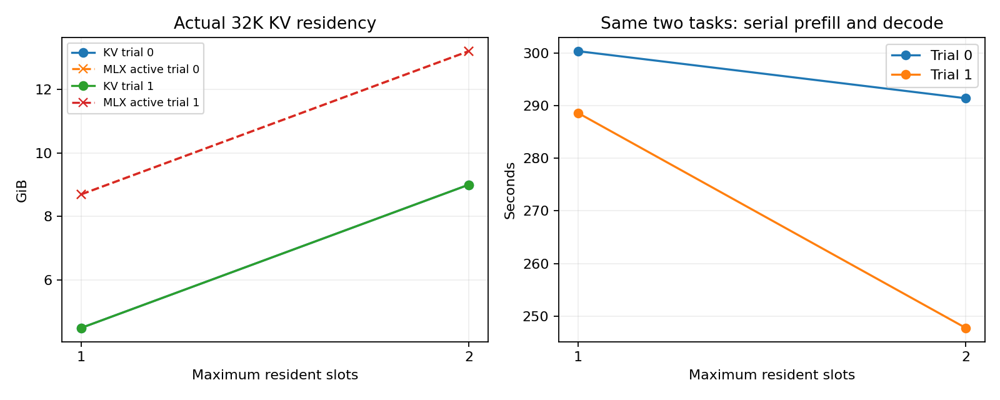

# 8-7 32K实际上下文与匹配任务混合

复用本地官方Qwen3-8B-MLX-4bit revision383413e909f3bc5303ce195ebbdf0339c5a1a2a3，权重未重新下载。本目录是独立可执行扩展，原8K封存不改。

全部四案例、8次真实生成已完成并通过主agent独立复核。8次均自然stop，4次lookup都回答7319，4次算术都错误回答63；两种槽数的匹配输出相同，未把题目混合差异当质量收益。

| 最大同时驻留槽数 | KV底层分配 | ready时MLX active | ready时记录的历史peak | 两题总完成时间（两重复） |
|---:|---:|---:|---:|---:|
| 1 | 4.5GiB | 8.698GiB | 9.106GiB | 300.381 / 288.617s |
| 2 | 9.0GiB | 13.198GiB | 13.606GiB | 291.429 / 247.758s |

每题真实预填充32767token；单槽条件两题prefill合计299.420/287.697s，双槽290.467/246.729s。最后1token续接的TTFT为0.291–0.460s，不能省略此前预填充。状态视图每层K/V为[1,8,32767,128] BF16；底层容量按32768位置分配，记录视图与底层nbytes分别保留。

这是匹配任务的驻留变体，不是同时解码的吞吐测试。两重复不足以给出稳定性能排序；本机同期有HTTP传输实验，且未控制频率与全部后台服务，因此不将时间差归因为增加槽数。没有触发主动active-memory guard，亦不据此声称框架硬限额或没有系统换页。



主agent接管时原agent因使用额度退出，原执行句柄39328已不可查询；PID50035已不存在，completion、全部输出、vm-after及四案例after记录齐全。进程exit code未知，未填写为0。terminal-observation.json保留这一区别；没有重复生成。

## 公平任务与实际执行

固定lookup-a（答案7319）和integer-b（9×7−5，仅答58）两题，分别构造32768个有效token输入。两种槽数在每重复均处理同样两题，输入IDs完全相同。1槽先完成第一题后销毁KV，再做第二题；2槽先独立建两份KV同时保留，再逐题生成。两重复×两条件，共8个输出；只有两种题，不能视作8个独立任务样本。

每次通过真实模型、每512token一块预填充32767token，再用剩余1token生成。greedy/no-thinking、最多64输出token，strip后字符串精确相等；算术错误、格式不合规或截断不改门槛。逐块立即落盘，不以零数组或复制KV代替模型计算。

所有构建和解码串行，没有并发请求调度，任务完成时间是相同两题串行工作总量；不能将2槽解释为并行吞吐收益。首token时间从预填充完成后的最后1token请求开始，必须连同prefill看，不能忽略32K输入成本。

## 容量边界

运行前磁盘约27GiB可用，96GiB物理内存；选择最多2槽，避免主动挤满内存。固定MLX memory_limit24GiB、cache_limit1GiB，每块前active超过20GiB主动报错停止。该版本set_memory_limit只是分配指导值，不是24GiB硬上限；实际主动停止依据是每块前20GiB active检查，单块临时峰值仍须单独观察。allocator-api.txt保留安装说明。没有提高阈值硬跑的重试。

逐层KVCache.nbytes计底层真实keys/values数组，state.shape和offset计已用位置；分配粒度使物理数组位置容量可能大于32767。MLX active/peak/cache是分配器指标，vm_stat是系统时点记录，resource进程RSS是历史峰值，三者分开，不相加，也不能据此证明offload或无换页。

本轮设置了1GiB缓存池上限，旧8K实验没有相同设置；即使模型相同，也不能把新旧耗时差都归于上下文长度。未测试235B、R1、磁盘换入、多请求同时执行、能耗或32K真实任务集质量。

## 复现与原始文件

PROTOCOL.md在运行前固定参数，model-local.json/model-source.json复制原固定缓存来源信息而非重复下载权重。已有模型路径存在时可直接运行，无需相邻实验代码：

```bash
# 在新复制目录中运行，results必须不存在；不要覆盖已有封存。
python3 -m venv .venv
.venv/bin/pip install -r requirements.txt
.venv/bin/python run.py
python3 analyze.py
# 绘图需另装Matplotlib。
python3 plot.py
```

若换机器，需要获取同一官方revision并更新本目录model-local.json的snapshot路径，复核其files字节/SHA；本次沿用已校验缓存。run.py实际源码hash与环境绑定。tasks.json保留全部输入IDs/长文解码；两道未执行题的模板也保留，不计为生成结果。每案例chunks.jsonl保留所有块的事件与资源；ready.json记录每轮实际驻留快照，outputs.json保留token事件、完整输出和质量；vm-before/after及各ready的vm_stat保留系统观察。

analyze.py检查同任务混合、所有32767token块覆盖、36层BF16缓存形状/offset、输入后缀、事件顺序、停止原因、预设答案以及跨条件输出差异。所有失败保留。原始数据不能证明完整8-7完成；该实验只补32K同模型的驻留变体。
