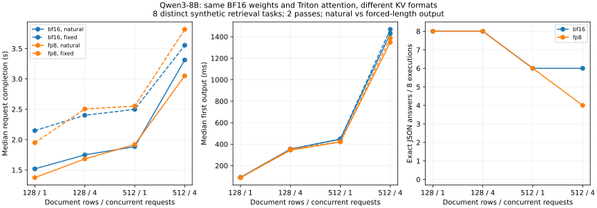

# 8-8：KV格式与自然结束质量（部分交付）

固定Qwen3-8B的BF16权重与Triton attention，比较BF16 KV和FP8 E4M3 KV；分别保留自然结束的精确检索质量，以及固定输出长度的计时。模型原生状态结构没有改变。本轮未使用量化权重，不能据此覆盖权重量化与KV量化组合的全部要求。

## 实测结果

|文档行数 / 输入token|并发|自然精确答案 BF16 / FP8|自然完成中位数(s) BF16 / FP8|固定64输出中位数(s) BF16 / FP8|
|---|---:|---:|---:|---:|
|128 / 1863|1|8/8 / 8/8|1.519 / 1.374|2.149 / 1.950|
|128 / 1863|4|8/8 / 8/8|1.749 / 1.683|2.402 / 2.505|
|512 / 7239|1|6/8 / 6/8|1.884 / 1.920|2.498 / 2.552|
|512 / 7239|4|6/8 / 4/8|3.313 / 3.051|3.554 / 3.816|

两格式全部正式自然输出均为46 token，均以stop结束，没有128-token上限截断；每格式固定输出组为32次64-token调用，length是人为固定工作量，不混为自然任务截断。自然答案BF16合计28/32通过，FP8为26/32；错误请求未自动重试，因此当前时间不包含修正答案或重试成本。



长文档四并发下，FP8自然完成时间中位数较小，但正确答案从6/8变为4/8；固定64输出的时间排序相反。由于格式未交错运行、每条件只有两轮，这些时间只能作为本轮观察，不能据此宣称稳定速度优势。此次自然输出长度相同，不能把时间变化归因为答案变短。

BF16在长文档r0的最后一个查询键上返回错误值，说明基线本身也会失败；FP8串行条件的失败任务换成r1，四并发时r0、r1均失败。因此只比较相同的6/8总分也会掩盖错误身份变化。原始错误文本保留，未由助手改成正确答案。

两个格式有34/64组配对输出序列不同（含固定长度生成）；同格式两轮对照中，BF16没有输出差异，FP8有3条固定长度记录不同，均在长文档四并发条件，自然答案的重复输出未变化。这些记录是需要进一步核查批次执行与数值稳定性的证据，不能以贪心采样推定所有条件逐token一致。

每层实际KV张量分别为[5461,2,16,8,128]的bfloat16与[10922,2,16,8,128]的uint8，两格式36层唯一底层存储总量均为12,884,115,456 bytes。FP8可分配块数翻倍，但这个实验没有扫描到最大可接纳并发，也没有测真实访存字节。

## 输入与控制条件

RTX PRO 6000 Blackwell Workstation，Qwen3-8B revision b968826d9c46dd6066d109eabc6255188de91218，vLLM 0.23.0、Torch 2.11.0+cu130。两组统一使用TRITON_ATTN：已安装的FlashAttention路径只在其支持的其他设备组合启用FP8，本实验不同时切换精度和attention后端。引擎日志与worker快照确认实际实现为TritonAttentionImpl。

每份文档包含128或512条六位数字记录，完整聊天模板后输入分别1,863与7,239 token。每种长度四份独立文档，共八个不同任务；提问取前部、中部、后部的三个键，要求只返回精确JSON字符串值。原始文档、预期值、完整token和种子保存在inputs.json。校验器从文档重新解析原始记录，拒绝重复JSON键、额外文字、错误字段或值。该任务很窄，不代表一般长文档理解、Agent成功率或模型总体质量。

每种长度分别串行处理四个请求或四个同时提交。自然生成温度0、最多128个输出token、允许EOS；固定工作量温度0、恰好64个输出token、忽略EOS。固定输出的后续内容不按自然答案评价，两种模式不要求完成同一生成量。两组均关闭thinking、APC、异步调度和CUDA Graph，分块预算16384、最大长度16384、最大4序列，KV内存预算12 GiB。

每个条件先完整预热，再做两轮打乱条件顺序的测量。每格式有64个正式请求、32个预热请求及1个校准请求；两格式合计194次。自然质量每格式32次执行，但只有八个不同任务，不将重复运行当作32个独立质量样本。格式之间依次运行，未交错引擎；共享GPU和时间漂移限制小差距的解释。

## 缩放与实际内存

[probe.py](probe.py)作为worker extension读取KV张量、唯一底层存储字节、CUDA分配及36层K/V scale。FP8组在正式请求前显式启用一次原生calc_kv_scales，由另一份512行、独立种子的校准文档触发；这次输入能在单个16384预算内完整prefill。不是每轮重算scale，也不是从评测答案校准。校准后flag关闭，测量结束时36层scale逐项未变。所有scale与校准输入保留，可检查校准范围的局限。

两组固定同样12 GiB预算，FP8通过较小元素获得更多可分配位置。因此不能说本配置的KV实际分配减半；它是容量余量对照。shape、存储dtype与底层storage字节均实际读取；FP8物理存储为uint8，编码含义由FP8 E4M3配置和后端确定。CUDA峰值计数覆盖模型初始化、校准、预热和测量整个进程寿命，不是请求局部峰值；只记录分配，不当成真实DRAM访问。

## 复现和验证

```bash
python run.py --model /path/to/Qwen3-8B --output results/fp8 --kv-dtype fp8_e4m3
python run.py --model /path/to/Qwen3-8B --output results/bf16
python verify.py
python plot.py
```

[run.py](run.py)和probe.py均为本目录独立源码，使用已安装的固定vLLM环境与本地模型。需要新的结果目录，已有目录会拒绝运行。采样使用原生路径，以避开此主机FlashInfer sampler与旧nvcc的不相容；没有修改共享引擎安装。

每请求保存输入身份、完整输出token和文本、首次/后续交付、终止原因与引擎指标；每批次另记实际开始与结束。[analyze.py](analyze.py)验证输入/源码哈希、配置差异、答案与文档一致性、缩放冻结、批次完整性，并报告两格式输出差异。TTFT取客户端首个输出交付，平均输出间隔取首末交付差除以输出数减一；不是引擎ITL尾部分布。批次输出吞吐包含prefill与生成，排除校准、初始化和预热。

## 执行路径与Q精度的后续对照

后续[实际Nsight采集](profiles/README.md)确认：该FP8 KV选项同时启用Q量化。一段prefill加一个decode步中，BF16共981个kernel，FP8共1,053个，差异为72次Q量化；KV缩放／编码融合于原缓存写入kernel。因此原两组是该引擎选项的整体对照，不能将质量或速度差异全部归因于KV存储位宽。

新增[run_qbf16.py](run_qbf16.py)与[probe_qbf16.py](probe_qbf16.py)，在原FP8独立校准完成后、预热之前，仅关闭这36层的Q量化分支。原KV scales逐项匹配并在测量期间冻结，FP8 KV格式与容量保持；在后端forward入口实际观察到全部36层Q为torch.bfloat16。没有修改共享vLLM安装。这是固定版本上的受控实现变体，不是声称存在同名公开CLI开关。

|文档行数|并发|BF16 KV / 原FP8路径 / FP8 KV＋BF16 Q 精确答案|
|---|---:|---|
|128|1|8/8 / 8/8 / 8/8|
|128|4|8/8 / 8/8 / 8/8|
|512|1|6/8 / 6/8 / 6/8|
|512|4|6/8 / 4/8 / 6/8|

新对照单独增加97次调用（64正式、32预热、1校准），32次自然输出仍均为46 token、无截断，合计28/32通过。长文档四并发恢复6/8，但BF16 KV失败的是r0，新对照失败的是r1；自然输出仍有8组与BF16 KV不同、4组与原FP8路径不同。相同总分不代表相同输出，更不能据这个小样本证明质量等价。详情见[q-control-summary.json](results/q-control-summary.json)。

Q类型观察增加了Python回调，新组未与旧引擎交错运行；其时间保留为诊断记录，不用来确定细小性能排名。复现新对照运行`python run_qbf16.py --model /path/to/Qwen3-8B --kv-dtype fp8_e4m3 --output results/fp8_qbf16`，随后运行`python analyze_q_control.py`。原两格式清单与结果不覆盖，新数据由followup-manifest.json单独封存。

## 未完成范围

量化权重组合、实际DRAM/L2计数、并发容量边界、更多长文档任务及重试总成本仍待补齐。实际转换路径的kernel trace已补齐，仍不将其当作DRAM/L2计数，不以八个检索任务证明FP8无质量损失。自然结束与固定长度结果分别保留，未执行自动重试；本轮错误已单列，未发现自然输出截断。容量、元数据和理论每步读取计算继续归C45。全书第一轮完成后，再对照另一session增补与论文比较，保留本轮原始基线。
