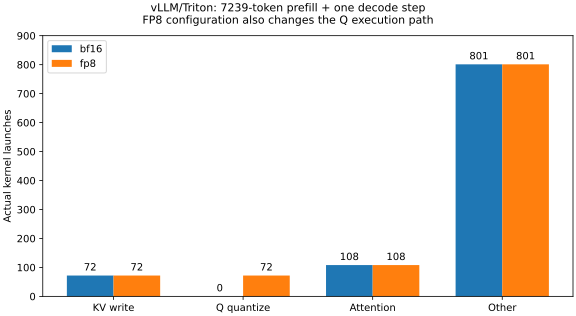

# 8-8：实际执行路径补测

同一vLLM 0.23.0 / Triton attention处理7,239-token输入，生成首token后再做一个decode步。两组均先用原独立校准文档校准，再对相同输入做两次预热；采集窗口外的工作不计入以下kernel数。每格式仅采一次，Nsight数据不并入原常规时间样本。

|实际kernel类别|BF16 KV|FP8 E4M3 KV|
|---|---:|---:|
|reshape_and_cache_kernel_flash|72|72|
|scaled_fp8_quant_kernel_strided_group_shape|0|72|
|kernel_unified_attention|72|72|
|reduce_segments|36|36|
|其他|801|801|
|全部|981|1,053|

新增72次量化是Q路径。[attention.py](native/attention.py)在后端支持量化Q且KV格式为FP8时建立query_quant，forward先将Q量化；[Triton后端](native/triton_attn.py)在CUDA上启用这个能力。实际trace中的BF16→FP8量化kernel与此分支一致。仅保持相同的Triton后端名称，不能推定两组attention数值路径都保持BF16 Q。

KV量化融合在[缓存写入kernel](native/triton_reshape_and_cache_flash.py)的缩放和FP8存储中，因此写入kernel数并未增加。[统一attention](native/triton_unified_attention.py)根据Q和KV类型处理转换与尺度；Q为FP8时把相应尺度并入score/output计算。没有将这个路径描述为另起一个完整KV解压kernel，也不把存储元素变小直接换算为访存减半。

此窗口72次Q量化kernel的持续时间合计约418微秒；缓存写入分别约993与1,002微秒，attention主体与分段归约合计约144.115与118.970毫秒。这些是带profiler的kernel持续时间之和，非独占GPU完成时间、无开销收益或DRAM流量。完整NVTX窗口约476.919与457.967毫秒，还含其他算子及主机等待；不能把差额全当成GPU空闲。

BF16、FP8 的原始 nsys-rep 报告仅保留在本地。仓库公开脱敏后的 [BF16 SQLite](bf16.sqlite)、[FP8 SQLite](fp8.sqlite) 及命令／版本记录；性能事件保持不变，原件与公开版哈希见 [归档说明](../trace-publication.json)。命令显式启用trace-fork-before-exec，捕获实际执行模型的子进程；NVTX区间内每个kernel、API和memcpy均在[analysis.json](analysis.json)。分析检查输入、源码、配置与原基线匹配，以及校准后的36层KV scales未变。原安装模块副本带[哈希](native/manifest.json)。

复现：在本实验目录设置NSYS为Nsight Systems 2026.4.1 CLI，再用vLLM环境运行`python collect_profile.py`；profiles/bf16与profiles/fp8须不存在。采集完成后运行`python analyze_profiles.py`及`python plot_profiles.py`（绘图需matplotlib）。两份公开 SQLite 导出和失败记录由独立 profile-manifest.json 核验；本地原始报告不属于公开文件清单。

最终采集使用 collect_profile.py 入口与子进程跟踪，profiles/analysis.json 保存 BF16 和 FP8 的 kernel 分析。相邻 profiles-capture-failed 中的实际请求已完成，因缺少 fork 子进程跟踪未生成 Nsight 报告，该有效请求记录保留。原 run.py、probe.py 和两格式测量清单保持原样。
