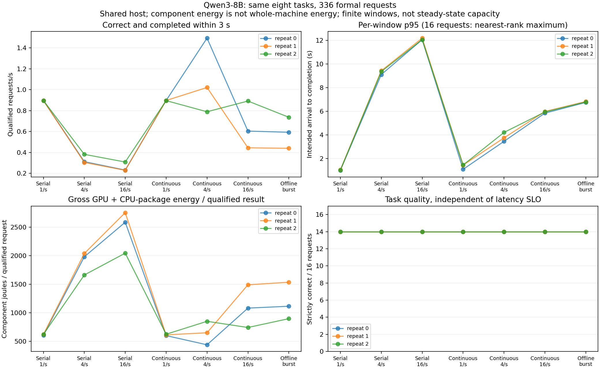

# 实验8-9：到达率、服务方式与实际能量计数

**同一Qwen3-8B、同一八道检索题完成336次正式生成；每题跨全部条件的输出逐token相同。** 三档到达率下，连续批处理提高高负载窗口的完成吞吐，但更高到达率或离线突发并不保证更多答案在期限内交付。整机墙上能耗、费用和跨设备赢家仍未知。

## 结果

三个重复，每条件16请求（八题各两次），严格正确均14/16；全部输出46token、自然stop。总体294/336正确，42个错误全是同一题n512-r0；这不是336个独立质量样本。事前固定从**计划到达**到完整输出不超过3秒，且答案正确才算合格，最终155/336合格。

下表是三次重复各自指标的中位数，不合并成一次稳态运行：

| 服务 / 到达率 | 完成吞吐(req/s) | 合格吞吐(req/s) | 每16请求的合格数（三次） | 窗口p95完成延迟(s) | GPU+CPU package计数差/合格结果(J) |
| --- | ---: | ---: | --- | ---: | ---: |
| 逐个接纳 / 1/s | 1.024 | 0.896 | 14 / 14 / 14 | 1.039 | 622.1 |
| 逐个接纳 / 4/s | 1.221 | 0.311 | 4 / 4 / 5 | 9.359 | 1982.3 |
| 逐个接纳 / 16/s | 1.231 | 0.231 | 3 / 3 / 4 | 12.059 | 2587.0 |
| 连续批处理 / 1/s | 1.025 | 0.897 | 14 / 14 / 14 | 1.455 | 615.0 |
| 连续批处理 / 4/s | 2.335 | 1.021 | 10 / 7 / 6 | 3.754 | 652.0 |
| 连续批处理 / 16/s | 2.378 | 0.604 | 4 / 3 / 6 | 5.942 | 1083.7 |
| 离线一次提交 | 2.357 | 0.593 | 4 / 3 / 5 | 6.789 | 1116.3 |

每窗口仅16请求，nearest-rank p95就是该窗口最大值，不称为稳定尾延迟估计。能量列不是电费，也不是整机或独占任务能耗。分母排除错误和迟到答案，分子仍包含整组工作以及计数范围内的其他活动；不能把失败请求消耗删掉。



图提供SVG，展示全部三个重复。到达率为固定间隔，没有伪装成Poisson流量；每组是有限16请求窗口，不由此推导持续可承载到达率或生产SLO。

## 接纳、排队和资源证据

- 所有条件共用同一已预热的引擎，max_num_seqs=4。逐个接纳用外层semaphore1，原始时间区间逐对验证最多一个未完成请求；连续模式按计划到达立即提交；离线模式一次提交16请求，由真实引擎排队。三次重复内各条件的任务顺序完全相同，重复间顺序打乱；条件顺序也在protocol.json中事前冻结。
- 10844条原生统计观测到最多4个running、12个waiting，KV usage最高0.3341、未见抢占。原生排队时间由同一monotonic时钟的scheduled_ts−queued_ts计算，最大6.063秒；arrival_time是wall-clock，不能拿来相减。安装版本字段定义保存在runtime-sources/stats.py。
- 原生统计是执行期间快照；group标签在控制端切换，边界附近异步报告不作为严格逐组事件归属。聚合样本和逐请求原生时间都保留。这里支持配置并发上限与排队解释，**不能仅凭队列或KV余量判定GPU算力、HBM或CPU哪个物理资源已饱和**，还没有硬件性能计数器归因。
- 任务进程采样GPU峰30866MiB，RSS求和峰3739971584bytes，系统MemAvailable最低138560622592bytes；采样可能漏峰、RSS不是独占内存。监督器运行249.729秒、exit0、无原因/残留进程。其他四个GPU服务保留。

## 能量边界

每组前后实际读取NVML累计GPU能量（mJ）和RAPL package-0（微焦），保存原始整数、设备UUID、真实sysfs路径、counter范围及每次读取的monotonic起止。只读CPU package，不重复加入其core/uncore子域或同一sysfs别名。

每个能量窗口都包住该组请求窗口；GPU计数器读取中点窗口比应用窗口长40.9–53.5ms，包含读数进程与边界开销。没有检测到CPU计数器回绕；分析器支持一次模回绕，不能在任意长区间无条件推断多次回绕。两种计数器边界略不同，原始值分别保留。

这是共享设备的总计数差，未扣空闲基线或其他服务。没有覆盖PSU损耗、整机风扇、所有存储和其他独立器件，也没有外部电表，所以whole_machine_energy_j和monetary_cost明确为null。只可讨论本次测量窗口的组件计数与交付结果，不能宣称某设备更便宜或更省整机电。

## 配置和复现

固定Qwen3-8B revision b968826d9c46dd6066d109eabc6255188de91218、BF16权重/KV、TRITON_ATTN，Torch2.11cu130、vLLM0.23，RTX PRO6000 Blackwell。maxlen16384、chunk预算16384、maxseq4、12GiB KV、APC/graph/异步调度关闭。温度0、最多128输出、允许EOS。输入复用8-8原始消息与token：四份128行和四份512行文档，每题精确返回三个六位数字字符串。

先对八题各预热一次，排除正式统计；正式7条件×3重复×16请求=336。新增的是到达率/接纳/能量条件实跑，不把旧8-8计时直接改标签。每次输入与tokenizer/引擎实际prompt一致，输出decode/EOS在运行时检验。完整记录在runs/service-001，协议和输入各有运行副本，环境保存执行脚本SHA。

```sh
/path/to/cuda-python -B resource_guard.py --out runs/new-guard -- \
  /path/to/cuda-python -B run.py --model /path/to/fixed-Qwen3-8B --out runs/new
python3 -B analyze.py --run runs/new --out new-analysis.json
```

使用同一CUDA环境中的pynvml；energy.py由sudo只读RAPL，需机器已有相应权限。没有改系统电源策略。离线分析只需Python标准库；绘图需Matplotlib，plot.py读取analysis.json。1810项独立检查覆盖文档答案、336输入调度/结束、每条件原计划、外层串行不重叠、能量窗口及逐任务输出一致性。

本轮仅一个成功正式run，无被替代启动失败。正文/inventory保持partial：整机功耗和费用、其他设备匹配实跑、物理瓶颈归因以及稳态服务范围仍待。calculations未动，最终跨session论文审计未开始。
