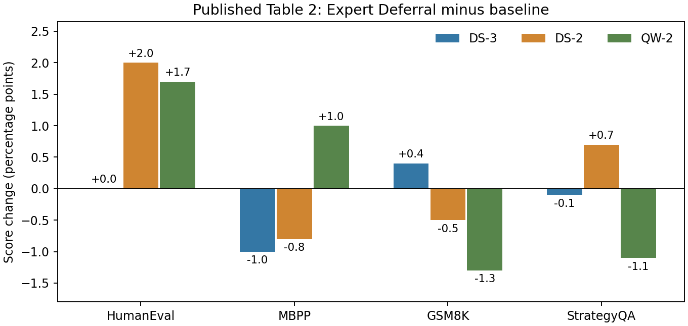

# 9-3：KTransformers 公开实验记录审计（部分完成）

本项按题目允许的公开记录路径执行。RTX主机实际是单路i9-13900KS，本地Mac为Apple Silicon，没有把它们的测量冒充双路Xeon＋4090。已固定资料、核验下载哈希，目视检查论文PDF第4、9、10、11页，再从原PDF独立提取表2的6行24个分数并生成差值图。没有运行KT模型或三路径硬件计时。



| 证据组 | 平台与条件 | 可以支持什么 |
|---|---|---|
| 固定KT-Kernel教程 | 2×6454S＋4090 24GB；Qwen3-30B-A3B | 启动配置示例，非三条路径的实测曲线 |
| 论文图3，PDF第4页 | 单颗8452Y、36核；DeepSeek-V3 MoE；每专家1至1024 token | CPU AMX/AVX-512内核随工作量变化；本轮未把曲线像素当精确原始计时 |
| 论文端到端，第9–11页 | 2×8452Y，每路36核/1TB DDR5；A100 40GB或4080 16GB | batch=1、Wikitext；prefill 32至8192，decode输入32/最多输出512 |
| 论文表2，第11页 | DS-3 INT4、DS-2/QW-2 INT8，Expert Deferral与原模型对照 | 量化模型的已发表质量分数，不能移作BF16无损证明 |

教程固定提交为`31985f40bcc40da08107efdb1f81bf88cb38c6b2`；该提交中的AMX.md描述历史v0.3，不把它等同于SOSP实验代码版本。论文未在本轮核对范围给出与教程同一运行提交，故不合并版本。

三条执行路径仍有证据缺口。论文的Fiddler与改造过的Llama.cpp基线也在CPU上执行路由专家，不能把这三套软件的速度直接改标为“CPU算／每次搬权重／全GPU驻留”。图3是CPU内核比较，不是4090传输测量。论文的32 GB/s是PCIe4.0理论峰值，不是有效链路实测；220/125 GB/s为其MLC同路/跨路内存测量，不能移给6454S机器。完整专家形状、每专家token数、相同精度下的三路径记录仍待。

AMX历史说明给出的选择规则是每专家平均超过4token时倾向AMX，较小工作量使用AVX-512；该规则不是本机测得的通用交叉点。权重在加载阶段重排和量化、CPU本地读取、NUMA放置及CPU/GPU汇合均需纳入后续计时。教程自身还有一个必须保留的差异：参数解释写prefill阈值2048，Option A命令写4096；本轮没有擅自统一，也没有将命令验证为可运行。

表2重新提取后，12个质量差值介于−1.3至+2.0个百分点。DS-3的MBPP下降1.0，QW-2的GSM8K下降1.3；正负变化同时存在，不能只报告加速或写成质量不变。HumanEval为0-shot pass@1、温度0.3/10次采样；MBPP为3-shot pass@1，GSM8K为8-shot EM，StrategyQA为4-shot EM，后三项使用greedy。表中没有给这些差值的置信区间，未做显著性判断，也未跨基准平均分数。此为公开记录复核，不是本地重新评测。

独立复核（仓库根目录，需要Poppler；绘图另需NumPy/Matplotlib）：

```sh
python3 experiments/ch09/09-03/analyze.py
experiments/.venv/bin/python experiments/ch09/09-03/plot.py
python3 experiments/ch09/09-03/verify_manifest.py
```

source-snapshots/保存固定文档、PDF和原文本，sources.json记录原链接、下载时间与哈希；records.json保存平台、精度、协议、提取分数和缺口。analyze.py从PDF重新执行pdftotext，核对与目视原表一致的24数值，程序产物是公开数据分析而非模拟测量。

固定来源：[KT-Kernel教程](https://raw.githubusercontent.com/kvcache-ai/ktransformers/31985f40bcc40da08107efdb1f81bf88cb38c6b2/kt-kernel/README.md)、[v0.3 AMX说明](https://raw.githubusercontent.com/kvcache-ai/ktransformers/31985f40bcc40da08107efdb1f81bf88cb38c6b2/doc/en/AMX.md)、[SOSP作者原件](https://madsys.cs.tsinghua.edu.cn/publication/ktransformers-unleashing-the-full-potential-of-cpu/gpu-hybrid-inference-for-moe-models/SOSP25-chen.pdf)。

实验9-3仍为partial：同平台三路径、量化与NUMA消融、传输/汇合、逐层Expert Deferral依赖及质量复现继续保留。数量级收支归独立calculations任务，本轮未执行或修改其内容。没有联系其他session，也未开始首轮完成后的最终增补/论文对照。
