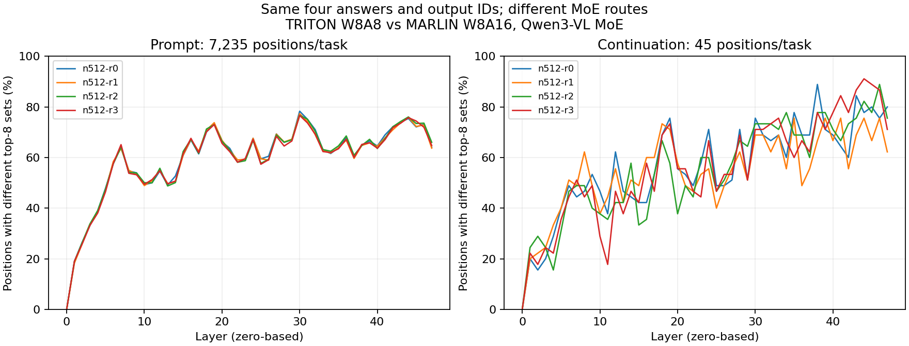

# 9-6：TRITON与MARLIN的真实MoE后端对照

复用此前完整Qwen3-VL-30B-A3B FP8的TRITON路由原件，仅新增MARLIN四次生成。**两边四题均正确，输出token逐个相同，但829,976/1,397,760个token-layer位置的top8专家集合不同（约59.4%）。** 不把专家顺序变化误计为集合变化；分析同时保留有序比较和集合比较。



每题7235个prompt位置和45个已消费输出位置均可逐位置对齐；最后EOS没有再次前向。第0层的专家集合全部相同，后续层产生差异。Prompt每个位置的8个专家平均约6.97–6.98个相同，continuation约7.25–7.31个相同；只描述这四个已知检索输入，不外推自然流量或训练稳定性。

## 改变了什么

固定模型revision `d9748a51ae66354c4dad665aab2c71f26cf2c8cd`、48层、输入全文/token、TRITON attention、4GiB KV、16384上下文、2048分块、单请求、seed906及greedy采样；关闭图、APC、异步调度、EP/EPLB/DBO，原生路由返回开启。环境配置只增加`kernel_config={'moe_backend':'marlin'}`。实际日志确认MARLIN Fp8 MoE和MoEPrepareAndFinalizeNoDPEPModular，没有只靠配置名称推断选中后端。

**这不是相同数值格式下的纯后端速度对照。** 安装源码`runtime-sources/model_executor/layers/fused_moe/oracle/fp8.py`对MARLIN返回W8A16量化配置，原TRITON使用W8A8。该选项同时改变MoE激活量化和专家内核/权重准备路径；路由差异无法归因于其中单一因素，未记录逐层激活误差或路由权重。相同输出不证明数值等价，也不证明MARLIN或TRITON哪一个更接近高精度参考。

检查时FlashInfer CUTLASS的设备判定包含SM120，但其FP8 block-scale量化组合限定SM90，故未启动已知不匹配的候选。这一限定不表示SM120不支持所有FlashInfer模式。相关安装源码原件和SHA已保存。

## 执行与证据

Marlin主运行56175 exit0，guard reason null、无存活后代，墙钟26.040秒；采样GPU峰58,224MiB、进程RSS求和峰13,322,141,696bytes，系统可用最低139,485,675,520bytes。GPU峰值是全运行采样，不是稳态权重驻留量或最低显存需求。基线是较早的成功运行，没有随机交错、预热重复或独占主机，不能比较这两次墙钟作为性能收益。原有四个GPU服务和额外870MiB进程仍在，未停止其他任务。

`reference/`逐字复制此前TRITON原始输入、输出、四份路由数组、配置/退出证据和执行源码；`reference-origin.json`包含来源路径及SHA。`runs/marlin-001/`为这次新增的完整原件。`runtime-after.json`核对此前保存的七份模型/路由/调度源码仍相同；新增oracle等源码只有本次快照，不能称全部安装文件做过跨运行哈希验证。两边报告版本相同，但没有完整依赖锁定证明。

`protocol.json`在执行前固定任务SHA、所改选项和质量/比较范围；不是盲测、没有重跑TRITON原件。`analyze.py`首先验证参考SHA、执行源码、唯一配置差异及原始退出；按两边已消费token序列的共同前缀限定路由对齐范围，避免输出分歧后仍错配位置。本次四题共同前缀均7280，因此全返回数组可对齐。62项检查、独立128位专家集合复核、离线重放和图QA见根复核记录。原始数组是每位置逻辑ID，不包含dispatch/GEMM/combine时间或物理专家副本映射。

## 独立复现

需要固定Linux运行环境、RTX和同revision完整模型缓存，输入、运行器、guard、参考原件、评分与绘图均在本目录：

```sh
/home/ubuntu/vllm023-venv/bin/python -B resource_guard.py --out runs/marlin-new -- \
  /home/ubuntu/vllm023-venv/bin/python -B run.py \
  --model /path/to/fixed-model --out runs/marlin-new/output
python3 -m pip install numpy matplotlib
python3 analyze.py
python3 plot.py
```

分析默认使用封存的marlin-001，重跑应更新目录选择并记录新条件。`python3 analyze.py /tmp/backend-review`可独立重放报告。沿用96GiB进程RSS求和、64GiB自身GPU、全局剩余24GiB、3600秒轮询限制；非硬隔离。没有模型权重副本写入本目录，没有被成功替代的启动失败记录。

9-6仍缺纯文本Qwen3、相同数值格式的可用后端配对、阶段计时、实际多卡放置/复制及DBO/TBO对照。该结果只补充真实后端输出与路由一致性；calculations和C49未动。
