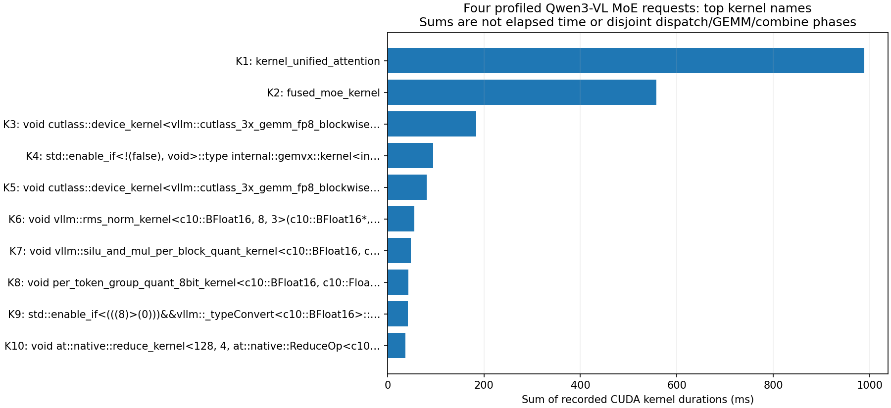

# 9-6：完整MoE模型的CPU/CUDA轨迹

固定Qwen3-VL-30B-A3B FP8及原四道长文检索输入，使用vLLM原生torch profiler，在Engine准备好后开始、四个请求完成后停止。**四题输出token、文本、正常stop和全部路由数组均与此前TRITON基线逐项相同**，此前四题均通过精确JSON质量门槛。只新增这次带profiler的四个请求，没有把原基线重跑作新数据。

## 实际记录

完整GPU worker压缩轨迹含3,009,672个事件，其中 **221,648个CUDA kernel**。全部kernel duration求和约2,283.422ms，首个kernel开始至最后一个结束的跨度约10,085.275ms；两者不是同一指标，不能把和除以跨度当作准确设备利用率。前端async_llm另有55个事件、零GPU kernel的独立轨迹，也完整保留。

| 原始事件名 | 次数 | duration之和 ms |
|---|---:|---:|
| kernel_unified_attention（CUDA） | 9408 | 988.358 |
| fused_moe_kernel（CUDA） | 18816 | 557.238 |
| vllm::moe_forward（CPU scope） | 9408 | 3649.970 |
| _moe_C::topk_softmax（CPU scope） | 9408 | 74.900 |
| _moe_C::moe_align_block_size（CPU scope） | 768 | 9.534 |
| _moe_C::moe_sum（CPU scope） | 9408 | 120.718 |

CPU行是主机operator范围，可能包含嵌套调用和异步提交；不能与CUDA行相加，也不能直接解释为对应GPU阶段时间。`fused_moe_kernel`将同名实例合并，尚未用CPU/CUDA关联ID区分两次投影、输入阶段和输出阶段。名字匹配不是完整dispatch/GEMM/combine归因。单卡也没有实际EP通信。



图中长名称缩略显示，K1–K10的完整映射保存在`results/kernel-labels.json`。没有将kernel名称按猜测合并成三段性能图。

## 执行条件与影响

固定revision `d9748a51ae66354c4dad665aab2c71f26cf2c8cd`，48层完整VL MoE的文本输入变体，vLLM0.23.0/Torch2.11.0，TRITON FP8 MoE、TRITON attention、4GiB KV、上下文16384、分块2048、单请求、greedy/128输出预算、seed906；关闭APC、图、异步调度、EP/EPLB/DBO，原生路由返回开启。新增profiler配置：记录CPU/CUDA及shape，关闭stack、内存记录，gzip输出。相关安装源码保存在runtime-sources。

运行19609 exit0，guard无原因、无残留后代，墙钟163.805秒包含模型初始化、四请求、较长的轨迹压缩导出和退出。导出期间轮询确认进程存活，未重新启动。自身GPU采样峰35162MiB，进程RSS求和峰16338993152bytes。profiler和首次JIT会干扰时间，不能与25–30秒的旧无profiler作业作性能比值。

## 复现

独立目录包含运行器、guard、输入、模型config、原始参考、完整采集与分析脚本。需要RTX上的固定vLLM环境和模型缓存：

```sh
/home/ubuntu/vllm023-venv/bin/python -B resource_guard.py --out runs/trace-new -- \
  /home/ubuntu/vllm023-venv/bin/python -B run.py \
  --model /path/to/fixed-model --out runs/trace-new/output
python3 -m pip install numpy matplotlib
python3 analyze.py
python3 plot.py
```

默认分析读取trace-001；新运行需改目录选择，勿覆盖已封存原件。可用`python3 analyze.py /tmp/profile-review`重放到独立输出目录。分析完整解压JSON，内存需求高于压缩文件大小，需保留足够主存。两份压缩轨迹原件总计75,063,723bytes，包含完整事件和关联字段，可后续进一步归因。

分析核对实际退出、执行源码SHA、四对输入/输出/路由一致性，然后按trace类别与完整kernel名称统计；不依据文件名编造阶段。原始参考来自此前single-gpu/native-001，参考SHA由本目录manifest固定；模型权重未复制。guard轮询限制沿用96GiB进程RSS求和、64GiB自身GPU、全局剩余24GiB和3600秒，不是硬隔离。

本轮补齐原始时间线，9-6的严格分段归因、padding形状、稳定性能、多设备放置/复制及DBO/TBO对照仍待。calculations/C49未修改。
