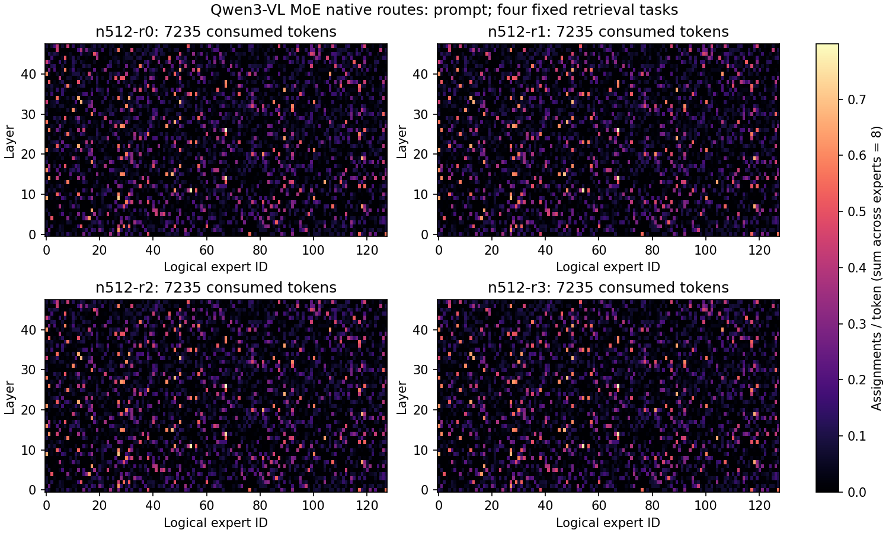

# 9-6：真实Qwen3-VL MoE单卡路由基线

完整缓存模型实际运行两次，每次四道固定512行多键检索题：先开启原生路由返回，再关闭作为输出对照。**两组均4/4精确JSON正确、全部正常stop，每题46输出token，两条件逐token相同。** 共八次实际生成，不是八个独立质量样本；这些题已在其他模型实验中使用，不是盲测。没有图像/视频输入。

## 路由与结果

原生返回每题`uint8[7280,48,8]`：7235个prompt位置、45个已消费的生成位置，48层，每层128个逻辑专家、top8。全量共 **11,182,080次专家选择**，所有ID在0–127内，每个token-layer的8个ID无重复。最后返回EOS未再次前向，数组不包含它的路由。已核对安装源码scheduler的完整prompt取回、普通decode末尾切片与output_processor拼接语义；不能把返回数组当作每个CUDA批次的时间线。




每行按对应阶段token数归一化，128个专家的值之和为8。四题prompt最高单元格约0.794–0.799 assignments/token；continuation只有45个位置，最高0.956–0.978，不能外推稳定热门专家分布。原始数组保留各位置完整ID，图只是汇总。

## 实际执行条件

Qwen3-VL-30B-A3B-Instruct-FP8 revision `d9748a51ae66354c4dad665aab2c71f26cf2c8cd`，完整48层；vLLM0.23.0/Torch2.11.0，RTX PRO6000 Blackwell。模型是VL MoE的纯文本输入变体，不冒充题设纯文本Qwen3模型。FP8块量化由模型配置决定；日志实际选中TRITON Fp8 MoE及MoEPrepareAndFinalizeNoDPEPModular，attention为TRITON_ATTN。TP/DP均1，关闭EP/EPLB/DBO、APC、CUDA graph、异步调度，KV预算4GiB，上下文16384、prefill分块2048、单请求、seed906、temperature0、输出预算128。

capture/control配置只差`enable_return_routed_experts`，两个执行版本源码分别保留于各run的executed-run.py，并与实际环境记录SHA匹配。原生采集额外存储和复制开销没有单独测量，未改变逻辑路由或权重；输出一致仅限这四题，不代替完整数值验证。

| 运行 | guard墙钟秒 | 采样GPU峰MiB | 进程RSS求和峰bytes |
|---|---:|---:|---:|
| native-001 | 30.302 | 35150 | 13423411200 |
| control-001 | 25.482 | 35150 | 13275570176 |

两次guard均exit0、reason null、无存活后代（句柄14460/39623）。没有预热或随机交错，采集先运行，日志显示推理期JIT和默认MoE配置提示；不能以这两个墙钟的差称作采集开销、服务吞吐或加速收益。采样主存可用最低分别139108278272/139578056704bytes；共享主机上的进程RSS之和不是独占物理内存。监督只终止本次进程身份，未释放其他服务显存。

## 独立复现

本目录自带输入、运行器、资源监督、评分分析和画图脚本。需要Linux、nvidia-smi、固定vLLM环境和同revision模型缓存；模型权重不复制进实验目录。用新输出名运行，避免覆盖成功原件：

```sh
/home/ubuntu/vllm023-venv/bin/python -B resource_guard.py --out runs/native-new -- \
  /home/ubuntu/vllm023-venv/bin/python -B run.py \
  --model /path/to/fixed-model --out runs/native-new/output
```

关闭采集的对照在run.py参数中加`--disable-route-capture`。guard记录0.5秒采样、96GiB进程RSS求和/64GiB自身GPU/全局剩余24GiB/3600秒限制；这些是轮询门槛，不是硬内存隔离。独特环境标记、会话、父子关系和PID出生时间用于登记，pidfd用于清理。实际重跑前核对当前共享主机资源。

```sh
python3 -m pip install numpy matplotlib
python3 analyze.py
python3 plot.py
```

分析默认读取封存的native-001/control-001，新运行需更新目录选择后重新比较。可传独立输出目录：`python3 analyze.py /tmp/moe-audit`。74项检查覆盖执行退出、执行源码SHA、输入、EOS、两条件输出、路由范围/唯一性/位置数及分层计数守恒；运行器对八个响应实际做过tokenizer decode一致检查。原始模型config、七份安装源码和各run完整日志/请求/路由/资源记录均保存，分析可离线重放。

## 仍缺的9-6部分

这里只取得逻辑专家ID，没有路由权重、物理专家副本映射、dispatch/GEMM/combine分段时间、padding后的GEMM形状、通信暴露、最忙设备或尾延迟。既有配置检查证明当前TP1/DP1不能启用EPLB，默认通信后端也不能启用DBO；多卡放置、复制、grouped GEMM后端和重叠仍需各自单变量对照。后续可复用这批原始输入/路由，但不能以离线重分配代替真实执行。C49及calculations未动，9-6保持部分完成。
