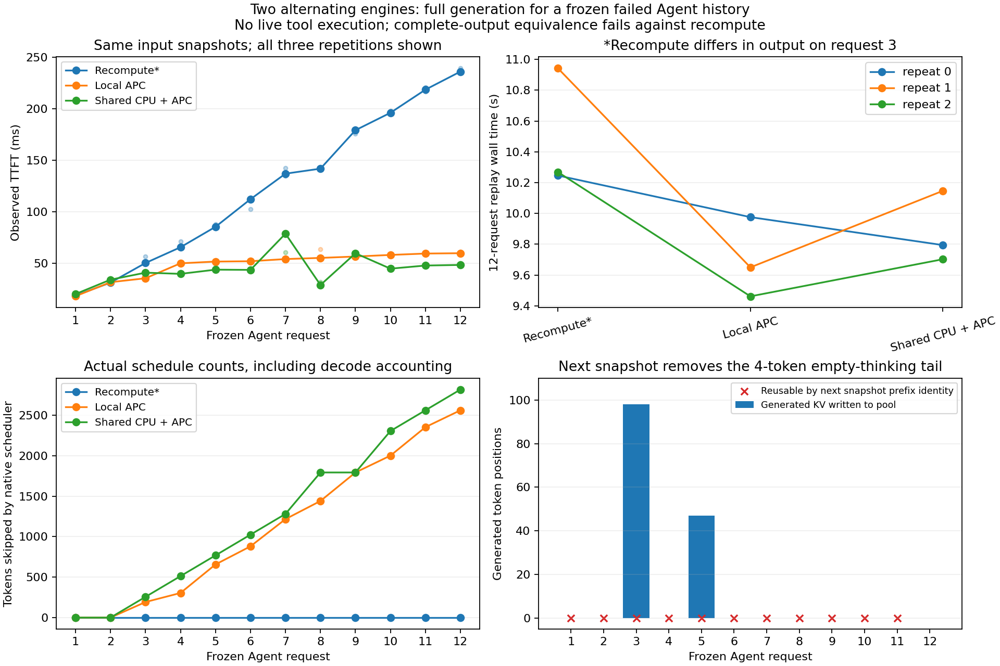

# 9-7：两个实例交替回放真实 Agent 历史

完成同一条12轮代码Agent历史在两个独立引擎间交替服务的完整生成：关闭缓存、本地APC、共享CPU KV池三条件，各三轮重复，共108次生成，全数正常stop。**本地APC与共享池36/36个完整输出token序列相同；两者相对同轮无缓存参考都仅33/36相同，三条件完全一致的门槛失败。**

历史来自原3-4的真实修复失败任务，输入、模型输出和工具结果原件独立保存在本目录。8-4曾对这条历史每个输入只生成一个token；本轮生成到自然结束，最多1200token，并使用两个独立实例交替服务，不重复那项单token测量。



## 主要结果

| 条件 | 每轮实际调度token | 每轮跳过的调度token | 三轮首输出中位数的中位数 | 三轮完整回放耗时中位数 |
|---|---:|---:|---:|---:|
| 无缓存重算 | 20289 | 0 | 124.18ms | 10.268s |
| 两实例各自本地APC | 6917 | 13392 | 53.05ms | 9.650s |
| 两实例共享8GiB CPU池＋本地APC | 5205 | 15104 | 43.72ms | 9.794s |

共享池每轮9次真实retrieve，相对本地APC少调度1712token，恰与原生取回范围扣除本地已存在前缀后的1712token相符。三轮每轮结果相同，但完整回放仅一轮快于本地APC，另外两轮更慢；不声称稳定端到端收益。回放计时包含本轮生成、发布等待、遥测与控制器开销，不包含模型初始化、预热或重新执行工具。

无缓存参考的第3个请求在三轮均生成105token的不同修复代码，APC两路径对应125token，因此不能把其完整回放时间当作同输出性能比较。独立运行原任务六用例夹具：无缓存的不同代码通过3/6，另一版通过2/6，均不合格。原始测试进程退出码为0，判断依据是JSON中的用例结果；不把exit0当修复成功。45个write_file输出只有两份唯一代码，分别测试一次，代码SHA、关联请求和原始输出见`code-quality.json`与`code-quality/`。

这条原Agent没有完成任务。新回放的下一轮使用已封存历史，不由本轮新输出和新工具执行决定；无缓存输出发生差异后，后续输入仍固定。这里不是新的闭环Agent成功率、真实工具重试成本或完整任务完成时间实验。

## 生成KV确实写入，但下一轮前缀身份变化

共享池每轮实际保存145个生成后的KV token位置：第3个请求98个、第5个请求47个。30个有写入的请求均核对了最后一次提交之后的成功store future，不能仅凭提交日志声称完成写入。这里的数量是生成区中进入实际写入范围的token位置，不是独立物理网络流量。

但全部99个相邻历史边界的最长连续公共前缀都在旧prompt末尾之前4token结束。旧生成提示带有`<think>\n\n</think>\n\n`，token IDs为`[151667,271,151668,271]`；下一轮重建assistant历史时不再包含这四个空标记。原生token序列与tokenizer重新decode均已核验。因分歧发生在生成区之前，曾写入的生成KV不能继续作为下一轮的连续前缀复用。图中的“可复用为0”由实际前缀身份得出，未伪造取回流量。

这解释了为什么保存会话状态不能只统计“写了多少decode KV”，还必须核对下一轮真正提交的token序列。不能将该边界现象解释成KV复制损坏；本地与共享APC完整输出一致，而无缓存输出变化的数值根因尚未隔离。

## 配置、原件与验证

- RTX PRO同一GPU上的两个独立Qwen3-8B引擎，turn0/2/4等走A，turn1/3/5等走B；每个条件/重复使用新引擎，共享条件也使用全新独立daemon。三个条件的顺序按重复循环轮换，事先冻结在`prepared.json`。
- Qwen3-8B固定revision `b968826d9c46dd6066d109eabc6255188de91218`，BF16权重和KV、TRITON_ATTN、eager、同步调度、单请求、chunked prefill256、最大长度12288，每引擎2GiB KV预算。vLLM0.23.0、Torch2.11.0+cu130、LMCache0.4.7，复用私有依赖环境。`prior-model-verification.json`是此前对同一固定模型快照的12文件SHA核验，不冒充本轮重新读取全部权重。
- 12个输入长210～3136token，合计19556；原始历史SHA为`2be17dc0b78f5c4e9b913906fd7d610d625801a41965d01a0bd50ddfc7c553dc`。原件和原失败结果见`original-rounds.jsonl`、`original-final.json`、`origin.json`。没有修改原实验。
- 每个引擎先生成独立短预热，不混入108个正式请求。APC开关是条件变量；共享条件增加8GiB非lazy CPU池与原生IPC connector。私有端口、缓存和进程均独立，原有四个GPU服务保留，没有停止其他任务。
- `shared_connector.py`记录lookup、实际store/retrieve范围、块ID和future结果；`scheduler_observer.py`记录实际块分配与调度量。每个提交的token序列哈希均与本次真实prompt＋已生成输出前缀匹配。未导出全部KV张量，不声称KV逐位相同；TTFT不是纯prefill kernel时间。
- `analysis.json`576项结构/原生范围检查；`review.json`470项独立核验，含报告临时输出逐字一致、三条件门槛失败的确切位置、36对本地/共享完整一致、1712token取回与调度差守恒、99个前缀边界、实际最后写入完成。`tokenizer-check.json`独立decode与EOS检查108/108通过。
- 监控采样GPU峰38018MiB、任务进程RSS求和峰18887241728bytes、系统可用内存最低91178733568bytes；RSS不是独占物理内存，采样可能漏过短峰。外层运行276.916s，guard exit0、无终止原因、无残留进程。共享主机、日志观察和遥测开销均保留，不给稳定性能倍数或置信区间。

## 单独复现

本目录脚本不调用其他实验脚本或calculations。需要上述CUDA/PyTorch/vLLM/LMCache依赖；RTX现有解释器位于相邻`shared-kv/.venv/bin/python`，也可在独立环境安装相同依赖。新环境可复制prepared后仅修改固定模型的本地路径，保持revision、输入token及条件不变，另选不存在的输出目录。

```sh
/path/to/runtime-python -B resource_guard.py --out runs/new-guard -- \
  /path/to/runtime-python -B run_history.py --prepared prepared.json --out runs/new
python3 -B analyze_history.py --run runs/new --out new-analysis.json
```

已封存结果的复核与绘图不重新运行模型：

```sh
python3 -B review_history.py
python3 -B check_code.py
/path/to/matplotlib-python -B plot_history.py
```

原始失败任务、输出差异及不合格代码是科学结果，完整保留；本轮启动一次即正常完成，没有被成功替代的启动失败目录。跨主机/NIC、实际PD角色交接以及每步远程KV访问未在此运行；计算模型继续归C50，不重复。
