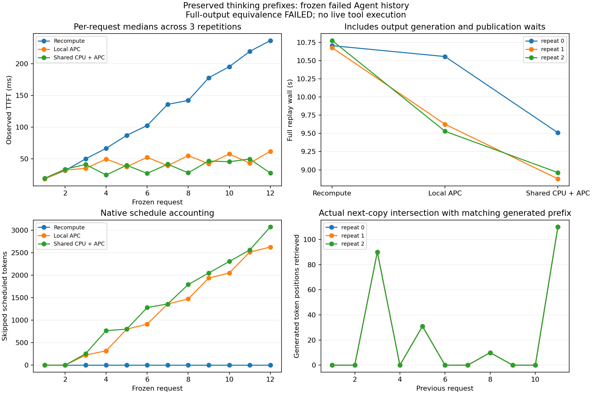

# 实验9-7：保留历史前缀后的真实共享KV回放

保留原历史每个assistant的4个空thinking token后，两个交替引擎之间**确实取回了上一轮生成的KV**。但共享池在每次重复的第9个请求提前输出`finish`，本地缓存与重算则继续写文件；严格输出等价门槛仍未通过，不能报告同等质量的加速。

## 正式结果

三条件各12请求×3重复，共108次完整生成，全正常stop。每条件/重复启动两个独立引擎；不是在原运行上补跑相同请求。新的冻结输入合计19820token，原历史输入19556；CPU序列化检查已证明保留方式可保持旧完整消费前缀，但新模型输出仍可能偏离冻结历史。

| 条件 | 对同重复重算输出完全一致 | 每重复调度token | 每重复跳过调度token | 三次12请求wall（秒） |
| --- | ---: | ---: | ---: | --- |
| 无缓存重算 | 参考 | 20564 | 0 | 10.7049 / 10.6762 / 10.7747 |
| 本地APC | 36/36 | 6356 | 14208 | 10.5550 / 9.6252 / 9.5289 |
| 共享8GiB CPU池+APC | 33/36 | 4269 | 16240 | 9.5089 / 8.8753 / 8.9617 |

本地与共享也仅33/36相同。共享第9请求输出70token的finish，其他两条件输出125token的write_file；三次均如此。共享每轮比本地少调度2087token，其中2032是额外跳过的工作，55来自输出缩短，不能把2087都归为KV收益。此处没有隔离造成输出分歧的数值或实现原因，不声称缓存损坏。

42次write_file只有一个唯一程序，原六用例独立检查仍为2/6；finish文本声称实现正确不构成任务成功。原任务本就失败，新回放不执行工具，不把新输出接入下一轮。三条件相对原冻结输出分别每轮11/12、11/12、10/12一致；真实后继输入完整保留实际消费前缀分别10/11、10/11、9/11，不能把CPU检查的11/11直接套到新输出。

## 实际生成KV与取回证据

共享每轮8次native retrieve提交，所有观察到的完成状态均成功。每轮写入241个生成token位置，下一轮实际copy区间与上一轮匹配生成前缀的交集也合计241：

| 上一请求（从1计数） | 下一请求 | 取回的上一轮生成token位置数 |
| --- | --- | ---: |
| 3 | 4 | 90 |
| 5 | 6 | 31 |
| 8 | 9 | 10 |
| 11 | 12 | 110 |

三次重复的交集相同。独立复核逐项检查前一请求store范围覆盖、最后成功store future晚于最后store提交且早于下一retrieve、下一retrieve成功完成晚于提交。12组衔接全部通过。native提交时token数组SHA与实际prompt+generated token前缀相符，实际copy排除skip_first_n_tokens。这里证明真实提交范围和完成状态，未用GPU张量逐元素比对或通信抓包；也不把所有241位置都称为一次连续的大块。



图提供SVG。TTFT是应用观察值，wall含生成、publication等待及控制/遥测，排除模型初始化、独立短预热和工具执行；不是完整Agent任务用时。共享主机，不与上一轮旧模板运行作因果耗时对比。

## 配置、复现与封存

固定Qwen3-8B revision `b968826d9c46dd6066d109eabc6255188de91218`，BF16权重/KV、TRITON_ATTN、eager、同步调度、chunk256、maxlen12288、每引擎2GiB KV；共享池为LMCache MP非lazy LRU 8GiB。vLLM0.23 / Torch2.11cu130 / LMCache0.4.7，使用已安装私有环境。三重复采用循环条件顺序，每条件新引擎及新共享池，每引擎单独17token短预热，正式输出上限1200。

`prepared.json`在运行前冻结；脚本在本目录，运行时源码快照保存在`runs/preserved-001/executed-source`，后处理脚本以根目录最终版为准。权重使用RTX已有固定缓存，不重复复制。本目录独立脚本不调用calculations或其他实验脚本；复现可安装相同环境并更新固定revision的本地模型路径。

```sh
/path/to/runtime-python -B resource_guard.py --out runs/new-guard -- \
  /path/to/runtime-python -B run_history.py --prepared prepared.json --out runs/new
python3 -B analyze_history.py --run runs/new --out new-analysis.json
```

当前正式结果的离线复核：

```sh
python3 -B review.py
python3 -B check_code.py
/path/to/runtime-python -B audit_tokenizer.py --model /path/to/fixed-model
/path/to/matplotlib-python -B plot.py
```

549分析检查与100基础复核、12组store/copy完成时序核验；临时目录重新分析逐字一致。独立代码测试原始JSON保存在code-quality.json。实际运行句柄88426 exit0、281.239秒，guard无终止原因、无残留。任务采样GPU峰38018MiB、RSS进程求和峰17940623360bytes、系统可用内存最低65325805568bytes；RSS非独占且采样可能漏短峰。退出后仅原有四GPU服务，本轮未停止服务。

本目录仅一次成功正式运行；输出等价失败和代码失败是科学负结果，完整保留。跨主机、每步远程访问和真实PD交接不在本次实跑范围，9-7总体仍为partial；计算任务与最终跨session论文审计未动。
