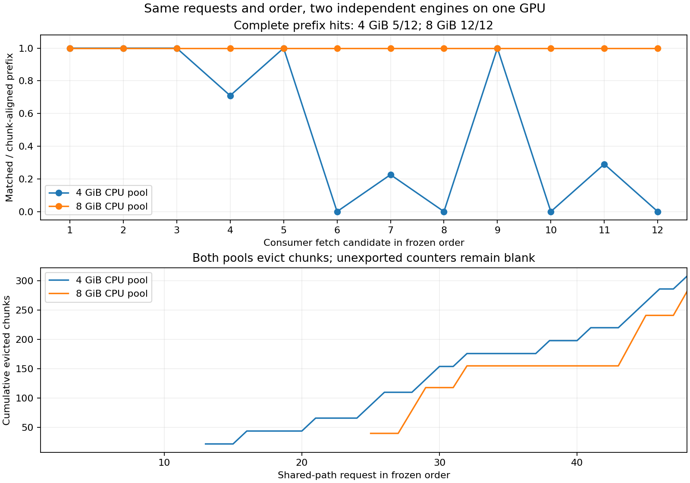
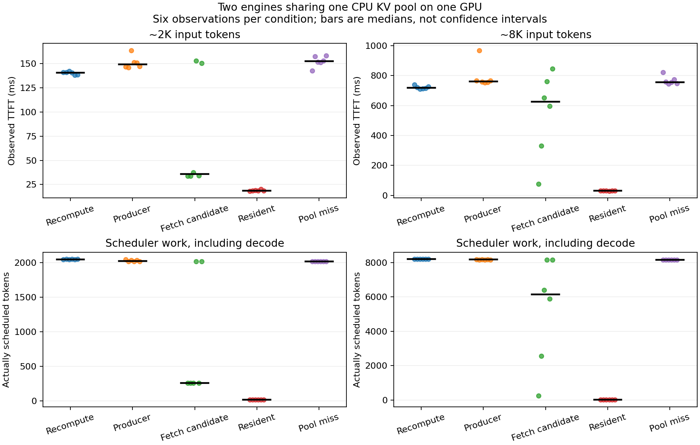

# 9-7：两个独立引擎共享 CPU KV 池

同一台 RTX PRO 上的两个独立 Qwen3-8B 引擎已完成真实 KV 写入、跨引擎取回、本地驻留和未命中对照。4GiB／8GiB 池各保存72条正式记录，共用24条已经完成的重算参考，最终数据包含120条不同的正式推理记录；两组答案均72/72正确，输出token与对应参考完全一致。它们是固定长文本查找任务，不代表一般Agent质量。

| 实际观察 | 4GiB CPU池 | 8GiB CPU池 |
|---|---:|---:|
| 首次取回候选 | 12 | 12 |
| 完整块对齐前缀命中 | 5 | 12 |
| 部分前缀命中 | 3 | 0 |
| 零命中 | 4 | 0 |
| 再次请求时实际retrieve提交 | 0/12 | 0/12 |
| 最后一次采样累计回收chunk | 308 | 282 |
| 约2K首次取回候选TTFT中位数 | 35.86ms | 33.22ms |
| 约8K首次取回候选TTFT中位数 | 624.39ms | 71.09ms |

8GiB池也发生回收，但本轮新写入的前缀在消费者请求时仍完整可用。不能仅用“发生了回收”判断复用收益，也不能把lookup显示命中当作发生了真实取回。12次再次请求均无retrieve提交，即使daemon的lookup已变为0，仍可使用引擎本地KV。4GiB的部分／零命中全部保留，没有删掉慢点。





## 实际配置与边界

- RTX PRO 6000 Blackwell，同一GPU上两个独立引擎进程，独立LMCache daemon CPU池；原有四个GPU服务保留。不是跨主机、跨NIC测量，也没有执行PD角色分离或每步远程KV读取。C50计算不重复。
- 固定Qwen3-8B revision `b968826d9c46dd6066d109eabc6255188de91218`，BF16权重/KV、TRITON_ATTN、eager、同步调度、单请求、chunked prefill 256、最大长度12288，每引擎KV预算2GiB。原生实际KV池910块、2146959360bytes。模型12个配置/权重文件共16395827868bytes的SHA保存于4GiB运行的`post-run-environment.json`，没有把权重复制到本目录。
- vLLM0.23.0、Torch2.11.0+cu130、LMCache0.4.7、CuPy CUDA13x14.2.0。LMCache固定commit `307439a1d7a4eb49fcaac1b565ad5c3b3b3f918f`，118份来源SHA见`source-manifest.json`；实际安装源码与CUDA扩展身份另存。私有环境复用已有Torch/vLLM，未改变共享环境。安装报告和最终环境列出确切依赖；未选择的云存储/GDS/NIXL后端不声称可用。
- baseline关闭APC且不接共享池；producer/consumer开启APC。CPU池为非lazy分配、LRU，其余配置与请求顺序不变。每个引擎单独执行一次短预热，原始输出另存，不混入72条正式记录。
- `formal-inputs.json`冻结三轮×约2K/8K×两个答案×main/miss，共24条输入。先完成24条baseline，再对12条main执行producer→consumer首次取回候选→consumer再次驻留→配对新前缀miss。8GiB对照在4GiB结果后单独冻结于`capacity-control.json`，没有事后改动原轮输入。

两组按阶段先后运行，参考引擎与共享引擎的常驻资源不同，观察钩子、遥测请求和共享主机活动均可影响时间。每长度仅六个观察点，且使用重复的查找任务，不给置信区间、稳定因果速度倍数或跨硬件结论。TTFT是应用层流式输出观察，不是纯prefill kernel时间；调度token包含实际生成步骤。

## 机制证据与独立复核

`shared_connector.py`调用原生适配器并记录store/retrieve提交、原生future的实际结果、token范围、块ID和lookup。消费者请求在最后完整前缀块写入future成功之后发出。同一请求分块写入会替换待查future，7个store提交可能只观察到最后一个成功future，不能声称拿到7个独立ACK。这里没有导出全量KV张量，不声称KV逐位相同；核验的是原生复制完成、正常输出及完整输出token相同。

vLLM为请求ID追加8位随机后缀，按安装源码及唯一匹配关联外部请求与原生事件；不以模糊前缀匹配混入另一请求。`scheduler_observer.py`记录实际调度token和原生块状态；参考每条调度量均等于input+output−1，驻留请求仅剩块边界尾部及生成步骤。`generation_probe.py`保存实际KV tensor布局、storage和CUDA分配信息。

每条共享路径请求后保存daemon `/metrics`原文，共48份/组。最初尚未导出的计数保持null和绘图空白，不伪造0。回收计数单调性、全部miss/producer的零外部命中、24次驻留无retrieve、实际retrieve成功、质量、执行源码及两份报告重放共814项核验通过。`tokenizer-verification.json`还独立重新decode两组各72条输出并核对EOS，全数通过。

4GiB／8GiB共享运行的监控采样GPU峰均38010MiB，进程RSS求和峰分别14268178432／18033442816bytes；系统可用内存采样最低118685048832／115223597056bytes。RSS求和不是独占物理内存，采样也可能漏过短峰。这些监控对应共享路径运行，不冒充此前独立baseline的完整资源轨迹。两组guard均exit0、无终止原因、无残留；完整原始记录与最后GPU进程列表保留。

## 单独运行与重放

在具备上述CUDA/Torch/vLLM/LMCache依赖的Linux环境中，本目录脚本可单独运行，不调用其他实验或calculations脚本。RTX使用本目录私有`.venv`，model路径须指向上述固定revision；重新取数需另选不存在的输出目录，不覆盖正式原件。

```sh
.venv/bin/python -B freeze_requests.py --model /path/to/fixed/model --out new-inputs.json
.venv/bin/python -B resource_guard.py --out runs/new-4g-guard -- \
  .venv/bin/python -B run_pair.py --prepared new-inputs.json --out runs/new-4g --pool-gib 4
.venv/bin/python -B resource_guard.py --out runs/new-8g-guard -- \
  .venv/bin/python -B run_pair.py --prepared new-inputs.json --out runs/new-8g \
  --pool-gib 8 --baseline-from runs/new-4g
python3 -B analyze_pair.py runs/new-4g --out /tmp/new-4g-analysis.json
```

复核已保存结果、重新绘图不启动模型：

```sh
python3 -B review_pair.py
/path/to/matplotlib-python -B plot_pair.py runs/formal-002/analysis.json --out shared-kv-results
/path/to/matplotlib-python -B plot_capacity.py
```

`runs/formal-002`和`runs/capacity008-001`是两种正式容量条件，均保留；`runs/smoke-004`是最终成功的六记录机制检查。原短案例参考启用APC、复用了32个公共前缀token，只用于机制，不当作全重算性能基线。被替代的启动/采集调试文件已经清理，成功输出、复用baseline及其执行源码保存在最终目录。源文件与原始记录以manifest封存。
