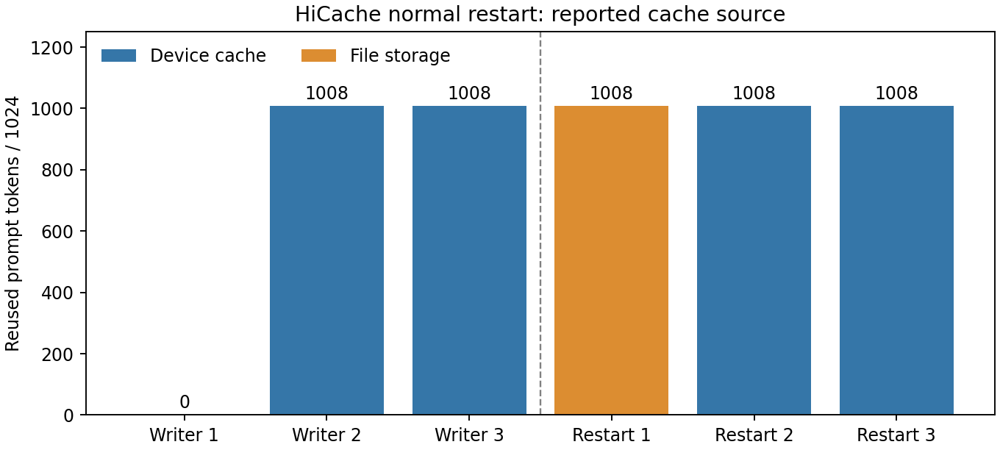

# 9-8：HiCache 文件后端与正常重启恢复（部分完成）

RTX PRO 6000 上，SGLang 0.5.13.post1 的原生 HiCacheFile 完成 Qwen3-8B BF16 写入及独立进程重启读取。固定 1024 token 输入、16 token 强制输出，每个进程连续请求三次。新进程首请求实际读取 64 个文件，报告从存储复用 1008 个 token；之后两次从显存复用。六次完整输出相同。



| 观测 | 写入进程 | 重启进程 |
|---|---:|---:|
| 首请求缓存 token | 0 | 1008，来自文件存储 |
| 后两次缓存 token | 1008，来自显存 | 1008，来自显存 |
| 成功 get 调用 | 0 | 64 |
| set 调用 | 65 | 1 |
| 首请求完成时间 | 15.309 s | 1.222 s |

首个写入请求包含 JIT 编译，因此表中时间只是运行记录，不估计重启加速。单次重启不报告有代表性的恢复 p95。65 个文件每个 2,359,296 字节，合计 153,354,240 字节（146.25 MiB）；64 次 get 对应 150,994,944 字节（144 MiB）。实际读取 1024 token 对应页，但引擎报告可复用前缀为 1008；文件读入量与有效复用量分别记录。

storage_trace.py 包装原始 HiCacheFile.get/set，原调用结果不变，记录时间、成功状态、文件大小和进程 PID。文件大小不能当物理磁盘 I/O：页缓存未清理，set 对已有文件可能直接返回成功。新进程的一次 set 不代表又写入一个完整文件。生产者和消费者的65文件清单与哈希相同；storage-v3 保存实际文件供离线验证。文件采用 fromfile/tofile，未显式 fsync／原子发布，本实验不证明断电持久性、损坏检测或崩溃一致性。

协议见 [PROTOCOL.md](PROTOCOL.md)，环境安装、CUDA JIT 链接修复及失败历史见 [ENVIRONMENT.md](ENVIRONMENT.md)。源模型固定为 config.json 的 snapshot，完整输入、输出、缓存字段与服务器信息在 results/，安装源码在 source-snapshots/，启动日志和环境版本一并保留。所有失败启动不计入有效结果。raw.json 中 status=passed 仅表示运行完成，完整正确性判定由 analyze.py 另行执行。

离线复核与绘图（从仓库根目录）：

```sh
python3 experiments/ch09/09-08/analyze.py
experiments/.venv/bin/python experiments/ch09/09-08/plot.py
```

远端重跑须使用新的输出和存储目录，按顺序等待前一个进程正常退出：

```sh
sh launch.sh --phase producer --output results/producer-new --storage storage-new
sh launch.sh --phase consumer --output results/consumer-new --storage storage-new
```

当前只完成正常重启的功能性子实验，实验9-8仍为partial。Agent轨迹、HBM/DRAM/SSD/远端容量扫描、全量/周期保存/重算、V4压缩与窗口状态、失效和故障恢复、预取与任务完成时间分布均保留待做。该单GPU顺序实验不替代异构PD、网络传输或LMCache比较。`calculations/` 未修改或执行；最终论文及另一session增补复核，仍待首轮所有实验完成后进行。
