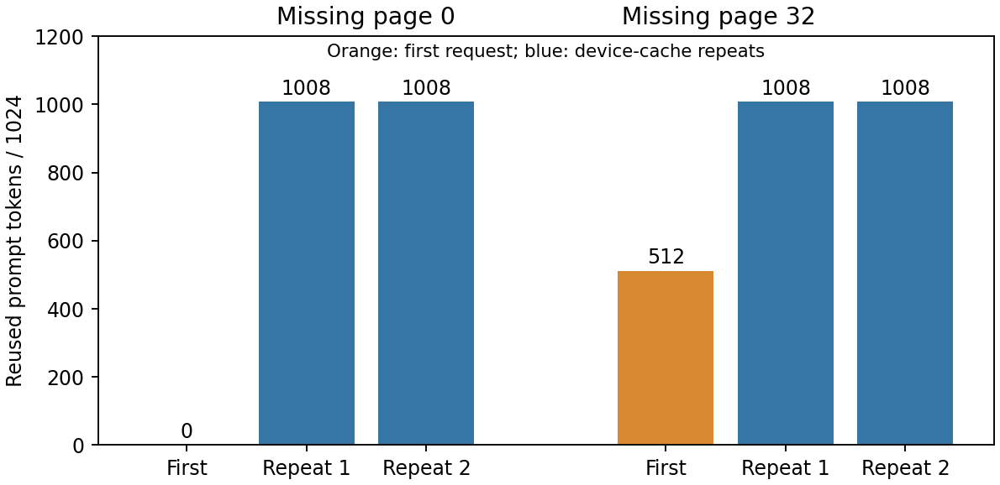

# 9-8 补测：文件缺页、重算与数值边界

同一 Qwen3-8B BF16 输入，在两个独立存储副本中分别缺失第1页与第33页。每种条件重启独立SGLang引擎，连续3次完整请求。原始成功存储未修改；准备清单逐文件记录遗漏项与复制前后哈希。



| 条件（页索引从0开始） | 首请求存储命中 | 实际get | 重新生成缺页 | 后两次显存命中 |
|---|---:|---:|---|---:|
| 缺页0 | 0 token | 0 | 是，原页逐位一致 | 各1008 token |
| 缺页32 | 512 token | 32页／72 MiB | 是，原页不逐位一致 | 各1008 token |

六次完整输出均与原实验相同；两种条件下其余64个文件保持原哈希。缺页32之后虽仍有其他文件，后端只接受连续前缀，实际get止于缺页前。首条件首请求含独立JIT编译，不能用完成时间比较速度。本轮每条件一次重启，不报告恢复p95。

**输出一致不等于KV逐位一致。** 按实际 `layer_first` 布局，页为BF16 `[2,36,16,8,128]`，布局依据封存的 memory_pool_host.py.snapshot。缺页32重算页的1,179,648元素中995,403与原页不同，最大绝对差26.75；首层K/V相同，后续层出现差异。实际重算页与原始页均保存，比较脚本同时确认所有值有限。

为检查分段执行本身的影响，另起独立引擎先运行512输入，再运行1024输入。初版前置生成16token导致实际复用528token，保留为条件不匹配的诊断。v2前置只生成1token，实际字段确认完整请求从显存复用512、从存储复用0；其3次完整输出也与参考相同，但重算页与原整段预填页仍有1,021,226元素不同，最大差13.5625。显存分段与文件恢复页之间亦有992,972元素不同，最大差26.53125。

这说明本例在显存分段路径也出现了KV变化，但并未隔离全部前缀生成、形状和数值因素，不能唯一归因于舍入，也不能据此排除存储路径问题。该合成输入下输出相同，只证明本次请求的有限行为，不推广任务质量或KV数值等价。更严格的同一前缀张量、调度形状和逐层比较仍待。

从仓库根目录复核：

```sh
python3 experiments/ch09/09-08/missing-pages/analyze.py
experiments/.venv/bin/python experiments/ch09/09-08/missing-pages/compare_kv.py
experiments/.venv/bin/python experiments/ch09/09-08/missing-pages/plot.py
python3 experiments/ch09/09-08/missing-pages/verify_manifest.py
```

本子目录是独立实验9-8目录内的补测，使用父目录封存的storage-v3及原consumer轨迹作输入；不必重跑原实验。prepare.py只创建新副本，路径已存在即拒绝，run_cases.py顺序启动两引擎。需重跑时在9-8目录的新副本内运行，先依ENVIRONMENT.md准备专用环境；不覆盖此处已封存结果。显存对照由run_device_prefix_v2.py与launch_device_prefix_v2.sh执行，必须使用新的输出及存储路径。

父实验README对读实现的概称在PROTOCOL.md有勘误：原get是open/readinto、set为numpy.tofile。所有原封存文件保持不变。容量扫描、Agent轨迹、损坏/不兼容状态、写入中故障、保存策略、V4压缩窗口、远端及多级比较仍待，9-8保持partial。原GPU服务及calculations未动，最终跨session复核未开始。
