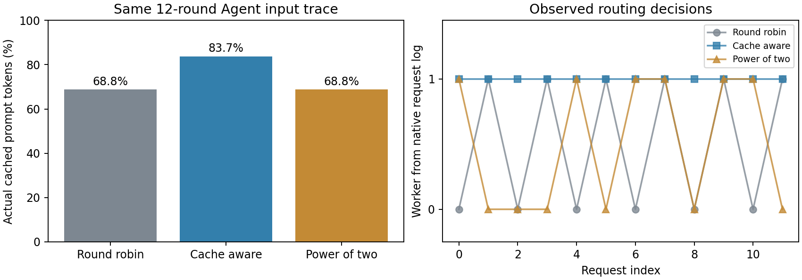

# 9-9：两个真实worker的原生缓存路由（部分完成）

SGLang 0.5.13.post1的两个独立Qwen3-8B BF16 HTTP worker共用一张RTX PRO；另用独立环境的原生Router0.3.2，依次运行round_robin、cache_aware和power_of_two。每组重放同一实际12轮Agent输入，每次强制1输出token，串行完成再发下一次。每组开始前清空两worker前缀缓存，并重新启动router。36个响应均与各自输入对应的其他策略输出一致。



| 策略 | 真实缓存token / 输入token | token加权命中率 | 有命中请求 | 本组完成时间中位 |
|---|---:|---:|---:|---:|
| round_robin | 13458 / 19556 | 68.82% | 10 / 12 | 45.524 ms |
| cache_aware | 16376 / 19556 | 83.74% | 11 / 12 | 32.770 ms |
| power_of_two | 13458 / 19556 | 68.82% | 10 / 12 | 43.371 ms |

worker原生JSON日志确认轮转交替选择0/1；缓存亲和把12请求全部送到worker1；power_of_two在两实例间选择，完整序列见summary.json。命中率取模型响应cached_tokens，不使用router的预计命中计数替代。两worker没有启用HiCache或远端KV，故不是远端取回实验。

这仅说明这组串行Agent输入的缓存行为。每策略只跑一组、固定顺序，未施加排队压力；power_of_two也不能在这种条件下代表已验证的队列优先优势。sample p95保存在summary.json，但只有12点，且为客户端整个请求用时，不是远端取回p95、稳定服务SLO或TTFT/ITL完整测量。两个实例共享一张GPU，也不代表跨机扩展效率。

输入来自第3章实际代码Agent的12轮失败任务记录，沿用第8章封存的token输入；本次不执行工具，也不声称Agent任务成功。运行前用固定模型tokenizer解码，再编码必须逐token完全一致；实际worker prompt_tokens再次与输入长度匹配。输出只有1token，不能由此推断模型任务质量。summary.json另保存同worker相邻请求间隔，这是本次串行重放间隔，不是原始工具耗时或真实线上复用间隔。

配置和执行边界：两worker各max_total_tokens=8192、max_running_requests=8、chunked_prefill_size=2048、BF16/Triton、mem_fraction_static=0.25。虽然命令设置disable-cuda-graph，当前版本仍捕获分段预填图，实际日志保留；本实验不是全程eager。完整命令、进程退出码和执行源码哈希在results/execution.json，router版本/依赖/二进制哈希另存。所有服务仅监听loopback。

正式流程等待 /workers 显示两实例，保留注册状态并离线核验两者 is_healthy 均真。确认端口无监听后，预检使用 SO_REUSEADDR。run-v3 是正式36请求记录，三种策略均 completed，summary.json 的 status 为 verified。

离线复核及绘图：

```sh
python3 experiments/ch09/09-09/analyze.py
experiments/.venv/bin/python experiments/ch09/09-09/plot.py
python3 experiments/ch09/09-09/verify_manifest.py
```

实际运行脚本为run.py，需同9-8说明的专用SGLang环境及CUDA13布局，另安装`sglang-router==0.3.2`到tools/router032-venv。脚本引用9-8已编译缓存路径，只复用编译产物，不执行旧实验。重跑须新目录且results不存在；模型和环境绝对路径写在脚本顶部。原生路由器接口说明见[官方文档](https://github.com/sgl-project/sglang/blob/main/docs/advanced_features/sgl_model_gateway.md)，实际选项以本次router-help.txt为准。

正式请求结束后主动停止router与worker；router退出0，worker在SGLang进程组清理中退出-9。post-cleanup.json记录无自建进程组成员，GPU仅剩原服务。未修改/执行calculations，未重跑原缓存恢复。

9-9仍partial：Chat输入、真实队列压力、预测完成时间策略、淘汰与重启偏差、多轮随机重复、远端缓存层级/取回及完整质量仍待。没有把本基础实验缩写成题目要求的完整路由比较；最终跨session增补与论文复核尚未开始。
