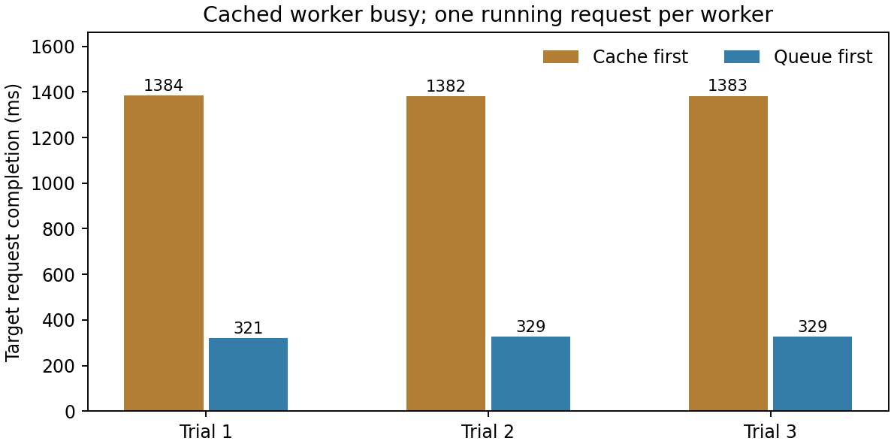

# 9-9 补测：缓存实例忙时的目标完成时间

两个独立Qwen3-8B BF16 worker共用RTX PRO，每实例max_running_requests=1。worker0预热实际Agent末轮3136-token输入，worker1保持冷缓存；worker0开始无关输入的128-token生成，经原生/get_load确认有工作后发送目标请求。客户端分别按缓存优先、当前num_reqs最小选择实例，各3轮，轮内顺序由seed909随机决定。



| 实际观测 | 缓存优先 | 负载最小 |
|---|---:|---:|
| 选择实例 | 已缓存且忙的worker0 | 冷缓存且空闲的worker1 |
| 目标缓存命中 | 每次3135/3136 token | 每次0/3136 token |
| worker0等待队列采样峰值 | 每次1 | 每次0 |
| 目标完成时间中位数 | 1.382795 s | 0.328635 s |
| 后台生成完成时间中位数 | 1.355724 s | 1.544837 s |
| 两任务全部完成中位数（从后台发出算） | 1.384443 s | 1.544837 s |

六次目标输出与预热及相互之间一致。缓存优先确实命中，但目标排在后台生成之后；在本条件下，去冷缓存实例能更早完成目标。这不是整机收益：两个进程共享GPU，冷缓存计算与后台生成同时运行，后台任务更慢，两任务全部完成时间反而增加。原始忙请求、目标请求的开始/结束时间都保存，不把目标局部收益替代完整负载收益。

每条件包含清空缓存、预热、一个后台请求和一个目标请求，共18个真实生成调用；表中目标时间不包括预热准备。目标强制输出1token，后台强制128token，不评价任务质量。负载接口采用该安装版本的/get_load（源码兼容/v1/loads的旧字段）；num_reqs含运行与等待。决策时worker0至少有一个请求、worker1为零，分析脚本逐组核对，不按预想状态直接分类。

采样间隔配置10ms，实际调用开销和间隔保存在samples中；队列峰值为离散观测，不是精确排队持续时间。轮内顺序随机但只有三轮；两worker共用GPU、观测开销及其他原有服务仍在，不能推广到两台独立机器、线上p95或任意背景长度。busy_remaining_at_dispatch_s是事后按真实结束时间计算的观测量，不是路由时可用的预测。

这是两个明确客户端规则的对照，不是原生Router实现，也没有冒充完成时间预测。此前轻载三种原生策略结果仍原样封存；本轮不直接与其延迟数值作同条件比较。worker默认分段预填图仍启用，完整命令见worker-command.json及执行记录。

离线复核：

```sh
python3 experiments/ch09/09-09/queue-pressure/analyze.py
experiments/.venv/bin/python experiments/ch09/09-09/queue-pressure/plot.py
python3 experiments/ch09/09-09/queue-pressure/verify_manifest.py
```

独立重跑使用本目录的新副本，在既有专用SGLang环境执行run.py，results存在即拒绝覆盖。模型/环境路径在脚本顶部，编译缓存沿用09-08目录，只复用编译文件，不执行旧实验。两worker监听loopback 31191/31192；仅清理自建进程组。results保留完整输入、每轮实际次序、负载快照、请求与worker日志、源码哈希及退出记录。

9-9仍partial：完成时间预测规则、Chat轨迹、背景长度/并发扫描、缓存淘汰与重启、跨机器/远端取回、更多随机重复和完整质量仍待。calculations及原有服务未动，最终跨session复核未开始。
