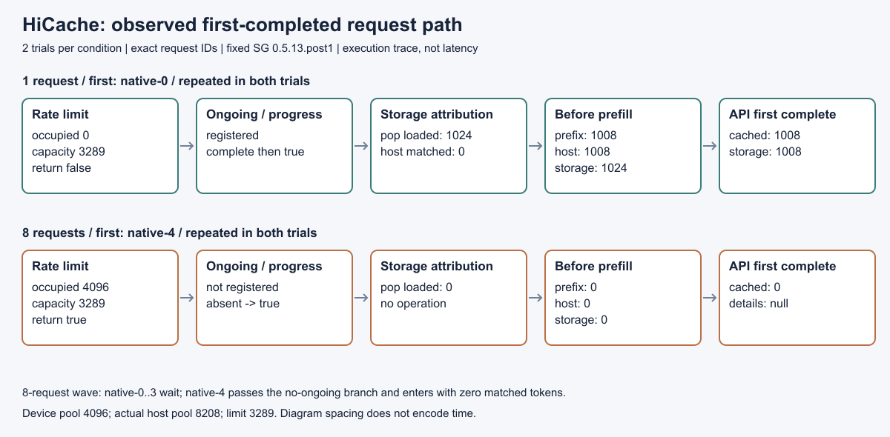

# 9-10 HiCache 分支观测（待主 agent 统一复核）

四组18请求完成，定位到本批两轮 8 请求波的真实执行路径：首完成请求均为 `native-4`，它在 prefetch 占用4096、限额3289时被限额分支跳过，没有登记 ongoing；scheduler 对该请求的 progress 检查走“无 ongoing → True”，pop loaded 为0，实际 prefill 入选时 prefix/host/storage 长度均0，最终 API cached_tokens=0。判断来自同请求ID的实际事件链，不是从文件get成功反推。

| 条件 | trial | 首完成 request ID | prefetch占用 / 限额 | pop loaded | prefill prefix / host / storage | API cached |
|---|---:|---|---|---:|---|---:|
| 单请求 | 0 | native-0 | 0 / 3289，未限额 | 1024 | 1008 / 1008 / 1024 | 1008，storage1008 |
| 8请求波 | 0 | native-4 | 4096 / 3289，限额 | 0 | 0 / 0 / 0 | 0，详情null |
| 8请求波 | 1 | native-4 | 4096 / 3289，限额 | 0 | 0 / 0 / 0 | 0，详情null |
| 单请求 | 1 | native-0 | 0 / 3289，未限额 | 1024 | 1008 / 1008 / 1024 | 1008，storage1008 |



实际 device token pool 是4096，ServerInfo 的 max_total_num_tokens 和所有 internal_states.memory_usage.token_capacity 双字段一致；controller 实际 host pool 是8208，因此源码 `.8*(8208-4096)` 取整限额为3289。max_running_requests=1，8请求波指客户端同时未完成请求，不是8个GPU同时decode。每组同一1024输入、16强制greedy输出、固定模型revision、全65文件fixture、mem_fraction_static=.75、wait_complete均保持。

两轮波中 native-0～3 分别在 occupied=0/1024/2048/3072 时通过限额检查并登记1024长度预取；native-4～7 均在 occupied=4096 时限额。实际事件显示 native-0～3 的 progress 先返回 False（源码1374行），随后 native-4 的 progress 从1361行返回 True。其 prefill 入选及首完成顺序经单调时钟交叉验证，API meta_info.id 精确等于 native-4。不存在靠默认 index0 认定首请求的步骤。

波中 native-0～3 后续各记录 completed_tokens=1024、host 插入 matched_length=1024，故 loaded_from_storage=0，pop为0，进入prefill时 device prefix=1008、host=0。这是实际重复匹配/请求归属证据；仅凭本观察范围，不进一步断言所有内部树节点由哪个写入调用创建。单请求则 completed=1024、matched=0、loaded=1024，prefix匹配受保留末token及16-token分页约束为1008，API storage分项由host有效长度截取为1008。原始 operation 的64个共享hash key按请求保存在 prefix-key-evidence.json，不重复旧storage-only计数。

`request-chains.json` 包含全部18请求的分支、入选及API关联；`REQUEST-EVIDENCE.md` 给出四个首完成请求的PID/seq索引。`results/*/events.PID.jsonl` 保存全部事件，无抽样。line事件在该行执行前，return事件保存实际返回；不把line前快照解释为该行执行后的值。每组3个安装PID，实际分支事件在scheduler子进程中，全部安装PID均在控制器实际观察的/proc后代集合中。原始事件带monotonic_ns、PID/PPID/TID、seq、request_id、固定输入SHA及operation keys。

固定 SG 0.5.13.post1 的五份相关原始源码独立保存在 `sources/`。`source-manifest.json` 与 `results/source-after.json` 的前后hash完全一致；其中controller/hiradix/scheduler与封存sources也一致。本批没有修改安装源码或替换分支，使用模块顶层sys.settrace/threading.settrace进入spawn；`observer.py` 是独立新观察器。额外执行跟踪会扰动时间，图不是时延图，本批不作性能比较或推广到其他容量/调度配置。

全部18输出ID和text精确等于独立保存的reference；`baseline.json` 保留封存native的18份原输出和固定文件hash。`reference-provenance.json` 另验证输出ID等于原9-8 missing-pages参考。旧实验README中单请求1008、波首完成0且256成功get/64key仍是封存对照，旧native缺日志已另补完成，本目录不改写或重跑那些结果。

GPU释放文件来自主agent，启动前及每组前独立检查其中2490395、2531457在远端/proc不存在且无GPU占用，证据在 `results/gpu-release-proof.json`。四worker、controller、SSH执行和原始数据下载均exit0；GPU采样峰值17290MiB，低于24576MiB预算。每组 `process-final.json` 中全部自有PID为null，最后 `remote-evidence-verification.json` 再核实worker/所有已观察后代/controller/launcher均不存在，GPU表仍只有原五服务。控制器 cleanup.json 四组均为空，没有额外发清理信号；Engine自身shutdown保持原语义。

子进程没有Python atexit事件，不能把它写成“子进程正常exit0”；子进程证据是/proc退出和显存释放，worker/controller返回码为0。额外分析检查曾误要求每个安装PID都有atexit，失败版本 `analyze-exit-assumption.py` 和 `analysis-failure.json` 已保留，修正为分别报告atexit缺失与实际退出，未复跑请求。CPU仪器检查仅验证返回位置，不计入GPU实验数据。Quick Look首版缩略图裁切失败也保留，最终用rsvg-convert渲染并目视QA通过，见figure-qa.json。

离线分析仅需Python标准库：

```sh
python3 analyze.py
python3 plot.py
rsvg-convert -o branch-flow.png branch-flow.svg
```

运行器可独立复制到相同固定SG环境的一个新实验副本；不得覆盖本批results。提供主agent新释放文档及其明确PID，保持固定模型/fixture可读：

```sh
/home/ubuntu/ai-infra-book-experiments/tools/sglang0513-venv/bin/python run.py \
  --release GPU-RELEASE.json --released-pids 2490395 2531457 --output NEW_RESULTS
```

这是本批实际PID示例；新授权使用新的明确PID及释放证明，不能伪造或仅依赖旧状态。runner使用端口18190（18191保留未用）、4线程环境、单worker、600秒worker/120秒波上限，按/proc PPID与starttime记录所有权，仅可能清理自己核实的PID，等待显存释放。`launch.py` 保存本批controller真实退出。默认fixture来自9-8/storage-v3，或用`--cache`提供hash一致的65文件；远端四份独立fixture副本保留，本地不复制重复storage目录，所有原始事件/输出/准备验证均已传回，77份原始结果文件逐字节对齐远端hash，本地大小约71MiB。

本交付只完成此有界分支观测，供主agent统一复核回填。没有修改两个封存实验、正文或全局进度；没有运行calculations、联系其他session、派生agent或git提交；不宣称全9-10完成。
