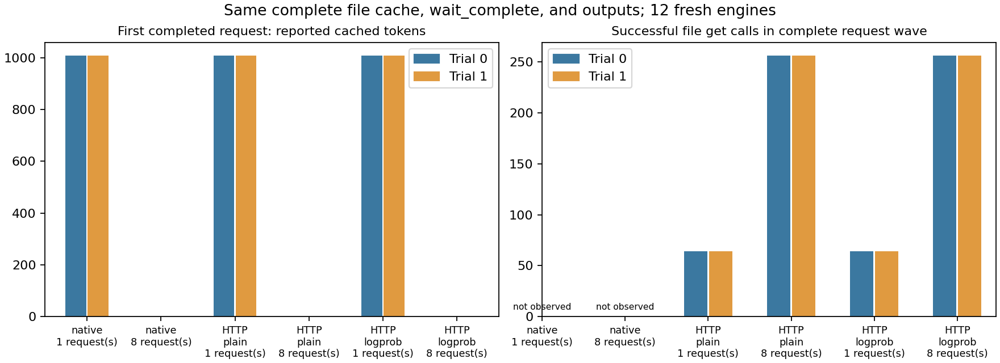

# 9-10 缓存首请求机制消融

12组54个请求已完成，完整输出ID与文本全部精确匹配参考。三个入口在两轮均显示：单请求的API缓存详情报告storage1008；8个同前缀请求波中首个完成请求cached0、详情null。内部max_running_requests仍为1，不是8请求同时GPU解码。结果不支持把此现象限定为HTTP或logprob开关，但具体根因尚未证实。

主agent接管后修正了离线分析的两个观测假设，初版保留为analysis-v1.py：原分析只在日志匹配max_total_num_tokens，native的worker日志没有该行；实际上12份server-info同时有运行时max_total_num_tokens=4096及internal_states.memory_usage.token_capacity=4096，现逐一交叉验证，存在的日志值也必须一致。容量证据并未缺失。

另一缺口是真实存在的：4个native条件均无storage.jsonl，本机与远端均核对缺失。当前代码在worker的native入口内安装补丁，是否进入另起的scheduler尚无直接证据，不能认为已成功观测子进程。native文件get数保留null，不填0、不从API命中反推调用数。HTTP的8条件有真实存储trace：单请求64次成功get；8请求波256次成功get。原计划要求的native文件调用观测尚未完成，需独立补充仪器检查，不能以图表完成代替此缺项。

analyze.py当前核验全部请求、运行配置、实际容量、输入缓存准备、来源hash与有记录的存储调用；summary标记completed_requests_partial_storage_observation。初版失败为native日志中pool_sizes=[]；不是模型失败或显存容量不符。原始请求和日志未改，也没有为修复分析器重跑请求。

本批GPU与已有49GiB服务共存，时间不作性能因果比较。主agent已经核验12个worker均exit0且未超时，results/execution.json记录12组完成。两个早期资源停止均保留：已退出进程仍短暂被nvidia-smi计入显存，初版和resume-v1源码/日志保存；最后版只增加对子进程树的实际观察与有限释放等待，并跳过已核验完成组，未重跑前三组。请求worker与引擎配置hash保持不变。

sources/保留此版本cache_controller、hiradix_cache、scheduler等代码。候选链为prefetch限额下部分请求不登记ongoing、就绪检查对没有ongoing的请求直接通过、随后同前缀插入影响归属；本批没有分支执行记录，不能把源码可行路径当作已证明原因。

[独立native观测补测](../native-storage-observation/README.md)另外完成4组18请求，以模块级钩子覆盖实际spawn子进程，记录其安装与get PID，单请求64次get/1008命中、8请求波256次get/首完成0在两轮重复。新增数据与原数据分开，原native计数仍为null。

完整运行前约束及命令见PROTOCOL.md。独立复制本目录，固定SGLang环境执行run.py --output NEW_RESULTS，--cache可指定同65文件来源；旧模型路径及环境需存在。复算本批用python3 analyze.py，绘图用安装Matplotlib的python运行plot.py。分析与图已主复核，源码/原始缓存和请求/失败边界/来源与图一起封存，不声称9-10整体完成。calculations保持不动。
