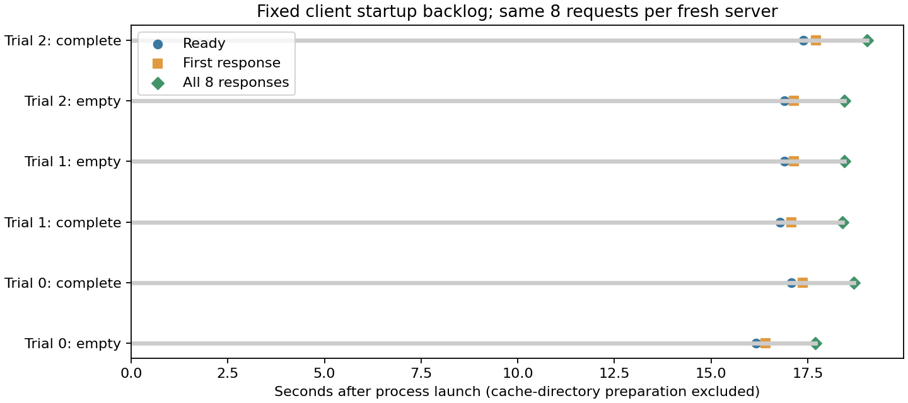

# 9-10 实际启动与客户端积压：完整文件没有形成首请求有效命中

RTX PRO 6000上完成SGLang0.5.13.post1／Qwen3-8B BF16＋HiCacheFile的空目录／完整文件目录启动对照。两组预热16请求、三轮交错正式48请求，全部完整16个输出token及文本与9-8参考相同。这里是固定输入回放，不是任务质量基准；16token强制长度结束不是自然答案成功。

**完整文件条件触发了真实存储读取，却没有形成首次有效KV复用。** 每组首个完成请求的cached_tokens均为0、details为null，后七个报告device1008；完整目录三正式组均记录256次成功get，对应64个不同key、603979776文件字节。空目录无get。不能把文件存在、get成功或读取字节当成API有效命中。

|三轮中位，从进程启动计秒|空文件目录|完整文件目录|
|---|---:|---:|
|health就绪|16.890|17.083|
|首个响应完成|17.139|17.379|
|全部8响应完成|18.441|18.696|
|就绪后到全部完成|1.542|1.613|

表中各行分别取三组中位数，不能把中位数直接相减当作另一行。只给本次观察，不宣称完整缓存成功加速、纯KV因果或稳定p95；更不能将9-8旧首请求含JIT的15.309/1.222秒直接并入这里。

## 固定条件与实际计时

两条件原样复用9-8配置：固定模型快照、Triton attention、PyTorch sampling、4096总token预算、max_running_requests1、chunk1024、page16、HiCache write_through和wait_complete。policy-review.json检查八组最终ServerArgs全部显式字段与输入一致，与旧consumer-v6配置也完全相同；没有因CLI漏参数变成best_effort。

首轮正式空目录之前，空和完整两条路径各进行完整8请求预热；TVM_FFI_CACHE_DIR和图配置固定，正式日志没有观察到额外编译记录。但没有逐组保存全部JIT缓存内容哈希，不能严格证明所有JIT状态相同，summary的speedup_claim_allowed仍为false。并发同前缀、HTTP/logprob返回、引擎初始化与9-8串行Engine入口不同，可能需要分开检验；当前未定位首次有效命中缺失的根因，不将候选解释写成结论。

每组八个请求计划在launch后0至0.7秒、每0.1秒到达客户端，实际到达时间保留。线程在health就绪后发送，因此这是客户端的启动积压，不是服务未启动就已接收HTTP，也不是稳定到达率扫描。health每100ms轮询，另有网络调用误差。首次发送与首次完成各按实际时间寻找，不固定index0；例如trial0完整条件首次发送index3、首次完成index4。

开始时刻是Popen前；不包含此前完整缓存复制和哈希检查，未计缓存目录准备成本。启动窗口包含引擎自身初始化/预热；64个请求数仅指脚本显式工作负载。全部完成是客户端全部响应收到，不是内部所有资源已释放。收尾另记reaped时间和退出码。

## 输出、存储与收尾证据

/generate使用固定input_ids和greedy/ignore_eos，return_logprob提供完整输出ID；分析实际读取两预热及六正式组每个请求，核验64个输出和时序，没有仅以主程序通过间接填成功数。cached_tokens_details缺失保持null，不补为零；原始服务日志同时保留首实请求new-token1024/cached0及后续1008缓存记录。

storage_trace是9-8原样包装，成功get次数及对应文件大小为逻辑读取观测，不是磁盘物理I/O；相同64个key重复读取，总get字节576MiB不是唯一缓存容量。API报告与底层读取不同，二者均保留。所有组工作目录和完整缓存文件已拷回归档。

初次尝试完成8个空缓存预热请求后，下一组端口预检因TIME_WAIT失败。整批源码/结果/日志保存在startup-failed-port，8个输出另核验通过，未算进正式48或本轮预热16。修正仅在预检socket增加SO_REUSEADDR，未改变服务配置或输出门槛，随后新results完整重跑。因此全部保存的显式请求为72，正式评分48。

每组结束只终止本次process group并wait，SGLang在组SIGTERM后记录子进程退出和自身清理，实际server退出码为-9；这不是“所有服务自然exit0”。控制器完整批exit0，gpu-after仅原四个服务，GPU窗口已释放。清理日志与退出码保留，不把输出通过当作进程生命周期无异常。

## 独立复现与剩余范围

    /home/ubuntu/ai-infra-book-experiments/tools/sglang0513-venv/bin/python run.py --output results
    python3 analyze.py
    python3 plot.py

需相同私有SGLang环境及已验证CUDA/JIT路径，端口31410空闲。输入、配置、参考、来源和缓存清单在本目录。默认--cache指向9-8原始65文件，执行只读核验后复制到新目录，旧文件不改；独立搬迁可指定含同样文件的目录。也可使用本归档完整条件中的文件副本，但须先逐个核对cache-manifest列出的SHA。results存在拒绝覆盖。

分析只需标准Python；绘图需Matplotlib。原始日志、请求、完整存储副本、进程退出与GPU清理、失败批及源码都在manifest中。图已目视检查。没有修改calculations、旧封存件、正文或共享进展。

本项提供一套真实引擎＋文件后端的启动/积压记录，保留首次KV复用缺失的负结果。仍需更严格JIT状态证据、同前缀并发/串行/HTTP返回设置的机制对照、不同图规格和文件准备计时；异构PD/AF、权重分片加载、动态并行、视觉EPD及整个9-10尚未完成。首轮全部完成后的跨session与论文增补复核仍未开始。
