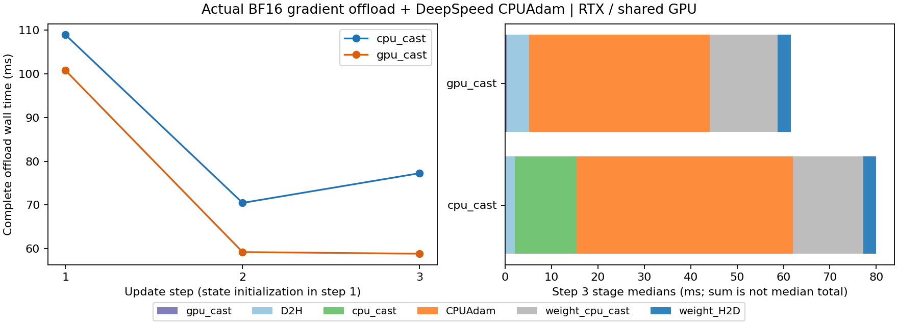

# 10-1：梯度转换、传输与真实 CPUAdam 更新

完整gate形状的14组42步全部通过数值检查，两条路径每一步的梯度、参数和Adam状态全张量SHA一致。第3步完整卸载墙钟中位数为CPU转换77.275ms、GPU转换58.851ms；GPU转换多传96MiB，但本实现CPU转换开销更大。共享RTX上的局部观测不能证明平台普遍收益，也不是GH200/SuperOffload或完整ZeRO-3训练复现。

## 固定工作与计时

[PROTOCOL.md](PROTOCOL.md)在运行前固定。随机FP32主参数与BF16 GPU线性层采用Qwen3-8B gate形状 `[12288,4096]`，每步32行固定输入和cotangent，执行真实前反向。线性内积损失的梯度不依赖权重；这是验证更新与数据搬运的夹具，不是训练好的模型、语言模型质量或收敛实验。

CPU转换路径把96MiB BF16梯度D2H到pinned内存，再转192MiB FP32；GPU转换路径先在GPU预分配FP32槽转换，再D2H 192MiB。随后均使用DeepSpeed0.18.0 CPUAdam更新FP32主参数，CPU转BF16并H2D回写96MiB GPU权重。各阶段串行等待，没有声称重叠。

每路径1组预热、5组正式、1组独立profiler，每组3步；正式顺序随机交错。小形状另有4组12步smoke。完整wall从已就绪梯度开始到更新GPU权重可用，包含阶段等待、CPUAdam与回写；前反向、分配、参考和验证不在wall内。第1步CPUAdam分配两个状态，不能与第2/3步混为稳态。每组重置相同初始状态，不是在一条42步训练轨迹上抽样。

|转换位置|第1步完整wall中位ms|第2步|第3步|第3步D2H中位ms|卸载区间CUDA allocator峰MiB|
|---|---:|---:|---:|---:|---:|
|CPU|108.936|70.482|77.275|2.095|209.250|
|GPU|100.792|59.230|58.851|4.892|401.250|

每格5次。第3步CPU转换本体13.351ms，GPU转换本体0.308ms；CPUAdam中位46.616/38.905ms也不相等，因此不能把总时差完全归因于转换位置。CPU缓存、共享资源与调度未隔离，未作因果消融或显著性判断。阶段中位数之和不等于完整wall中位数。



## 数值与实际字节证据

每步独立torch.optim.AdamW CPU FP32参考检查全部参数、一阶矩、二阶矩，固定atol2e-6/rtol1e-4，42步最大参数绝对误差2.981e-8；传输梯度和GPU权重回写均逐位通过。`records.jsonl`逐项保留误差与全张量SHA。

为离线验收另执行3步不计性能的 `capture_tensors.py`，保存完整梯度/参数/一阶矩/二阶矩；必须与原42步对应SHA逐项相同才接受。它不替换原计时样本。`verify_tensors.py`无需DeepSpeed/GPU/NumPy，从本批初始参数与梯度重跑独立CPU AdamW，并验证9个完整结果张量和存档SHA。原始输入及初始参数在 `results/fixture.pt`。

张量补存53381 exit0、完整传输56150 exit0；Mac独立Torch2.14.0 CPU复核71037 exit0，9个完整结果张量和全部存档SHA通过，详见tensor-evidence/offline-verification.json。该环境提示缺NumPy，但本验证采用ctypes分块hash，不使用NumPy。

两个实际Torch profiler trace各记录3次pinned D2H，CPU路径每次100663296字节、GPU路径201326592字节；各有3次pinned H2D、每次100663296字节。`results/trace-review.json`只列卸载的pinned传输；完整trace还包含前反向输入和未计时参考/验证的pageable传输，不能把它们计作训练卸载字节。

记录实际张量：FP32主参数、梯度、两Adam矩各192MiB，BF16主机回写槽96MiB；CPU路径额外pinned BF16槽96MiB，GPU路径额外device FP32槽192MiB。GPU参数与梯度各96MiB。CUDA峰还包含区间内仍驻留输入/工作区等，不能只加这几个矩阵推算；也不是nvidia-smi整进程、CPU RSS或主机pinned allocator缓存峰。参考和初始夹具驻留内存不属于被测CPUAdam状态，均在源码中明确保留。

## 环境与保留失败

RTX PRO 6000 Blackwell、x86 i9，Torch2.11.0+cu130、DeepSpeed0.18.0、CPU线程4。独立 `tools/deepspeed018-venv` 的existing_torch.pth只读引用SG环境Torch及依赖，未修改SG环境。DeepSpeed以--no-deps/DS_BUILD_OPS=0安装，CPUAdam首次使用时JIT编译；私有补齐py-cpuinfo9.0.0、hjson3.1.0、msgpack1.1.1。完整包清单、已安装CPUAdam/C++/builder源码、编译产物SHA和build.ninja在setup/sources。

最终 CPUAdam 环境补齐 cpuinfo、msgpack，并使用 probe.sh 中的独立 CUDA_HOME。cpuadam-probe-v3.log 记录三步 CPU 参考通过（74912 exit0）；smoke 运行59753、分析96012，完整运行91587、分析/来源采集21082及初次数据传输62679均 exit0。未改框架源码或数值门槛；最终 completed=true，14组42步，日志与张量证据保留。

五个既有GPU服务全部保留；8-5 worker的vLLM进程与本批共用GPU，setup/gpu-final.txt在本批运行进程退出后采集仍可见该worker。图只展示共享条件下实现观测。

## 重跑

在具有本目录所记依赖/工具链的RTX环境中，设置 `CUDA_HOME` 为匹配Torch13.0的nvcc/runtime根，`OMP_NUM_THREADS=4 MAX_JOBS=4 TORCH_EXTENSIONS_DIR` 指向私有编译缓存。执行：

```sh
python run.py --smoke --out new-smoke
python analyze.py new-smoke
python run.py --out new-results
python analyze.py new-results
```

结果目录必须不存在。源码不依赖相邻实验。plot.py固定读取本批results/summary.json；capture_tensors.py与verify_tensors.py固定复核本批results，不能悄悄替换为新批次。绘图用Matplotlib3.10.6，PNG/SVG均保存并目视QA。

尚未覆盖：改变真实链路吞吐、NUMA/亲和性消融、GH200/MPAM、super_offload优化器比例、完整ZeRO-3与Qwen训练、长程收敛。calculations未执行、修改或复制，最终跨session审计尚未开始。
