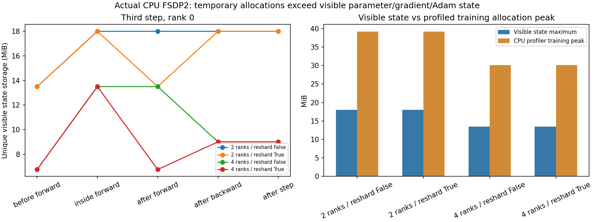

# 10-1：实际CPU FSDP2训练状态与临时聚合

四个正式配置（2／4进程，前向后重新分片开／关）各完成三步全参数AdamW，控制器及各worker均正常完成。逐rank重组后的参数、梯度和Adam一阶/二阶矩、step共180个张量检查全部通过独立未分片全局batch参考；最大绝对误差1.286e-6，未调整预设atol2e-6、rtol1e-4。

这是真实PyTorch2.14 FSDP2、CPU DTensor与Gloo执行，不是分片模拟。固定随机512→1536→512 SwiGLU三矩阵、32行全局batch，优化器和数据见PROTOCOL.md。它核验小模型框架路径，不代表Qwen全模型质量、DeepSpeed卸载或多GPU性能。

## 分片与阶段观测

完整参数为9MiB。实际DTensor本地参数2rank各4.5MiB、4rank各2.25MiB；前向内部参数恢复完整形状，梯度和Adam矩状态在训练后继续分片。相同阶段按底层storage身份去重，避免把别名重复相加。

| 进程数 | 更新后参数+梯度+Adam可见状态 | 前向内部可见状态最大 | 训练区域CPU profiler分配峰值（跨rank最大） |
|---:|---:|---:|---:|
| 2 | 18MiB+12bytes | 18MiB+12bytes | 39.156MiB |
| 4 | 9MiB+12bytes | 13.5MiB+12bytes | 30.141MiB |

12bytes为三个optimizer step标量。第三步前向后重新分片开启时，可见状态从18降至13.5MiB（2rank），或从13.5降至6.75MiB（4rank），随后反向还需梯度与临时工作。关闭时完整参数保留更久。本批两种策略的训练分配峰值相同，不能只按前向结束的状态容量判断整步峰值。



每rank真实trace含FSDP::all_gather、c10d::_allgather_base_、c10d::_reduce_scatter_base_等执行事件。峰值取训练step时间区域内[memory]事件的Total Allocated最大值，包含所观察到的临时聚合/计算分配，排除证据保存区域本身；完整trace仍含初始化和保存阶段。可见状态只是模型参数/梯度/优化器能直接枚举的存储，不能替代此分配观测。

Profiler计数是被PyTorch记录的CPU分配，不是完整进程RSS、系统物理内存、CUDA峰值或未被记录的原生库临时空间；不把它与RSS相加。没有隔离CPU频率与全部后台服务，不评价通信吞吐或训练加速。三个训练步验证有限数值路径，不证明收敛。

## 失败与修正保留

最终 torchrun 预检显式使用 127.0.0.1 和 lo0，66174 返回0；probe-rank0.json 与 probe-rank1.json 均为 passed。正式四配置训练完成，summary.json 的 status 为 passed。

pilot-v1的第一个2rank配置已完成三步，下一组在启动前EADDRINUSE失败。该批还发现证据字典会跨步保留旧梯度；旧结果只作pilot，原源码/状态/trace/失败日志完整保留。正式批选择非临时端口，并在每步保存后释放证据字典与输入/输出/loss引用；四配置使用相同修正，没有更改模型、数据、算法或验证阈值。正式6849返回0，独立分析返回0。预检和pilot不混入正式180个张量检查。

## 独立运行与复核

适用本次Mac CPU环境。Gloo接口固定lo0；换操作系统需明确修改接口与RSS单位，不能照抄作同条件比较。

```sh
python3 -m venv .venv
.venv/bin/python -m pip install -r requirements.txt
.venv/bin/python run.py
.venv/bin/python analyze.py
.venv/bin/python plot.py
```

results存在拒绝覆盖；请在新的独立副本执行，原pilot目录无需重跑。分析使用model.py在未分片全局batch重新训练，逐步拼接所有实际rank分片，核对完整参数、梯度和优化器；reference.pt、summary及analysis.log保留结果。run.py固定四配置顺序、逐组端口与执行命令/退出，worker保存每步实际本地张量、16个状态快照和CPU trace。

[PyTorch FSDP2官方接口](https://docs.pytorch.org/docs/stable/distributed.fsdp.fully_shard.html)说明参数在执行前聚合并按配置恢复分片；本次实际安装的六个关键源文件已复制至sources，版本与SHA可复核。没有改框架源码或用手写分片替代FSDP。

第10-1项的GPU容量、Qwen全模型、固定DeepSpeed卸载比例/转换/传输等仍待完成；本目录不执行calculations，也未进入全书最终跨session论文审计。
