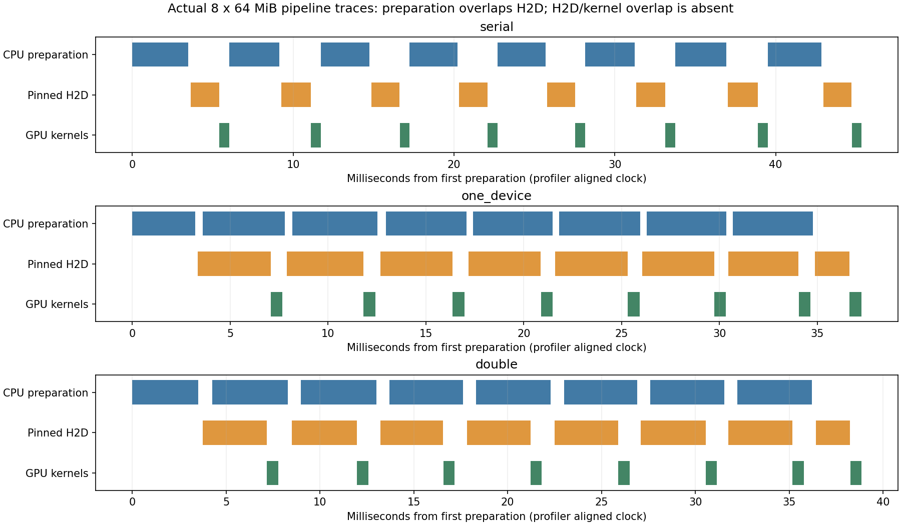

# 10-1：真实传输与缓冲复用

三种策略各1次预热、7次正式、1次独立profiler，共27组、216块。所有64MiB完整输出都与独立FP64计算后BF16舍入参考逐位相同，完整SHA也一致；没有仅检查首元素。远端运行67801、传输60520均exit0，三份trace已核验。

## 观测结果

每组实际准备并传输8块[8192,4096] BF16，随后执行FP32累加的RMSNorm并保存BF16结果。数据是每块不同的周期值夹具，符合4096隐藏维的激活形状，但不是模型捕获的训练数据。

| 策略 | CPU锁页槽／设备输入槽 | 7轮总墙钟中位 | H2D区间累计中位 | 消费区间累计中位 |
|---|---|---:|---:|---:|
| serial | 1／1 | 47.547ms | 15.093ms | 4.815ms |
| one_device | 2／1 | 39.496ms | 27.663ms | 4.814ms |
| double | 2／2 | 38.550ms | 27.010ms | 4.803ms |

总墙钟包含CPU准备、槽复用等待、传输和GPU消费；分配setup、最终D2H校验不在其中。各项中位数不能相加或相减解释因果。缓冲组中位数较低，但H2D累计时间反而更长；共享主机/GPU、CPU内存访问和提交开销限制性能归因，未做统计显著性声明。

**没有观察到H2D与消费内核重叠。** 21组正式CUDA事件范围重叠均为0；三个独立profiler各有8次64MiB Pinned H2D、56个实际消费kernel，H2D/kernel交集也为0。对应profiler内CPU准备/H2D重叠分别0、24.276、20.427ms。因此本批确证的是准备阶段与传输有重叠，不能因用了两个设备槽就声称GPU复制/计算流水生效。profiling调用不是7轮正式时间的替代。



图直接使用各策略单次profiler的统一时间轴；正式CUDA事件和CPU perf_counter时钟在raw中分别保存，没有人为将不同零点拼接。

## 容量与正确性

每次复制CPU输入到锁页槽前，等待该槽上次H2D事件完成；覆盖设备槽前，copy stream等待该槽上次消费完成；消费stream等待新H2D。serial另等待每块消费完成。所有内存复制及RMSNorm真实执行，不使用sleep模拟。

CPU原始pageable输入512MiB，锁页活跃槽64／128MiB。设备输入槽64／128MiB之外，每设备槽还有256MiB FP32工作区与32KiB行统计，并为校验保留8块共512MiB输出。实际Torch allocation峰值单设备槽832.031MiB、双设备槽1152.063MiB；不能把64／128MiB写成整个GPU占用。reserved/caching、其他服务、驱动上下文与CPU物理RSS不混入这些活跃张量字节。

输入和参考完整行保存在fixture.pt，形状与生成规则可重建全部512MiB输入；分析重新做FP64参考并流式重建完整块SHA，验证8个不同参考及全部216输出。原预设允许1/128绝对误差，但实际全部精确，不用放宽结果。原GPU五服务一直保留；进程内gpu-after还含本进程，退出后另取gpu-final确认仅原五服务。

## 独立复现与范围

运行需要CUDA版PyTorch，本次Torch2.11.0+cu130、CPU线程8、RTX PRO6000；版本在environment.json。已有同版本环境时在新的本目录副本执行：

```sh
python run.py
python analyze.py
python plot.py
```

run.py依赖Torch和NumPy，analyze.py依赖Torch，plot.py需Matplotlib。results存在拒绝覆盖；不依赖相邻实验代码或下载大模型。预先确保至少4GiB空闲显存。本次固定环境为/home/ubuntu/ai-infra-book-experiments/tools/sglang0513-venv；图和离线分析可在CPU环境执行。

[PyTorch锁页/异步复制指南](https://docs.pytorch.org/tutorials/intermediate/pinmem_nonblock.html)说明异步H2D结束前不能改写锁页源；本实验用显式事件控制复用，而非依赖Python调用返回。全部源码、原始逐块时序/校验、输入参考、独立分析、三份真实trace及GPU前后快照已归档。

未人为限制PCIe带宽，没有DeepSpeed CPU Adam或完整训练步；数据与消费强度改变后需另测。本项不重复calculations中的时序估算，不把本结果当作论文复现或全书实验完成，最终跨session审计仍待。
