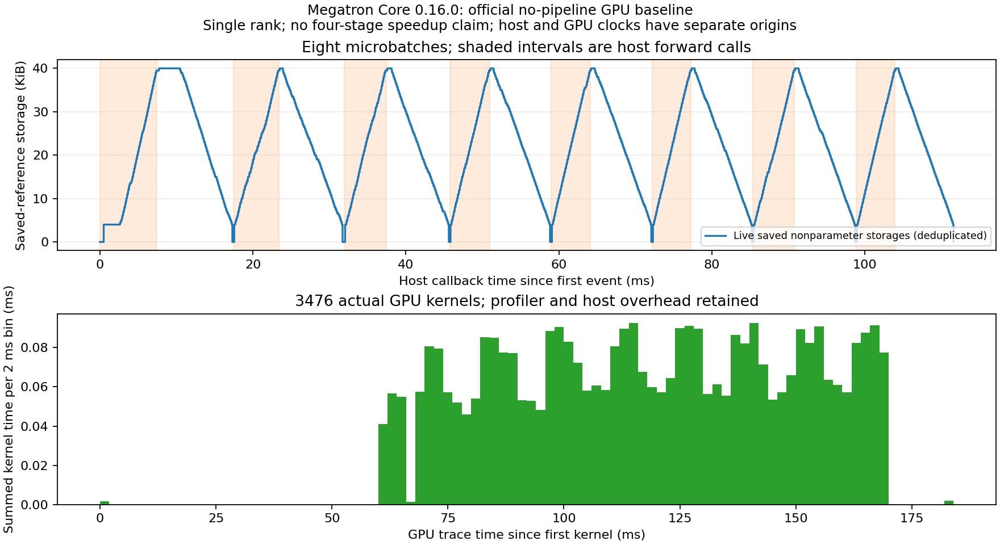

# 实验10-5：官方Megatron无流水GPU基线

**已完成单rank GPU基线，四阶段流水尚未运行。** 固定Megatron Core 0.16.0，直接调用官方 `forward_backward_no_pipelining`，真实36层残差小模型、8微批、一次SGD更新。不是Qwen3，也不替代四GPU/NCCL流水要求。

## 结果

- 8个微批输出、72份参数梯度与未切分PyTorch GPU autograd参考逐位相同；更新后51/72份参数逐位相同，其余最大绝对差7.45058e-9，全部通过事前`1e-6 + 1e-5*abs(reference)`门槛。独立复核所有9792参数及SGD关系，保留全部实际/参考张量。参考更新表达式与SGD实现存在舍入差，不改门槛。
- 864次autograd save、864次unpack、864次release一一配对，无遗留保存引用。按活跃storage去重、排除参数后峰40960bytes（40KiB），包含输入视图的底层storage，不等于纯中间激活或分配器总峰。
- CUDA allocator总allocated峰68320768bytes、reserved峰69206016bytes。原始allocator记录2665次alloc、2593次free_requested和2593次free_completed；这里不要求它们等于wrapper事件数。统计开始前已有分配，不能仅据这些事件重建全部存活内存。
- 实际profiler记录3476个CUDA kernel，时长求和3.821032ms，首尾跨度182.484041ms。记录带profiler/stack/内存观察开销，微小模型和共享机器不适合据此排名。图以实际kernel区间与2ms时间桶的交集求和；不是硬件利用率。host回调与GPU时间各自归零，不强行对齐。



图同时提供SVG。保存引用释放只表示autograd不再持有引用，CUDA caching allocator的free_completed也不等于reserved显存还给驱动。

## 配置与范围

固定源码commit `3bec9aa97dda898d16ff5a89bac0ed2b6682b172`，源归档在sources；执行前实际已安装调度器和P2P文件SHA与manifest精确匹配，未修改框架代码。运行从本目录解压的runtime-source导入，而非安装另一Megatron版本。Torch2.11.0+cu130、CUDA13.0、RTX PRO6000 Blackwell、FP32、TF32关闭、deterministic开启、CUBLAS_WORKSPACE_CONFIG=:4096:8，单rank NCCL。

模型每层为`x + 0.1*tanh(linear(x))`，宽16，36层；每层seed105000+层号。输入/目标seed105，8微批，每微批序列8、batch1，MSE除8累计；SGD lr0.01、无动量/weight decay。参考先在GPU完整运行再释放模型，CPU参考结果保留；阶段模型、输入、目标、优化器与真实autograd张量共存。运行一次，不作稳定性能统计。

原四进程单卡Gloo候选先进行了CUDA tensor send/recv预检，当前构建报Bad address、发送进程SIGABRT，因此按协议没有启动四阶段训练。这只描述该配置，不能推广为所有版本Gloo均不支持CUDA。未修改P2P来隐式搬到CPU，未将物理四卡改称已完成。原始四卡实验仍待实际硬件。`PROTOCOL.md`保留执行前范围与后续基线补充；只有成功的baseline-001训练记录，没有把启动失败包装成训练数据。

## 复现

需要Linux CUDA环境，Torch2.11cu130、NumPy、packaging、einops、PyYAML等Megatron依赖。此次直接使用RTX已有 `/home/ubuntu/vllm023-venv/bin/python`，未改其依赖。未装TE/Apex，固定Core使用自身Torch后备实现，环境警告保留在成功进程日志中。

```sh
mkdir -p runtime-source
tar -xzf sources/megatron-core-3bec9aa.tar.gz -C runtime-source --strip-components=1
export PYTHONPATH="$PWD/runtime-source"
/path/to/cuda-python -B resource_guard.py --out runs/new-guard -- \
  /path/to/cuda-python -m torch.distributed.run --standalone --nproc-per-node=1 \
  train.py --stages 1 --backend nccl --output runs/new
/path/to/torch-python -B analyze.py --run runs/new --out new-analysis.json
```

当前图读取根目录analysis.json；`plot.py`需要Matplotlib。独立CPU Torch2.14重新读取原始pt与pickle执行2841检查通过。pickle仅用于此自行生成、已封存SHA的可信快照。

原始证据在`runs/baseline-001/rank-0/`：elementwise.pt、checks.json、lifetime.jsonl、trace.json、allocator_snapshot.pickle及environment.json；完整进程/资源记录在同级baseline-001-guard。监督句柄87546 exit0、6.015s、无终止原因/残留进程；四个原GPU服务保留。本轮没有设备独占条件，未运行calculations，10-5总体仍partial。
