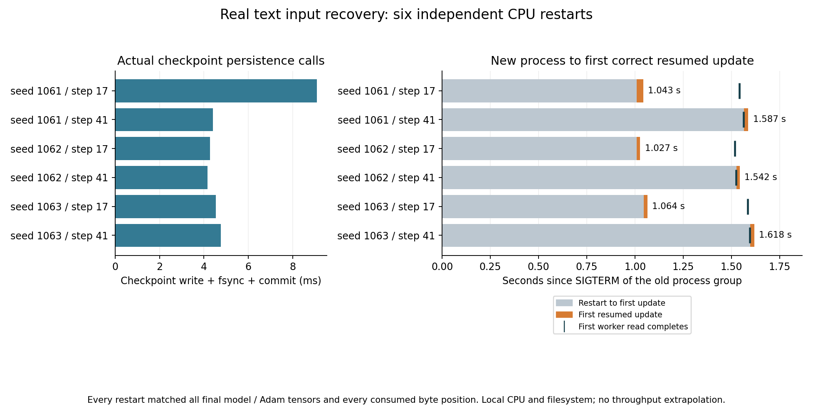

# 10-6：真实文本预取与 packing 状态恢复

六次独立进程恢复都保持了同一条训练轨迹：每一步实际输入字节位置、loss和梯度范数与未中断基线完全相同，最终模型、Adam及随机状态逐张量精确一致。检查点时既有未消费的预取记录，也有非空packing残留。丢掉残留或误用预取派发游标的两个预登记控制均产生输入错位及不同模型状态。

这补足真实输入流水的恢复机制验证。原10-6的大模型输入／检查点带宽与争用仍未完成；此处不计算保存周期，也不外推V4吞吐。

## 实际执行与结果

M2 Max本机CPU，Python3.14.7、Torch2.14，主进程intra2/inter1；真实DataLoader使用两个spawn worker、每worker1线程、prefetch_factor2，顺序返回记录。复制3-8固定源文本及width64两层byte Transformer源码，数据1,115,394 bytes、模型124,672参数，无dropout。目录自带文本、来源及模型，不依赖相邻实验执行。

固定seed1061/1062/1063，每条完整轨迹64次真实AdamW更新。主训练batch1、每步128个next-byte目标，CPU FP32，lr0.001、betas(0.9,0.95)、eps1e-8、weight_decay0.01、clip1。变长记录长度为257+2×(record_id mod7)，worker每次实际打开文本、seek并读取；父进程跨记录拼成连续输入。每个训练目标位置仅消费一次，邻接步骤共享一个上下文边界字节。

正式共17个训练控制进程、34个DataLoader worker：3个未中断基线，6个保存后终止的前缀，6个新PID恢复后缀，2个负对照后缀。合计670次真实更新；前后缀合起来分别构成完整64步轨迹，不能将它们各算成64步。独立smoke有5个进程、46次更新，不混入正式数据。

| seed | 固定保存步 | packing残留 bytes | 保存调用 ms | 终止至首个正确恢复更新 s |
|---:|---:|---:|---:|---:|
|1061|17|181|9.090|1.043|
|1061|41|6|4.404|1.587|
|1062|17|181|4.279|1.027|
|1062|41|6|4.169|1.542|
|1063|17|181|4.544|1.064|
|1063|41|6|4.764|1.618|

所有固定检查点均有4条已派发且worker完成、但训练尚未消费的记录。第17步的记录游标是9，待消费记录9–12；第41步游标20，待消费记录20–23。恢复后这些记录实际重新读取，已提交训练目标没有重做。每份检查点约1.54MB。正式控制器总墙钟34.508秒，采样训练进程组RSS峰765,640,704 bytes；RSS包括训练、DataLoader workers和其资源跟踪进程，不含外层控制器，也不是独占物理内存。



图中竖线为新worker首次实际读完记录。第17步保存的181字节足够立即恢复一个训练步，所以首次正确更新早于新worker读取完成；“首个正确更新”不能当作整个预取流水已重新就绪。第41步仅余6字节，下一步需要新记录。本图记录同机时间，不据此将两个检查点位置的时间差全部归因于残留大小。

## 保存与恢复的准确含义

保存训练已消费的记录游标、packing残留字节及其源位置、模型、完整Adam、CPU RNG、DataLoader专用Generator。恢复从消费游标重新读取未消费记录，不读取框架私有队列，也没有序列化其进程内队列。保存派发游标仅用于观察和负对照，不能拿它代替消费位置。

DataLoader构造新iterator会消费一次用于worker seed的Generator抽样；本数据读取没有随机增强，恢复在创建iterator后复原已保存的专用Generator状态，避免多一次iterator创建改变下一保存点的逻辑状态。模型CPU RNG单独恢复。模型无dropout且worker确定性读取，因此本实验不证明随机增强、多worker随机流或stochastic训练的通用恢复。

checkpoint使用真实torch.save写临时文件，flush/fsync后原子rename，并fsync目录。完成后才发ready记录；控制器确认自己创建的PID/PGID再SIGTERM该进程组，含其DataLoader workers，随后核验无存活成员并启动新PID。终止是预登记机制实验，退出码−15及其资源回收日志属于正式记录。此处没有故意制造写到一半的损坏，文件系统调用成功也不证明断电持久性。本补测采用单进程torch.save来保存Python packing状态，不替代父目录的实际DCP重分片实验。

两个控制固定为seed1061、第17步：omit_buffer丢弃181字节残留，从第18步起47个后续步骤位置错误；dispatch_cursor保留残留却跳到已派发游标13，从第19步起46个步骤错误。两者均完成实际训练至64步，最终模型及Adam与基线不同。这些科学负结果保留。

## 独立核验与复现

[PROTOCOL.md](PROTOCOL.md)在执行前冻结seed、17/41两个位置、负对照和门槛；每个批次的environment.json记录执行源码／协议／数据SHA。固定位置必须同时满足非空残留及完成而未消费的预取，否则停止，未按结果另选位置。

[analyze.py](analyze.py)仅离线核验：从源文件位置独立重建全部输入；将原始dispatch、worker read_complete及consume事件与保存点交叉核对；对前缀加恢复后缀逐步比较基线，并用torch.equal逐项比较全部模型／Adam及RNG状态。每次最终状态含114个张量（重复值也不省略），共六次正常恢复。正式2457项、smoke196项检查全部通过。模型和Adam漏状态控制都被独立检查检出，loss不是唯一验收依据。

同一Torch2.14 CPU环境，在整个目录副本中运行，输出名称必须不存在：

```sh
python -B launch.py --name smoke-new --smoke
python -B analyze.py --name smoke-new
python -B launch.py --name formal-new
python -B analyze.py --name formal-new
```

`plot.py`默认只读取已交付formal/summary.json及worker日志，需要Matplotlib，可在副本修改输入目录画新结果。已交付图使用Matplotlib3.10.6，PNG/SVG已目视检查。Torch环境无NumPy时的初始化警告不影响此次CPU执行，分析没有依赖NumPy转换。

正式原始数据在formal/，smoke在smoke/；每个路径保留逐步输入、派发／消费／worker日志、最终完整状态或实际checkpoint、PID及真实起止时间。manifest逐文件SHA封存。没有启动失败记录需要清理；预登记终止和负对照必须保留。

本次未修改3-8原始封存、正文或inventory，未使用GPU、停止其他进程或触碰calculations。它覆盖当前确定性输入管线的状态恢复；多机、异步保存积压、真实大模型I/O争用、随机增强及不同worker数量仍需各自实测。最终跨session论文审计尚未开始。
