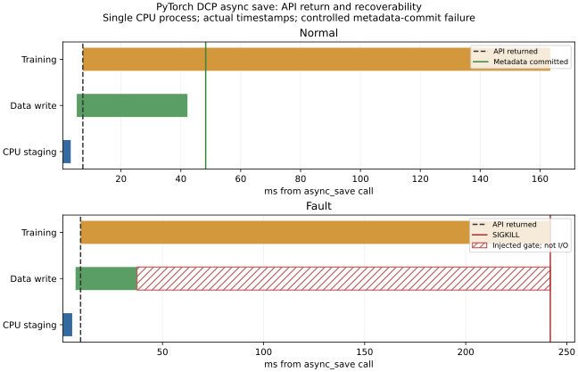

# 10-7 异步检查点的恢复点（部分交付）

使用真实PyTorch 2.10.0+cu128 DCP线程式`async_save`，在CPU上训练一个含Dropout、AdamW的1024×1024线性模型，分别保存第3步和第23步状态。每次API返回后继续更新20步，保留训练与写入重叠的真实时间戳。正常路径两份检查点都能恢复到各自快照；训练后续对权重和Adam的原地更新没有污染已经暂存的状态。

故障路径在第二份检查点的数据文件写完后、元数据提交前设置一个明确的阻塞点。父进程确认API已返回、后续20步已完成，并确认后台到达该阻塞点，然后仅对本实验子进程发送SIGKILL。第二份目录已有12,622,659字节的数据文件，但没有`.metadata`，实际DCP加载抛出CheckpointException；第一份检查点仍可恢复到第3步，全部张量哈希一致。没有将未提交目录当作最新恢复点。

## 观测时间

| 路径与快照 | API返回 | CPU staging | 元数据提交完成 |
|---|---:|---:|---:|
| 正常，第3步 | 11.33 ms | 9.26 ms | 76.17 ms |
| 正常，第23步 | 7.25 ms | 2.60 ms | 48.30 ms |
| 故障对照，第3步 | 9.85 ms | 4.72 ms | 62.62 ms |
| 故障对照，第23步 | 9.48 ms | 4.57 ms | 未发生 |

API及提交时间从对应调用开始计量；staging列是其自身区间。四次API返回时Future都未完成。保存第23步的正常路径，数据写入约36.98 ms，而元数据提交在调用后48.30 ms完成。故障路径的斜线区间是人为故障屏障，**不是慢磁盘或低带宽实测**。



## 独立运行

在Linux安装PyTorch 2.10.0即可，不需要CUDA设备、分布式进程组、外部数据或相邻实验。

```bash
python run.py --output results
python analyze.py
python plot.py  # 需要matplotlib
python verify.py
```

`run.py`要求新结果目录，避免覆盖之前证据。它启动正常与故障两个子进程，父进程管理故障注入及恢复检验；除实验子进程外不终止任何进程。`verify.py`针对交付的原始文件清单做离线校验，自行重跑后的不同计时及文件布局不会自动匹配旧清单，需保留新数据并独立登记哈希。

固定单CPU计算线程，FP32、AdamW，输入为独立Generator产生的16×1024合成张量，Dropout使用另一个CPU全局随机状态。保存参数、Adam步数与两个动量、全局RNG、数据Generator和步游标。预期哈希在调用前取得，实际加载目标张量置零，因此比较不能被未覆盖字段的原值蒙混。正常路径验证两份完整状态，故障路径实际加载第一份，并实际尝试和拒绝第二份；原始错误保存在`outcomes.json`。

存储使用FileSystemWriter，显式`sync_files=True`，未改动共享PyTorch安装。诊断子类只记录stage/write/finish边界，并在故障路径阻止最终metadata提交。完整检查点每份约12.63 MB，原始数据文件、metadata、时间戳和校验记录均保留；`raw-manifest.json`绑定其大小与SHA256。

## 解释边界与剩余工作

- 这是**进程终止**实验，不是断电、磁盘损坏、多rank故障或远端对象存储一致性测试。
- 记录中的`future_complete`是主线程完成20步后调用`result()`的观察时刻；Future可能更早就绪。不能把它与metadata提交之间的时间当作存储耗时。图采用writer内部的实际提交完成事件。
- 两个子进程各运行一次，训练20步耗时保留在原始记录，但没有无保存基线或随机交错重复，不能据此量化训练吞吐下降，也不能从人为故障屏障推导带宽。
- 尚需测不同写入带宽下的积压、暂存峰值、检查点新鲜度及有／无后台保存的训练吞吐。保存周期、故障率与预期损失模型归已有计算任务C57，不重复实现。
- 本组只恢复和校验状态，下一步更新一致性由独立10-6实验测量；10-7不依赖它运行。全书第一轮后的论文增补复核仍需完成。

所以本目录标记部分交付，不据一次受控中断声称完整故障容错或最优保存周期已经验证。
