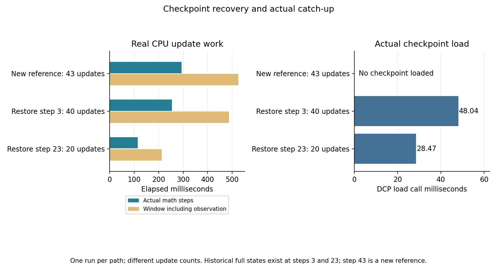

# 10-7：恢复有效检查点后实际重做40步

从原故障实验有效第3步检查点启动新进程，真实完成后续40次CPU更新到第43步。恢复后的每步输入、target、loss及完整状态SHA与本轮从原seed开始的独立43步路径一致；另一新进程从历史正常第23步检查点更新20步，也得到相同第43步完整状态。

历史第3／23步全部11项状态SHA及第23／43步loss均通过硬门槛。历史没有保存第43步完整张量，因此这里的第43步全状态比较对象是**本次新执行的未中断参考**，没有把它冒充历史第43步原件。

## 实际执行

原RTX主机只用CPU，`/usr/bin/python3` 3.10.12，Torch2.10.0+cu128，正是历史代码使用的版本；CUDA_VISIBLE_DEVICES为空，没有GPU调用。三个进程顺序执行，绑CPU8–9、intra/inter1。CPU FP32模型为Linear(1024,1024)→Tanh→Dropout(0.1)，torch.manual_seed(1007)，AdamW lr0.001、其余保持该版本默认，没有新增clip。

每步使用保存／初始化的数据Generator依次生成[16,1024]输入和target，MSE mean、backward、AdamW step。模型Dropout使用全局CPU RNG，输入使用独立seed107 Generator，两份状态分别恢复。总计103次真实更新，没有重跑原async_save或再次注入故障。

| 新执行路径 | 真实更新次数 | DCP load ms | 状态安装 ms | 原数学步合计 ms | 含观察的训练窗口 ms | 控制器测得进程墙钟 s |
|---|---:|---:|---:|---:|---:|---:|
|从原seed开始|43|不加载|不适用|292.910|525.264|3.402|
|从故障有效第3步恢复|40|48.044|2.206|253.932|486.345|2.552|
|从正常第23步恢复|20|28.467|2.739|114.745|211.692|2.080|

第3步恢复路径从控制器创建进程返回到首次恢复更新完成为1.352秒。加载计时只含dcp.load调用，之前读取metadata和创建全零目标模板另有时间戳；状态安装另计模型、Adam和两份RNG的赋值。原数学步从生成输入开始，到AdamW step完成结束。训练窗口则包含中间逐步SHA、记录和第23步状态保存的观察开销，两列不可混用，也不将差额全部归因于存储。最终第43步快照落盘在最后更新结束之后，计入进程墙钟而不计入训练窗口。



每路径只测一次，三条路径更新数也不同，不排名性能、不计算吞吐加速或保存周期。今日新执行与原故障不是同一连续生命周期；没有拼接历史monotonic时间，没有声称测得原故障至今日恢复的停机时长。

## 历史锚点与新的全状态证明

[checkpoint-inputs.json](checkpoint-inputs.json)固定两份有效检查点的metadata/data文件SHA及真实路径。执行前和每个worker启动时均核对原件；原checkpoint只读复用，没有复制大payload或改动。故障路径缺metadata的checkpoint-2仍未被加载或修复。

历史原件根目录为 `/home/ubuntu/ai-infra-book-experiments/ch10/10-07`，输入是 `results/fault/checkpoint-1/` 及 `results/normal/checkpoint-2/`。本目录的historical/包含小型原源码、expected、环境及正常／故障事件副本，不包含历史checkpoint payload。

DCP先加载到全零模板，再安装模型、Adam step/m/v、CPU RNG、data_rng和cursor，加载与安装后都核对历史SHA。新参考执行第3和23步时分别再核对历史全部11项SHA。三路径对应的第23步loss均为1.2358448505401611，第43步均为1.2407095432281494，与历史事件精确一致。

[analyze.py](analyze.py)在Mac上离线独立核验，读取8份实际新状态.pt、共88个张量，逐张量复算SHA。两恢复路径的60个重叠更新逐步比较实际输入、target、loss及11项状态SHA；两份第43步完整状态再逐tensor用torch.equal与新参考比较。共422项检查全部通过；没有只用最后loss替代全状态比较。

每个worker记录了实际源码／协议SHA、Torch配置、Adam参数、CPU亲和性、PID及准确区间。预执行metadata核查见[preparation-environment.json](preparation-environment.json)：该文件中的training_executed=false只描述当时只读准备动作，正式完成记录在formal/。

## 安全范围与独立复现

root在V4仍运行时授权了受限CPU窗口：启动前MemAvailable至少28GiB，运行中低至25GiB只终止本实验进程组；自身进程组RSS上限1GiB、单路径120秒。实际采样全机MemAvailable最低31,151,661,056 bytes，自身进程组RSS峰762,806,272 bytes，三个路径均退出0、没有残留。RSS是约100ms采样点的进程组和，不能保证捕获所有瞬态尖峰，也不代表独占物理内存。未触碰其他进程或服务。

脚本独立，不导入相邻实验代码；复现需要作为只读输入提供上述两份历史checkpoint，按checkpoint-inputs.json的SHA校验。不要将已有formal覆盖。先为实际CPU任务安排资源，再运行：

```sh
/usr/bin/python3 -B launch.py --name formal-new \
  --historical-root /home/ubuntu/ai-infra-book-experiments/ch10/10-07 \
  --execute
```

没有--execute时不会启动训练。离线分析只需已有Torch，图使用Matplotlib：

```sh
python -B analyze.py --name formal
python plot.py --name formal
```

应在目录副本运行离线分析，避免改动封存结果。PNG/SVG已目视检查，全部原始及派生记录由manifest封存。当前无启动失败待清理；若未来历史兼容性或数值门槛失败，应保留科学结果，不修改容差宣称恢复原轨迹。

本补测补上“有效第3步之后实际重做40次更新”的证据。它仍是小模型、同机CPU恢复，不证明断电持久性、多rank故障、大模型追赶成本或输入／检查点争用。保存周期与预期损失模型归已有计算任务，本目录没有运行或修改calculations；正文／inventory交由root集成，最终跨session论文审计未开始。
