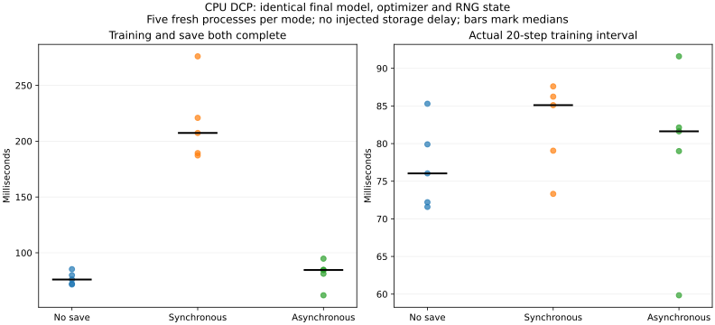

# 10-7：无保存、同步保存和异步保存的训练基线

本目录补测正常保存时的训练开销，与父目录的故障注入实验分开。使用真实PyTorch DCP、CPU单线程1024×1024 Linear／Tanh／Dropout模型和AdamW，每个进程先训练3步，再比较保存与继续训练20步。每种模式5次，轮内顺序以Random(1007)预定随机化，共15个独立进程。完整方案见 PROTOCOL.md。

保存第3步的模型、Adam状态、CPU RNG、数据生成器RNG和步数；同步与异步检查点均重新加载逐张量核对。三种模式第23步的全状态哈希必须一致，防止以训练工作变化换取表面加速。每次使用新检查点目录，sync_files=True，无人工限速、延迟或故障屏障。

记录staging、API调用／返回、write_data完成、metadata提交、逐步训练及训练与保存均完成的窗口。文件哈希／字节随每个raw记录保存。只观测Linux进程ru_maxrss在窗口前后的高水位差，它包含训练和库内分配，**不等于单独的暂存峰值**。未清除操作系统页缓存，也没有专用存储设备带宽测量，不能把文件字节除以某个局部区间称为磁盘带宽。

## 实际结果

| 五次中位数 | 无保存 | 同步DCP | 异步DCP |
|---|---:|---:|---:|
| 训练与保存均完成的窗口 | 76.042 ms | 207.377 ms | 84.569 ms |
| 20步训练区间 | 76.040 ms | 85.106 ms | 81.630 ms |
| 保存API调用区间 | — | 122.268 ms | 2.206 ms |
| 异步stage区间 | — | 不经过该stage钩子 | 1.408 ms |
| write_data区间 | — | 118.251 ms | 25.765 ms |

10份检查点全部恢复正确，15次最终模型、优化器及两类RNG哈希全部一致。文件总量各约12.625MB，精确字节见原始记录，metadata序列化大小略有差异不代表张量差异。异步保存完成基本落在训练区间内；API返回快并不代表训练完全无扰动。单次样本有波动，本数据不单独识别CPU争用、首次库内准备、文件系统缓存或存储服务分别贡献多少。同步与异步write_data区间差异不能全部归因于重叠。

## 原始数据与复现

results/run-v1下保留15个进程日志、完整状态哈希、10份实际检查点和逐步时间。results/summary.json给出全部运行与中位数，图展示全窗口和训练区间；保存API暂停和后台影响分开报告。



```sh
python analyze.py
python plot.py
```

离线核验只需Python标准库，画图需Matplotlib。实际独立重跑需原始记录中的PyTorch环境，在本目录指定新结果位置：

```sh
python run.py --output results/run-v2
```

程序拒绝覆盖已有结果。分析新版本时在目录副本中修改读取路径，保留当前封存文件。子进程导入、模型建立、前3步及哈希计算均在计时窗口之外；检查点恢复在窗口结束后执行，不能把窗口时间当作完整进程寿命。

此为小模型CPU正常保存基线，不是Qwen训练性能或多GPU分布式存储吞吐。带宽受限、缓冲上限与检查点新鲜度扫描仍待；故障恢复沿用父目录实际受控SIGKILL记录，不重复注入。calculations未执行或修改，无GPU使用。
