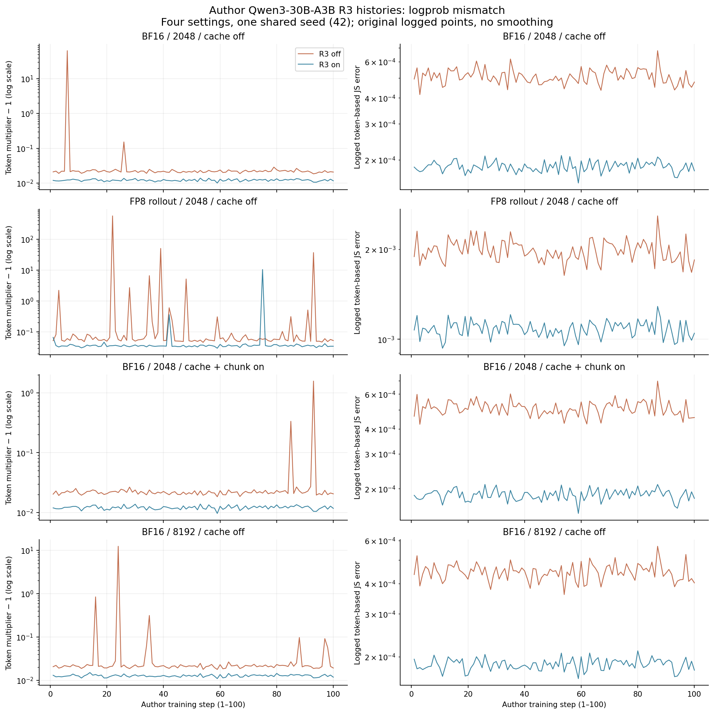
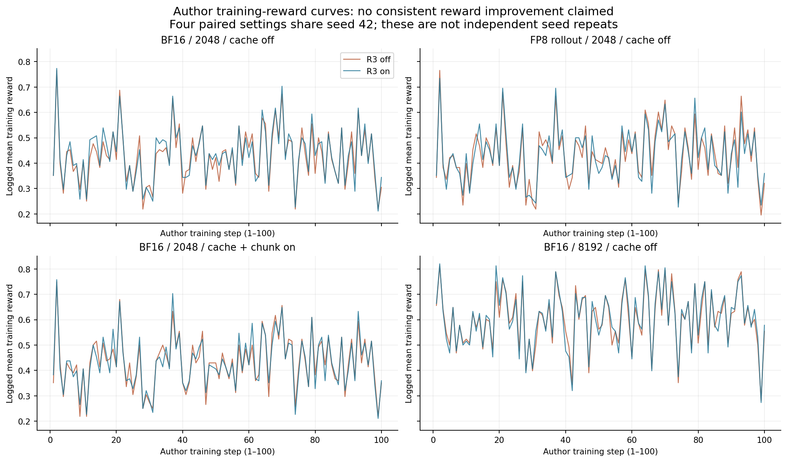
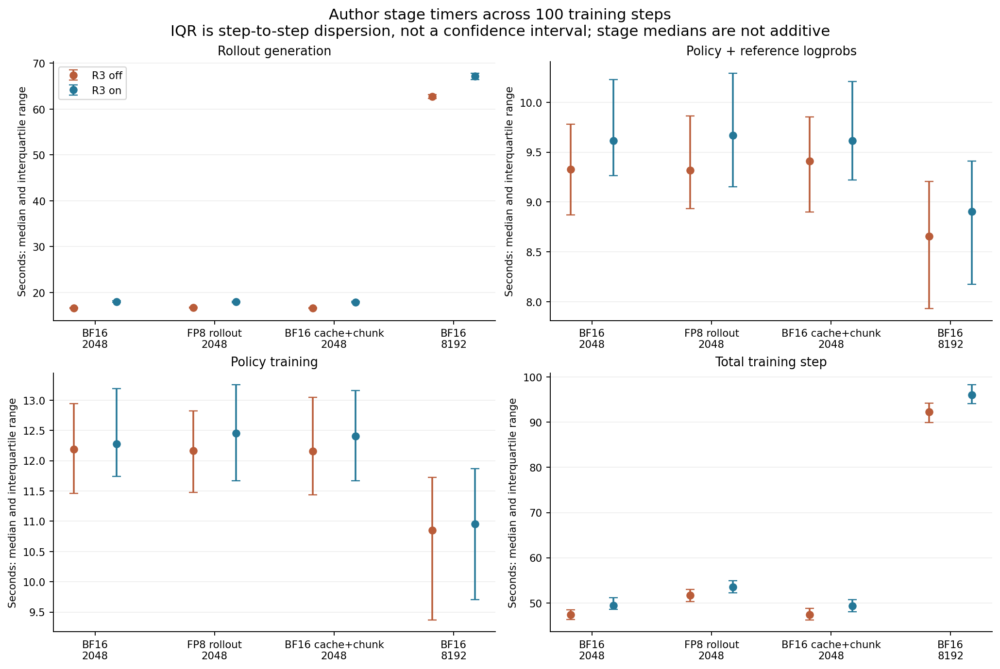

# 10-9：NeMo RL R3 作者原始 history 与单卡执行准备

本目录取得并分析了 NVIDIA 官方 R3 验证报告的四对真实训练 history，交付 logprob 不一致、训练 reward 和阶段时间图。数据由原作者在其集群运行，本机只做下载、逐步对齐、源码核对与离线分析；没有在本机重新训练 Qwen3-30B-A3B，也没有把论文图片数字化。

八个已完成 run 各有 step 0…100，共808个原始 history 行。step0只记录 setup，训练指标为null；实际可比较训练记录为800行、每run100步。四种配置共用seed42，是四种设置的一对一对照，不能当八个独立随机种子。结果显示四种设置的日志级logprob误差中位数均降低；reward无一致改善，R3-on的总步时中位数均略长。这些结论不代替逐token专家集合、缺失路由或packing的原始trace验证。

## 原始来源与版本

入口为官方[Router Replay文档](https://docs.nvidia.com/nemo/rl/latest/guides/router-replay.html)指向的[R3 Effectiveness Report](https://api.wandb.ai/links/nvidia-nemo-fw-public/lxoovk60)。本目录保存原始报告HTML、原始GraphQL响应及派生report-spec；通过公开分享链接和官方网页客户端采用的只读请求方式获取数据，没有使用个人登录、私有API key或发送任何消息。报告不回显分享token，原始分享入口文件按下载原样保留。

报告页原始spec说明它验证[NeMo RL PR2590](https://github.com/NVIDIA-NeMo/RL/pull/2590)。v1 on/off的原始requirements标记NeMo RL `0.6.0+b1a965171`；已从官方API解析固定历史commit **b1a9651716473a449fe76140fbff04aee6fd00e0**，并下载历史loss、GRPO、logger、timer、R3实现及配方。该对子日志记录vLLM0.20.0，requirements记录Torch2.11.0+cu130、Transformers5.8.1、Megatron Core0.19.0+6204b925f、Transformer Engine2.15.0+42b84005。日志开头报告git code artifact上传失败，因此不将已下载源码说成作者全部工作树的完整归档；历史版本绑定来自requirements、日志和官方commit记录。

另固定当前官方主线 **74b857c8e57b82e4518ca4ee2a9b88cc1e45ef37**（2026-09-09），作为下一次执行准备的源，而不混作这批历史实验版本。`historical/`和`nemo/`分别存放两版原件；每个HTTP下载原件有URL、抓取时间、字节数、SHA元数据。Github完整递归tree的`truncated=false`。

原作者四对均使用Qwen3-30B-A3B缓存revision **ad44e777bcd18fa416d9da3bd8f70d33ebb85d39**；cluster配置均为8节点×8GPU，TP4/PP2/CP2/EP4、packing开启，16 prompts/step、8 responses/prompt、seed42。没有下载模型权重或训练数据。

| 对照 | 原始run ID：off / on | Rollout精度 | 最大新token | Prefix cache / chunk prefill |
|---|---|---|---:|---|
|gate3-v1|gate3-v1-r3off-12705644 / gate3-v1-r3on-12705645|BF16|2048|off / off|
|gate3-v2|gate3-v2-r3off-12705786 / gate3-v2-r3on-12705789|FP8|2048|off / off|
|gate3-v6|gate3-v6-r3off-12707221 / gate3-v6-r3on-12707222|BF16|2048|on / on|
|gate3-v7|gate3-v7-r3off-12707537 / gate3-v7-r3on-12707538|BF16|8192|off / off|

四对config逐字段比较：每对除checkpoint路径、log路径和run名外，唯一不同字段为`policy.router_replay.enabled`。原始config见`wandb/runs.json`；差异清单见`history-inventory.json`。匹配配置不意味着后续每步产生相同token或每步权重相同；不同学习轨迹仍须以真实trace判断。

## 实际history与图

`wandb/histories/`保存八个API原始响应、对应只读query与获取元数据；请求`history(samples:1000)`，每个响应实际返回全部101个连续整数step，未对曲线插值、平滑或补零。八个run状态均为finished。`wandb/files/`保存v1对子两份原始output.log（约1.4MB/份）、config.yaml与requirements.txt；日志中的普通警告保持原样，不把它们误作本次下载或实验失败。



左列绘制原始token multiplier减1后的对数坐标，以同时显示接近1的差异与原始尖峰；没有删除异常大值。FP8组R3-on仍出现11.425290的multiplier峰值，不能把中位数改善说成消除了全部不一致；同组off峰值566.931163。右列是原作者名为JS error的token级日志指标，不是重新计算的全词表JS。



所有100个训练步直接连线。Reward是训练批次的已记录平均reward，不是独立测试集准确率。这四组没有显示一致的最终reward改善，因此不声称R3在这些100步中提高了最终任务质量。



点为100步中位数，误差线为25%至75%分位范围，表示随训练步变化的离散程度，不是置信区间或独立重复的方差。各阶段单独画，不能把中位数相加成总步时。setup行单独保存在analysis/summary.json；首步训练时间仍保留在100步统计中。

汇总如下；最后10步reward均值是本次离线描述性汇总，非预登记质量门槛：
| Setting | R3 | Median token multiplier | Median logged JS error | Mean reward (steps 91–100) | Median total step s |
|---|---|---:|---:|---:|---:|
| BF16 / 2048 / cache off | off | 1.021628 | 0.00050413 | 0.424219 | 47.408 |
| BF16 / 2048 / cache off | on | 1.011945 | 0.00018476 | 0.421094 | 49.412 |
| FP8 rollout / 2048 / cache off | off | 1.056666 | 0.00197660 | 0.439063 | 51.706 |
| FP8 rollout / 2048 / cache off | on | 1.035196 | 0.00108476 | 0.425000 | 53.518 |
| BF16 / 2048 / cache + chunk on | off | 1.021583 | 0.00050665 | 0.430469 | 47.401 |
| BF16 / 2048 / cache + chunk on | on | 1.012084 | 0.00018587 | 0.432031 | 49.383 |
| BF16 / 8192 / cache off | off | 1.021322 | 0.00044536 | 0.592187 | 92.231 |
| BF16 / 8192 / cache off | on | 1.012770 | 0.00018663 | 0.600000 | 96.086 |

## 指标的历史源码定义

固定历史[loss_functions.py](historical/nemo_rl/algorithms/loss/loss_functions.py)第263–349行：先对齐`[:,1:]`的生成token位置；`generation_logprobs`来自rollout，`prev_logprobs`来自训练引擎的旧策略重算（force_on_policy另有分支，不能泛化忽略）。mask结合token mask与sample mask。设这两个被选token的logprob为a、b：

- `token_mult_prob_error`归约的是`exp(abs(a-b))`，完全一致的参考值为1。`masked_mean`按有效mask求和，再以`global_valid_toks`归一化；框架后续归约成为已记录标量。这里没有原始token张量，不能独立重算该标量，只能复核定义及原始history。
- `js_divergence_error`先令`m=log(0.5*exp(a)+0.5*exp(b))`，归约`0.5*(exp(a-m)-(a-m)-1 + exp(b-m)-(b-m)-1)`。这是对采样token logprob构造的误差项，不能当作拿到两份完整词表概率分布后精确求和的Jensen–Shannon散度，也不是专家集合不一致率。
- `train/reward`由GRPO代码中的reward数组归约。`train/loss`保留在analysis/summary.json，不把不同轨迹上的loss数值当作独立质量分数。
- 阶段时间由历史[Timer](historical/nemo_rl/utils/timer.py)使用`time.perf_counter`记录，GRPO围住generation、policy/reference logprob与policy training调用；它们是原作者控制器阶段墙钟，非GPU kernel时长。历史[logger](historical/nemo_rl/utils/logger.py)以训练步`total_steps+1`提交，解释step0/setup与step1…100的界限。

报告中的BF16/FP8明确指各组rollout配置；不把FP8对子称为全系统FP8，也不把不同精度组横向差异全归因于R3。没有逐tokenlogprob/专家张量，也没有本机性能，因此不主张本文数据证明了严格数值一致或单RTX速度。

## 路由trace可得性与下一项实际工作

取得了真实训练history、阶段时间、完整run config和v1原始文本日志。检查八个run的完整文件清单（均无后续分页），没有找到`r3_trace`或`routed_experts`张量文件；报告的trace smoke部分是作者通过情况说明及一张图片，不能当作已取得原始路由数据。当前官方tree中也未列出R3命名的`.jsonl/.pt/.npz/.parquet/.csv/.log`原始trace。这个结论仅限实际检查过的公开入口，不能断言作者从未保留或发布过其他数据。

官方可运行源已提供`NRL_R3_TRACE`、`NRL_R3_TRACE_VERIFY_FORWARD`、`NRL_ROUTER_REPLAY_VALIDATE`和`tools/check_r3_trace.py`。需注意`r3_trace.py`的常规tensor记录主要是shape/dtype/SHA加16元素preview；即便拿到这种JSONL，也不能自动算出全量expert集合不一致率，下一次须额外保存完整路由与对应input IDs、sample ID、token position、weight version和逐tokenlogprob。

原题仍未完成的部分：逐token专家集合on/off不一致率独立复算；同权重逐tokenlogprob差异复算；完整路由记录实际字节数；多轮缓存命中/packing/CP切片的token身份；缺失路由及回退的实际注入验证。现有缓存开启对子只说明该配置下作者日志，不代替多轮cache身份trace。

单RTX现阶段可直接完成的是本目录的CPU离线原作者记录重分析。原Qwen30B配方和官方测试脚本要求64GPU，不能只改`num_nodes=1`就宣称完成原配方。当前主线需要Python>=3.13.14,<3.14、独立vLLM0.25.1/MCore依赖环境；历史版需要Python>=3.13.13,<3.14、vLLM0.20.0，均不能直接套用已有SGLang私有环境。

下一次单卡模型实验建议先做“同一固定Qwen30B权重的顺序rollout与只读重算”可行性探针：在root统一GPU调度下，分别启动vLLM和Megatron而非同时常驻，TP/PP/CP/EP设1，极短冻结样本，先验证加载与数据格式，再保存完整路由/logprob并开关replay；不预先分配Adam状态。此方案尚未执行，SM120依赖、模型转换与显存是否可容纳必须实测，不称可直接运行的原配方。它也不覆盖CP、多GPU训练或收敛曲线。实际完整原配方的下一步需要相应多GPU资源，或取得原作者完整trace；不能用小模型或人工路由替换后仍称Qwen30B原实验。

## 离线复跑与封存

无需下载、模型或GPU，在本目录副本执行：

```sh
python3 -B analyze.py --output replay-analysis
python -B plot.py --analysis replay-analysis/summary.json --output replay-plots
```

分析器仅stdlib；绘图需要Matplotlib。脚本明确核验全部step、null/setup边界、800条训练指标有限值、四组实际精度/长度/cache配置、每对唯一配置差异及原始SHA。默认输出analysis/plots可重建，正式归档要在副本上运行。`manifest.json`封存全部下载原件、来源记录、源码、分析和PNG/SVG。

本次读取范围限10-9首轮原题、原书固定R3/NeMo文档相关节、官方R3文档和配方、两个固定commit的相关实现、作者报告及选定八个run；没有开展最终全书跨session论文增补审计，没有修改另一session研究、正文、inventory或calculations。
