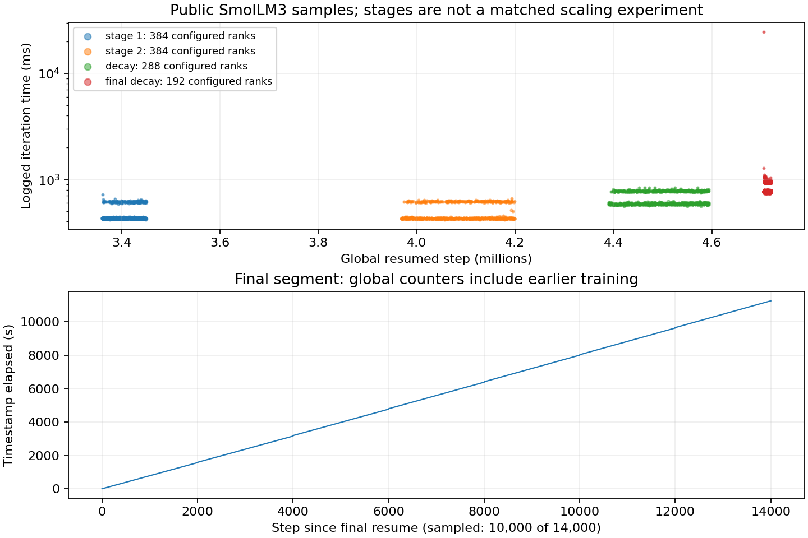

# SmolLM3 公开训练记录核验

这是作者公开记录的取数与离线分析，不是本地重新训练。原始数据通过匿名只读 W&B GraphQL 和公开文件链接取得，不使用账号凭据、不下载模型或训练数据。

## 结果

官方 [固定版本预训练说明](https://github.com/huggingface/smollm/blob/27c26a85dbf3a5dcc00d61cdb9108473edf93cdc/text/pretraining/README.md) 将训练概述为 384 H100、24 天。其 [公开项目](https://wandb.ai/huggingface/SmolLM3-training-logs) 返回全部 29 个 run：3 finished、25 crashed、1 failed。状态不是硬件故障分类；这些历史中断是期限分析的原始证据，不能当本次下载失败删除，也不能把各 run 的累计计数相加。

实际配置的 DP×TP×PP×CP×EP 有 384、288、192 三种，和日志中总 token/s 除以每 GPU token/s 一致。这是配置及指标分母的核验，不是物理设备在场证明。最终 run 的 DP96、TP2，微批3、累积2、序列4096，每步 2,359,296 token；配置为 BF16、36层、隐藏宽2048、AdamW。原配置保留完整字段。

| 作者 run | 配置 rank 数 | 返回抽样条数 | 抽样步时中位数 ms |
|---|---:|---:|---:|
| 28jt9vhg | 384 | 1,000 | 430.046 |
| uliytlp7 | 384 | 1,000 | 429.873 |
| 8ey7uow0 | 288 | 1,000 | 598.553 |
| n4jn9hla | 192 | 10,000 | 773.089 |

这些是不同训练阶段的抽样描述，不是固定工作负载的卡数伸缩实验。请求 20,000 条仍只返回 10,000 条；最终抽样区间有 4,000 步未返回，其他三个区间也不连续，不用抽样中位数代表完整作业吞吐或稳定尾延迟。

[最终 run](https://wandb.ai/huggingface/SmolLM3-training-logs/runs/n4jn9hla) 的原始控制台包含连续 14,000 次迭代，范围 4,706,001–4,720,000。此次片段新增 33,030,144,000 token，而终点累计 11,135,877,120,000 token 包含以前的训练。不能拿后者除以此次 runtime 11,472.831 秒。控制台数值经过人类可读单位舍入；精确数值只取 API 返回的样本。首步约24.691秒，没有因慢而丢弃。控制台另含上传、保存、清理及等待消息，消息本身不证明全局存储耐久性或全部 rank 完成；本分析未将其自行归类成完整停顿时间。



## 复现与文件

在本目录运行：

```sh
python3 analyze.py
python3 -m pip install matplotlib==3.10.6
python3 plot.py
```

分析仅依赖 Python 标准库，画图另外需要 Matplotlib。可用 `python3 analyze.py /tmp/smollm-audit` 把结果写入独立目录再与 `results/analysis.json` 比较。`manifest.json` 封存相对路径、字节数和 SHA256。每份来源旁的 `.source.json` 保存 URL、HTTP 状态、取数时间和原件 SHA；W&B 查询体另存 `.query.json`。在线重取可运行 `python3 query.py wandb/new.json < wandb/runs.json.query.json`，应使用新输出名，避免覆盖已封存历史。`get_histories.py` 为三个代表片段的取数脚本；在线项目可能变化，离线原件才是本报告的复现输入。

`sources/` 保存当前及固定提交 README、提交查询；`wandb/` 保存29 run配置/summary和四组抽样；`final-run/` 保存作者 config.yaml、requirements.txt、完整 output.log。`query.py`、`fetch.py` 是原始取数工具。更早的最终 run 1,000条抽样已被10,000条版本替代并移除；没有保留本次失败下载体。

## 适用边界与待补

52,067项离线断言检查来源 SHA/字节/HTTP、分页终止、配置分母、token累计口径、步时与token/s恒等式，以及最终控制台连续步号。恒等式互相依赖，不当独立性能测量。作者源码历史提交与每个 run 的物理卡型、内存、分配起止、重叠恢复、断点丢失工作、输入停顿和质量目标尚未形成完整证据链；记录中的 model_tflops_per_gpu 不是本机硬件计数器，本目录没有用它反推 MFU。

因此只能校准“需逐阶段检查配置、全局计数与局部时钟”的口径。尚不能填入 Qwen/V4 或万亿 Dense 的 A100/H100/B200 配对性能、90/180天期限、质量约束或成本。相关数量级计算由独立任务负责，未修改 `calculations/`。
