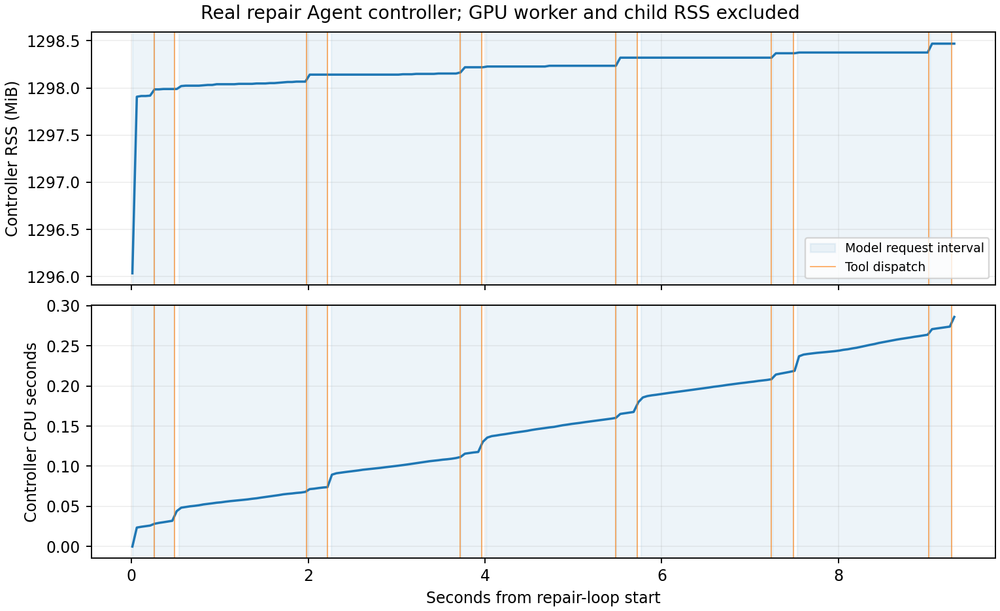

# 11-1 实际Agent控制器的CPU与驻留内存

状态：资源采样子实验完成，11-1整体partial。复用3-4的受控区间合并修复任务定义，新跑Qwen3-8B与真实文件/测试工具，补旧记录缺失的RSS和子进程CPU。旧任务数据不修改、不作为此次无采样性能对照。12轮后Agent未宣告完成，最终可见测试仅2/6通过；失败尝试和完整消息均保留。

## 测量对象与实际结果

RTX主机上vLLM真实生成工具JSON，控制器读取/写入文件并启动独立Python测试进程；GPU模型worker与CPU工具分开。模型配置、Torch/vLLM版本和源码哈希见results/environment.json。每50ms读取控制器/proc/self/status的VmRSS和RUSAGE_SELF CPU，实际186样本，中位间隔50.166ms、最大61.933ms；这不是硬实时采样。

| 指标 | 本次观察 |
|---|---:|
| 整个修复循环墙钟 | 9.357789秒 |
| 12次模型请求墙钟和 | 8.995477秒 |
| 模型区间控制器CPU和 | 0.157146秒 |
| 工具区间墙钟和 | 0.275527秒 |
| 工具区间控制器CPU和 | 0.075647秒 |
| 工具区间已回收测试子进程CPU和 | 0.179064秒 |
| 模型区间控制器RSS采样范围 | 1297.906–1298.469 MiB |

模型请求期间控制器大部分时间没有消耗CPU，但内存保持驻留。这里的控制器RSS包含Python、Torch、tokenizer、引擎前端及采样记录，不是干净工具沙箱的每环境内存，不能直接乘以环境数做预算；它也不含活GPU worker、测试子进程RSS或显存。模型等待更不表示整台机器空闲。

图中蓝色阴影是实际模型请求区间，橙线是工具开始。CPU曲线从首个样本计数归零；报告的阶段CPU来自另设边界，二者统计窗口不同，不要求精确相加。工具子进程CPU为RUSAGE_CHILDREN前后差，覆盖实际回收的测试进程及其开销。控制器CPU包括采样线程和运行时工作，不宣称纯业务指令时间。

初始化、基线测试和模型关闭在主体采样窗口外；最终测试在循环末尾，其时间进入最终elapsed，但阶段和只包含12轮工具。没有把嵌套CPU秒再加进墙钟。短工具区间只有8个RSS样本，control区间仅1个，不能用低频样本推断瞬时内存峰值或空白区间为零占用。

## 质量与复现

真实动作包括读取文件、写修复和六次运行测试。最终代码仍修改输入；通过数量、完整逐例预期和实际值见results/final.json。资源消耗不能因为未成功而删掉；本次未换模型、未比较暂停环境或修复策略收益。

专用远端环境执行示例（调整绝对权重路径至相同快照）：

    /home/ubuntu/vllm023-venv/bin/python run.py \
      --model /home/ubuntu/.cache/huggingface/hub/models--Qwen--Qwen3-8B/snapshots/b968826d9c46dd6066d109eabc6255188de91218 \
      --output results

run.py自带任务/测试和工具控制，拒绝覆盖已有输出。需要Linux /proc与resource，Mac可离线分析；工具AST限制不是完整安全沙箱。独立副本中运行，保留原始模型输出和全部失败。离线 python3 analyze.py 核验源码、完整会话连续性、计时/CPU单调性、最终文件与测试结果；python plot.py 需Matplotlib。原始输出、采样、日志、图和脚本由manifest.json封存。

引擎关闭完成、控制器退出；gpu-after.txt显示原有四项GPU服务仍在，无本实验控制器残留。没有杀原服务或调用calculations。不同等待/工具耗时/到达突发条件、完整环境进程树内存与暂停/恢复收益仍待；不由这一轨迹直接推出扩容结论。最终跨session实验与论文复核仍待首轮全部实验完成。
