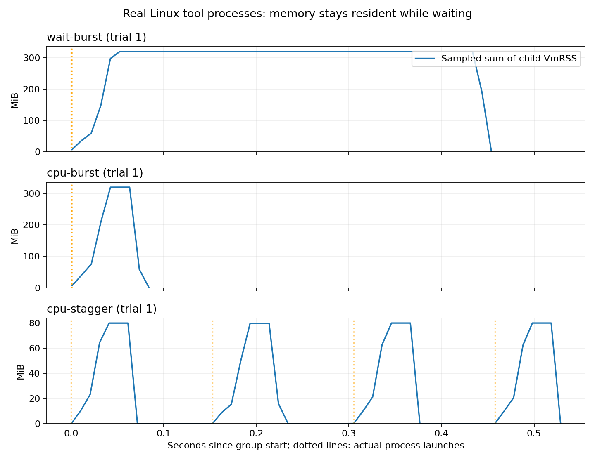

# 11-1 工具子进程：等待、CPU工作与到达突发

完成独立资源测量补充，11-1整体仍为部分完成。RTX主机Linux上的36个真实Python工具子进程，九组随机顺序，每条件三轮、四进程。每个进程分配并逐页触碰64MiB；等待条件sleep 400ms，CPU条件做250000次256字节SHA256更新。突发同时提交，间隔条件计划每150ms提交。无GPU请求、模型等待预测、VM恢复或容量模拟，不调用calculations。

| 条件（三轮中位） | 组墙钟秒 | 子CPU秒和 | 采样RSS峰值和MiB | 采样RSS驻留GiB·秒 |
|---|---:|---:|---:|---:|
| 等待，突发 | 0.471 | 0.175 | 319.5 | 0.1305 |
| CPU，突发 | 0.103 | 0.291 | 319.6 | 0.0141 |
| CPU，间隔 | 0.539 | 0.271 | 80.0 | 0.0138 |

等待期间内存持续驻留；CPU秒包括Python启动、导入、分配和触页，不是sleep本身的CPU成本。相同CPU任务分散到达，观测峰值较低，整个组的完成时间则受人为到达间隔拉长。不能把这个差异当作调度器提速，或据三轮小样本选择生产容量；没有固定核数、绑核、后台负载隔离和SLO测量。等待与CPU条件工作内容不同，CPU秒差不是单因素优化收益。

图固定展示trial 1，三面板横轴相同、纵轴自适应，点间连线为采样插值，虚线为实际启动。所有trial原件均保存，没有按效果挑选。目标10ms采样，各组实际最大间隔以及启动偏差见summary.json；间隔条件的最大启动偏差三轮中位约7.35ms，不把计划150ms当成精确实际到达。

## 口径与证据

采样读取每个活子进程/proc/PID/status的VmRSS与stat CPU ticks；RSS和会重复统计共享页，**不是PSS、物理内存、cgroup或整个Agent进程树内存**。父监测器和GPU模型worker未计入。离线积分只对实际采样点做梯形积分，漏掉未采样瞬态和首样本前驻留；不是精确分配字节积分。64MiB有效载荷以外还有解释器等开销。回收后进程不再统计；末尾sleep最多增加约10ms墙钟，已保留在结果中。

CPU采用各子进程退出前的RUSAGE_SELF总user+system之和；运行时tick样本也保留，不能把其粒度当作精确工具段CPU。程序从分配前记录start、触页后ready、工作后end，父进程记录launch/reaped；初始化、监测和采样开销没有被伪装成业务执行时间。

全部36子进程退出0，逐页检查均正确，CPU输出与独立一次性SHA256参考完全一致。分析检查PID、时间顺序、四进程完整性、源码哈希和工作结果。组结束记录含全部回收状态；远端ps复核未发现本实验run.py残留。未处理GPU服务。

## 独立复现

Linux/Python标准库即可。在本目录的独立副本执行（results存在则拒绝覆盖）：

    python3 run.py --output results
    python3 analyze.py
    python3 plot.py

绘图额外需要Matplotlib；离线分析可在Mac运行。PROTOCOL.md为运行前参数，results含环境、顺序、九组逐进程stdout/stderr及全部采样。run.log记录每组终止。manifest.json封存脚本、文档、原始数据、摘要和图。

原11-1真实模型轨迹的封存件未修改。本项补工具进程测量，不把人工sleep当作真实模型等待，也不证明暂停/恢复或增加CPU/GPU的收益。完整Agent进程树、更多工具与到达条件、资源扩容及最终跨session论文复核仍待完成。
