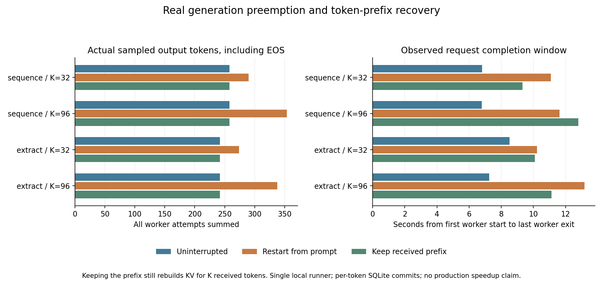

# 11-4：真实生成被抢占后的token前缀恢复

在Mac本机Metal上实际执行12条生成路径、20个模型worker。两项新任务全部严格验收通过；8条被抢占路径恢复后的完整token IDs均与对应不中断基线一致。从头重做实际多采样并重复投递32或96个token；保留已提交前缀没有这些重复采样，但确实重新处理了前缀以构建KV。

保留前缀不保证更快：整数序列K96的恢复窗口为12.800秒，反而长于从头重做的11.619秒。这里验证的是这些任务上的恢复正确性与实际工作，单次路径不支持稳定加速或生产容量结论。费用、资源存活时间与预期损失仍由计算任务C63负责，本目录没有实现这些模型。

## 固定任务与正式结果

[协议](PROTOCOL.md)和[tasks.json](tasks.json)在执行前固定两项全新任务：输出101至164的完整JSON整数数组；从给定打乱表格提取24个编号与code，按编号升序输出JSON对象。两个抢占阈值为32／96个非EOS token，greedy／关闭thinking／总输出上限768。没有借用8-7的短答案或生成轨迹。

2任务×2阈值×3策略共12条正式逻辑路径，seed1104固定打乱执行顺序。两个K下各实际运行了一次baseline，属于相同任务的配对重复，不能称12个独立任务。独立smoke使用整数11至26、K8、上限128，3条路径均通过，未据此修改正式任务。

| 任务／K | 策略 | 实际采样token总数 | 唯一提交token | 重复投递 | 窗口秒 |
|---|---|---:|---:|---:|---:|
|sequence／32|不中断|258|258|0|6.816|
|sequence／32|从头重做|290|258|32|11.083|
|sequence／32|保留前缀|258|258|0|9.319|
|sequence／96|不中断|258|258|0|6.791|
|sequence／96|从头重做|354|258|96|11.619|
|sequence／96|保留前缀|258|258|0|12.800|
|extract／32|不中断|242|242|0|8.520|
|extract／32|从头重做|274|242|32|10.212|
|extract／32|保留前缀|242|242|0|10.084|
|extract／96|不中断|242|242|0|7.241|
|extract／96|从头重做|338|242|96|13.177|
|extract／96|保留前缀|242|242|0|11.114|

计数包含最终EOS，K本身只数非EOS。正式总计3256次真实token采样、3000个唯一提交位置、256次相同token重复投递；8次实际SIGKILL全部发生在预登记K。12条路径均自然EOS、严格JSON质量通过，无length截断、冲突或恢复token分歧。正式控制器总墙钟121.101秒。



窗口从第一次worker创建返回至最后worker退出被观察到，包含模型加载、两次进程切换、真实生成、HTTP／SQLite确认等待，不含此前管理器启动和之后数据库备份。它不是纯模型时间，也不是从单次平均token速度算出的虚拟完成时间。完整阶段时间在formal/summary.json每条workers下，原始模型调用在calls.jsonl。

## 真实中断、提交与去重

每条逻辑request有独立HTTP管理器和SQLite数据库，meta固定request_id，tokens表的seq主键在该request内唯一，逻辑身份为(request_id,seq)。SQLite使用WAL和synchronous=FULL；新token事务提交完成后才允许ACK。模型revision及prompt身份绑定到管理器，重试必须相同。

第K个非EOS token提交后，HTTP handler进入明确屏障，不发送ACK。控制器观察提交屏障、核对自己start_new_session创建的PGID，再SIGKILL模型进程组；确认退出后才解除handler，handler关闭连接而不补发ACK。管理器持续存活，新的PID从数据库查询实际提交前缀。因此这是“提交已发生、ACK尚未返回”的真实进程中断，未声称注入物理网络丢包或管理器故障。

从头策略重新发送seq0起的真实生成。相同seq同时比较token ID和EOS标记，完全相同计重复；不同内容返回409并记录conflict，绝不静默覆盖。保留前缀策略从已提交高水位K继续，旧数据库逐位置保留。正式没有出现冲突，因此本次证明相同重复的处理及这些生成路径；不同内容分支由源码审查确认，未额外声称已实际注入冲突。最终同时保留数据库及SQLite backup生成的快照，离线核验以快照为准。

## KV重建仍有真实工作

实际模型为官方Qwen3-8B-MLX-4bit，固定revision383413e909f3bc5303ce195ebbdf0339c5a1a2a3，缓存权重文件4,351,884,216 bytes，所有模型文件执行前逐项SHA核对；没有复制第二份权重。M2 Max96GiB，MLX0.32.2、mlx-lm0.31.3、Transformers5.16.1，Mac Metal执行，不使用RTX。

这里使用自己的同步model／argmax／mx.eval／synchronize循环，每token收到管理器ACK后才计算下一步。未使用会提前提交下一步的mlx_lm.generate_step，不能把此测量标成该API的性能。抢占前generated日志恰好K条，没有未报告的提前一步采样。

所有worker对原prompt按256token分块prefill；sequence prompt50token、extract309token。恢复必须重新加载同一模型，再次处理完整原prompt。preserve还将已提交token按64token块teacher forcing重建KV，然后从下一位置实际argmax续写。K32使用一个32token块，K96使用64＋32两个块，全部36层的真实KV offset逐调用记录并核验。

四条preserve分别实际重建32／96／32／96个prefix token，耗时84.592／263.293／223.925／256.043ms。这个工作不计为重新“采样输出token”，却确实执行了模型，不能算零成本。批量重建和原单步decode的数值路径可能不同；这两个任务的全token比较实际通过，但不能推广到随机采样、其他任务或模型。

RSS约100ms采样峰4,717,379,584 bytes；MLX active观测峰4,521,207,816 bytes、框架peak峰4,874,725,488 bytes。它们不是同一内存口径，也不是硬件能耗。单worker及自身进程组限制16GiB，单worker300秒；实际所有worker退出，无存活残留，管理器socket和数据库正常关闭。模型加载受已有文件缓存、前序运行及主机共存影响，无独占频率或冷盘保证。

## 独立核验与复现

[analyze.py](analyze.py)不加载模型，仅加载原tokenizer。正式6778项、smoke474项机制检查通过，包括：DB每行与首次实际提交对照；worker真实生成与提交内容、时间对应；commit-before-kill、K处无ACK、无提前采样；原task模板→prompt SHA→DB→各worker一致；真实EOS token集合与末位置；恢复高水位、序号及新旧PID时间；KV offset、prefill及重建输入数。质量检查拒绝重复JSON键，要求整数的type确为int、提取对象完整键值与顺序，并要求自然EOS。性能和质量结果不会被机制assert自动改为成功。

formal/保存12条原始token流、20个worker环境／模型调用／ACK日志、管理器事务事件、每request数据库及快照、资源与进程记录；source-sha.json绑定执行时协议／代码／任务／模型身份。smoke单独保存，不合入正式计数。PNG/SVG已目视检查；manifest逐文件封存。没有启动调试失败待清理，所有预登记抢占日志保留。

脚本独立，不导入其他实验代码。需要相同MLX环境及model-identity.json指定的既有模型；在整个目录副本执行，新结果名称必须不存在：

```sh
python -B verify_inputs.py
python -B launch.py --name smoke-new --smoke
python -B analyze.py --name smoke-new
python -B launch.py --name formal-new
python -B analyze.py --name formal-new
```

图脚本默认读取已交付formal，需Matplotlib；修改副本中的输入路径可画新批次。现有脚本基于Mac的ps与进程组管理，不是跨平台沙箱。

11-4的真实生成／抢占／接收／恢复记录已补齐此小模型变体。未测多机资源扩张、随机策略、并发rollout、管理器崩溃、存储故障、成本或资源存活临界点，不据此把原11-4全范围标为完成。未改正文、inventory、PROGRESS、共享模型／环境或calculations，最终跨session论文审计尚未开始。
