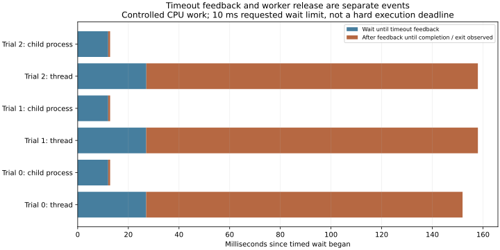

# 11-5：超时反馈、执行结束与资源释放

本目录先完成11-5的超时变体，实际执行确定性CPU校验工作，区分反馈返回与worker完成／退出。三轮结果中，线程等待超时后仍继续工作约 **130.885 ms**（中位数）；受控子进程收到终止信号后约 **0.767 ms** 观察到退出。三次宽限额复验全部得到正确结果。超时本身不能证明计算结果错误，反馈返回也不能证明资源已释放。

## 执行与结果

在本地Mac实际运行Python，版本和平台保存在results/run-v1/raw.json。工作为固定600000次串行SHA256，先独立完整执行取得参考摘要；它是明确构造的验证载荷，不是模型生成程序、真实RL任务或CUDA性能测量。

每轮顺序执行：线程等待10ms、独立子进程等待10ms后终止并回收、同工作10s宽限额复验。计时从worker已启动后开始，不包含前置排队。线程路径显式shield保留实际任务，在反馈后继续等待真正完成；进程路径只终止自己创建的子进程，并await退出。没有留下后台工作，没有杀外部任务或服务。

| 指标中位数 | 线程等待超时 | 子进程终止并回收 |
|---|---:|---:|
| 请求的等待限额 | 10 ms | 10 ms |
| 实际反馈等待 | 27.045 ms | 12.045 ms |
| 反馈后至完成／退出观察 | 130.885 ms | 0.767 ms |

线程完整输出与参考相同；被终止的进程没有完成输出，退出码为信号终止。三次相同工作宽限额重跑均通过，因此若把短超时直接记为错误奖励，会把本次可正确完成的工作计为失败。复验本身也消耗资源，原始工作时间和thread CPU时间保留，没有宣称免费纠错。



调度及解释器执行会影响实际超时返回，不能把10ms配置当作硬截止。线程与进程的启动/GIL/执行位置不同，本实验不把二者总耗时当公平吞吐排名。release_observed是等待者观察到完成或已回收子进程的时刻，不是操作系统CPU配额或全部内存释放的计量。

## 复核与范围

```sh
python run.py --output results/run-v2
python analyze.py
python plot.py
```

run.py拒绝覆盖旧结果。分析默认run-v1；新版本在目录副本中修改分析路径，保留旧记录。标准库即可运行与核验，画图需Matplotlib。analyze.py核对每轮真实超时、反馈后仍运行、最终完成／退出、校验摘要和复验结果；完整事件和源码哈希封存。

本次没有实现DistRS／verl，也没有比较两批候选的FIFO与批次目标调度、CPU编译和GPU执行资源分配。这些11-5要求仍待，状态partial。既有calculations教学调度和条件剩余时间不重复执行或修改。最终跨session论文增补复核尚未开始。
