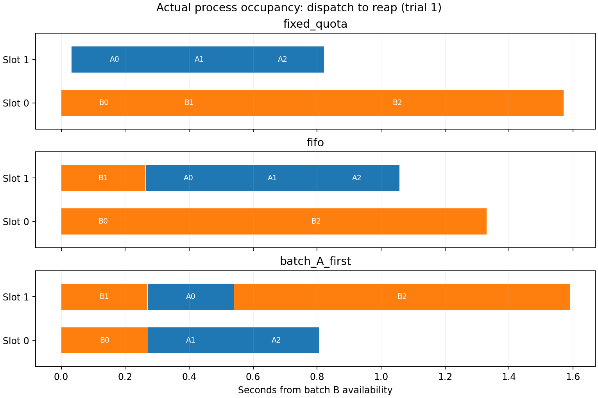

# 11-5 两批验证工作实际调度

状态：两批CPU调度子实验完成；11-5整体仍为partial。Mac实际独立Python子进程，两个逻辑执行槽位，比较固定每批一槽、共享FIFO和共享A批优先。不是模拟队列，也不是verl/DistRS生产调度实现。

## 设计

B批三任务在t=0可用，A批三任务在t=30ms可用；可用时刻是控制输入，不是模型真实生成记录。一般任务600000次串行SHA256，B2为3000000次长尾。实际compile固定Python验证代码、执行并输出digest；独立完整运行两种长度取得参考，保存原始参考工作时间。摘要核对验证执行一致性，不证明任何模型生成代码的正确性。

每策略每轮执行相同六个任务，三轮随机策略顺序seed1105，共54个正式子进程。固定配额每批一槽且不可借用；FIFO按可用时刻及序号；A优先只影响尚未开始的工作，已运行不抢占。A批目标事先指定，不读取未来实测时长。槽位在父进程wait回收后才释放。两个槽是实验限制，不代表Mac仅有两个CPU，也未限制OS调度到固定核心。

## 结果

| 策略 | A批全部反馈中位秒 | B批全部反馈中位秒 | 全部进程释放中位秒 | CPU工作和中位秒 |
|---|---:|---:|---:|---:|
| fixed_quota | 0.809988 | 1.570138 | 1.577498 | 1.975633 |
| fifo | 1.041770 | 1.306119 | 1.313080 | 1.966657 |
| batch_A_first | 0.776328 | 1.561612 | 1.568646 | 1.969164 |

A优先相对FIFO提前A批反馈，但延后B批及全部释放；不能把一批受益称整项吞吐改善。固定配额也有初始空槽和不可借用约束。全部54摘要匹配参考、退出码0，离线按实际dispatch/release区间核对最多两任务及每个决策的政策顺序。三轮不建立稳定尾延迟或显著性结论。

图固定展示第1轮三个策略，条宽为dispatch至wait回收，包含进程启动、Python编译、工作和退出。summary.json逐任务另列排队、进程启动、编译、执行、结果抵达与回收间隔；不能把整条宽称纯执行时间。批次反馈从B批可用时刻计，A批自身30ms可用延迟保留。CPU工作和使用子进程process_time差值，覆盖被测校验工作，不含全部启动/退出或系统成本。

## 重现与范围

仅Python标准库执行：在不存在results的独立副本运行 python3 run.py。python3 analyze.py 核验源码SHA、54输出、两个槽位、固定配额隔离、策略选择和计时先后；python plot.py 需要Matplotlib，python3 write_report.py 重建报告。results保存完整任务规格、两种参考、策略顺序、逐子进程时间与平台信息；cleanup-check.json确认子进程退出，manifest.json封存数据和脚本。

[既有超时与释放实验](../README.md)原样保留，本次没有重跑。CPU编译为Python compile，不冒充C++/CUDA编译；真实生成候选、GPU资源分配、与训练阶段联动等仍待。没有调用calculations、没有GPU任务或外部服务改动。最终跨session实验及论文复核仍待全书首轮完成。
