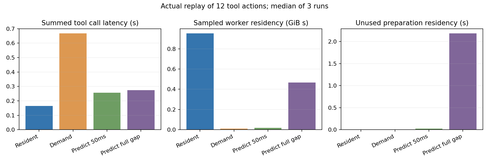
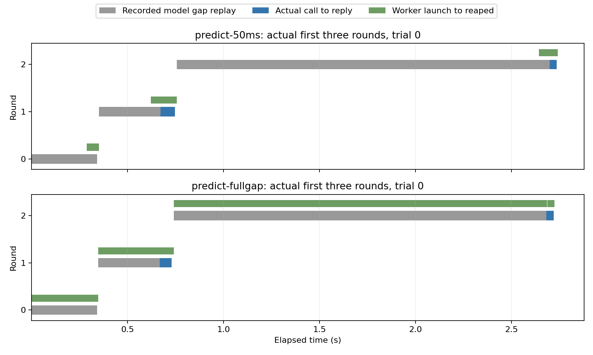

# 11-6 工具进程预热的收益与浪费（实际轨迹重放）

Mac本地标准Python真实执行3-4已采集的12轮工具动作：1读、5写、6次测试。每轮工具返回和文件SHA与原始轨迹严格一致；模型阶段仅按原记录13.156450秒总时长等待，不执行或模拟模型输出。实际工具代码和内容固化在fixture.json，可独立运行。

四条件各3次，共144次真实工具调用：两个进程常驻；每次调用后按需创建；按固定预测提前50ms创建；同一预测从整个模型间隔开始创建。原任务最终测试未全过，重放一致不是代码修复质量通过。

## 实测结果

各策略3次中位；预测命中率均10/12，未执行工具的预测进程均2个。

| 策略 | 任务完成s | 累计工具调用s | 采样峰值RSS MiB | 采样GiB·秒 | 无用准备就绪驻留s |
|---|---:|---:|---:|---:|---:|
| resident | 13.413 | 0.165 | 72.88 | 0.9513 | 0.000 |
| demand | 13.968 | 0.667 | 36.39 | 0.0114 | 0.000 |
| predict-50ms | 13.570 | 0.256 | 36.42 | 0.0193 | 0.023 |
| predict-fullgap | 13.596 | 0.275 | 36.45 | 0.4673 | 2.182 |

将预测提前量从50ms扩到整段等待，在本次三重复中没有降低工具延迟中位，却把采样worker驻留从0.0193增至0.4673 GiB·秒；两个错误预测的就绪驻留从0.023增至2.182秒。提前更多的收益有限而闲置成本上升，不据此给出通用最佳提前量。

所有时间均由perf_counter_ns实测。任务完成包括初始常驻进程准备、原记录的等待阶段、真实工具调用和中间进程销毁；末尾清理另列total_with_cleanup_s。工具累计调用延迟从明确调用到收到工具结果，包含尚未完成的准备与错预测处理；没有把提前准备消耗藏进工具执行时间。





时间线固定展示trial0前三轮；绿色为实际worker从启动到回收，错预测及补建进程分别保留。

## 方法与内存口径

预测只使用已经完成的工具类型：初始file，之后选择历史最近观察到的“上一类型→下一类型”转移；没有该转移则保持上一类型。当前工具类型在正式调用时才用于命中判断。预测进程只分配缓冲并导入依赖，正式读取／写入／测试均在调用后发送命令。错预测进程销毁，实际类型重新创建。两种预测提前量的输入和规则相同，未按结果挑选规则。

file/test是本实验定义的两种独立Python进程类型，各分配16MiB零初始化缓冲；它们不是真实不同容器镜像或安全隔离。缓冲的分配大小不是物理驻留量。工具工作空间跨轮保留，进程生命周期按策略变化，各案例工作空间从原初始文件重建。

约每50ms再加ps调用开销，采集活跃worker当前RSS；以采样窗口中点和相邻RSS梯形积分生成GiB·秒。缺少启动、退出和短生命周期中的样本，故该值是采样估计，不是精确内存账单。高水位ru_maxrss另存于ready/reply，不拿高水位积分冒充当前RSS。RSS可能重复统计共享页；未采集控制器、ps和测试子进程内存，不能称平台总内存。无CPU亲和性或背景进程隔离，三重复不支持生产级显著性或容量结论。

未使用RTX、Docker、E2B或SpecBox，也未改变模型策略。这里只测真实主机工具进程准备，11-6的环境大小／切换频率／预测准确率完整扫描和容器级对照仍未完成，不把抽象计算任务C62重复执行或覆盖。

## 原始证据与复现

运行前协议见PROTOCOL.md。fixture.json绑定原run.py和rounds.jsonl的SHA，保留全部动作、模型阶段边界、原结果与每轮文件hash。每案例raw.json保留launch／ready／call／send／reply／destroy和RSS窗口；workspace保留实际最终代码、测试文件与规范。completion.json仅在全部案例正常结束后生成。analyze.py验证144次工具结果、文件hash、在线预测、事件顺序和全部worker退出，summary.json与per-case.json保留指标。

```bash
# 在新复制的实验目录删除旧results或将其移到另一个目录，勿覆盖封存原件。
python3 run.py
python3 analyze.py
# 绘图另需matplotlib；真实实验与验证只需标准库。
python3 plot.py
```

run.py若results已存在会直接拒绝。Mac Python3.14.7完成本轮；同机所有进程使用同一个perf_counter时钟，平台信息见environment.json。

原Linux工具limits中的RLIMIT_AS在Mac实际preexec报错，已在compatibility-probe.json保留；probe.py使用tools-linux-original.py可再次检查原行为。正式tools.py明确移除该地址空间限制，保留2秒CPU限制、4秒subprocess超时和原AST守卫；不宣称这些措施是完整沙箱。没有删掉原轨迹中的失败测试。本目录正式运行正常完成，各配置 completed_rounds=12。
