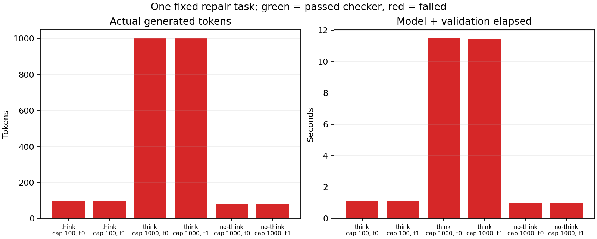

# 11-8 同任务的思考开关与生成上限实测

状态：预算与质量子实验完成，11-8整体partial。固定Qwen3-8B BF16、vLLM实际请求，三条件各两轮；输入为已知受控区间合并修复任务，所有条件使用相同规格和六例检查。**六次均未通过完整检查**，本次候选集没有满足质量门槛的方案。

## 设计和结果

thinking开启、总生成上限100与1000；thinking关闭、总上限1000。max_tokens限制全部生成token，不是独立的reasoning token配额，不能冒充C64的精确思考长度手算。两轮内策略顺序seed1108打乱，APC关闭，串行，每次重建工作目录，前次输出不写入后续上下文。思考开关改变模板，输入分别157/161token，实际IDs完整保留。

| 条件 | 两轮实际输出token | 结束原因 | 模型与验证总时间秒 | 质量结果 |
|---|---|---|---|---|
| thinking，cap100 | 100 / 100 | length / length | 1.142 / 1.147 | 思考尚未结束，无可解析回答 |
| thinking，cap1000 | 1000 / 1000 | length / length | 11.474 / 11.454 | 思考尚未结束，无可解析回答 |
| no-thinking，cap1000 | 84 / 84 | stop / stop | 1.014 / 1.014 | 代码仅通过3/6检查 |

开启思考的四次输出没有结束思考标签及后续JSON；所有截断输出和解析失败都保留。关闭思考的两次完整代码相同，但仍原地排序输入、嵌套区间会缩短终点；自然结束不代表正确。每次首token约15–20ms，却没有产生通过检查的可用修复；summary.json的verified_usable_s因此全部null，不能以TTFT代替首个正确结果时间。

这是一项已知任务的两次重复，不是质量基准或模型总体能力判断。它不证明更长预算永远无益，也不支持从失败候选中选出“成功任务更便宜”的方案。没有服务商价格、机器整机账单或跨模型质量数据，费用字段保留null；不用token数虚构货币成本。所有失败消耗都保留。

## 复现与证据

run.py和fixture.py独立携带任务、初始代码、AST约束与测试。AST限制不是完整安全沙箱；受控测试子进程另有限时/地址空间限制。原始engine配置、Torch/vLLM版本、源码SHA保存在results/environment.json。GPU为RTX PRO 6000，完整权重路径见环境记录，初始化在六次请求计时之外。不是无扰动或生产性能实验。

在独立副本且无results时运行：

    /home/ubuntu/vllm023-venv/bin/python run.py \
      --model /home/ubuntu/.cache/huggingface/hub/models--Qwen--Qwen3-8B/snapshots/b968826d9c46dd6066d109eabc6255188de91218

离线 python3 analyze.py 核验源码、六条件、固定输入、APC零命中、输出事件/终止原因、保存代码及实际测试结果；python plot.py需Matplotlib。results保留全部token IDs、完整输出、事件时间、测试stdout/stderr和每次工作目录。manifest.json封存脚本、日志、图及数据。

引擎已关闭，gpu-after.txt显示原有四项GPU服务未动。更宽预算或其他模型、缓存/排队、实际费用与质量约束路由仍待；这六次失败不自动完成11-8。没有调用calculations；最终跨session实验及论文复核仍待全书首轮完成。
