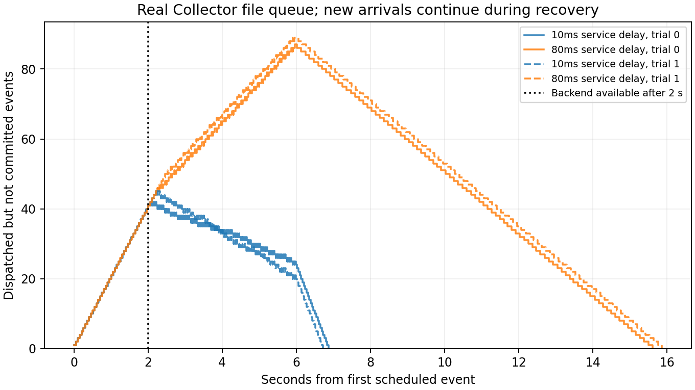

# 11-9 后端恢复时仍有新事件到达

状态：持续到达与排空子实验完成，11-9整体仍为partial。使用本地真实OpenTelemetry Collector contrib0.133.0、file_storage/fsync=true、OTLP HTTP和SQLite后端。不是队列仿真。

## 方法

每条件120事件，计划20次/s、约6秒持续到达，每事件有2048字节padding（整体事件和OTLP请求另有元数据）。前2秒后端返回503；随后在每次后端请求中额外等待10ms或80ms，再实际提交SQLite。该等待是注入的受控服务耗时，不是测得的物理链路带宽。两轮，轮内条件seed1109打乱，正式共480次事件发送。

固定100请求文件队列、一个消费者、无batch processor、无采样；重试200ms初始、1秒最大、总时长不限。源端保存计划发送、实际dispatch与HTTP接收确认，后端保存实际收到和事务提交后的时间，最终按事件ID逐字核对。未完成数是源端已dispatch减去后端已提交，包含传输、队列与在途；它不是Collector内部队列长度。

## 实测结果

| 轮次 | 注入服务等待ms | 首次清空距恢复秒 | 清空时仍在发送 | 停发时未完成 | 停发后排空秒 | 最大发送迟到ms |
|---:|---:|---:|---|---:|---:|---:|
| 0 | 10 | 4.867 | False | 25 | 0.893 | 10.253 |
| 0 | 80 | 13.610 | False | 87 | 9.641 | 10.406 |
| 1 | 10 | 4.723 | False | 21 | 0.746 | 10.219 |
| 1 | 80 | 13.868 | False | 89 | 9.898 | 10.479 |

10ms条件恢复后积压逐渐减少，停发后仍需0.746–0.893秒；80ms条件恢复后积压继续增长，停发后还需9.641–9.898秒。两档都未在持续发送期间清空。注入等待不包含文件队列、HTTP与SQLite等路径开销，不能按等待倒数直接当导出吞吐，也未单独测量这些开销的归因。每条件120条均被Collector接受并最终逐字提交，无缺失；重复提交数另存summary.json。曲线与原始记录保留最初中断期间的积压、新事件持续到达和最后排空，不能把“最早那批旧事件已经抵达”当作系统全部清空。summary.json也单独记录旧事件最后提交时刻。每条件只有两次重复，结果不当生产吞吐、稳定p95或长期无损保证。

停发点采用最后一次发送获得接收确认并完成本地记录的实际时刻；后端恢复为预定2秒阈值，重试何时再次抵达由实际记录决定。源端按绝对截止安排发送，但单线程HTTP提交仍可能使发送迟到，因此公开实际偏差。

## 计时修正与复现

timing-pilot-v1保留四条件初版完整记录：其后端end_s取在SQLite事务开始前，因此不进入正式曲线。正式run.py在事务提交后记录end_s，并保留事务前commit_start_s；SQLite行内时间仍为事务前标记，离线统计使用后端JSON的事务后end_s。初版480事件与正式480分开，不混用。

固定二进制版本和发布包校验见本目录environment.json，run.py的二进制路径可在独立副本调整。源码config.py独立包含完整配置，不导入其他实验脚本。确认31331/31332/31333空闲，运行 `python3 run.py`；已有results会拒绝覆盖。离线 `python3 analyze.py`核验源码、SQLite内容、480接收/提交、计时先后和重复情况；`python plot.py`需要Matplotlib，`python3 write_report.py`重建说明。

results保留四份原始Collector配置/日志、源端事件、所有后端尝试、SQLite及文件队列数据库；cleanup-check.json记录无自建进程残留，manifest.json封存正式和初版文件。没有GPU调用或calculations改动。32/64MiB容量预算仍归另一任务；模型任务的重试/续接/升级成本对照和最终跨session实验论文复核尚待。
