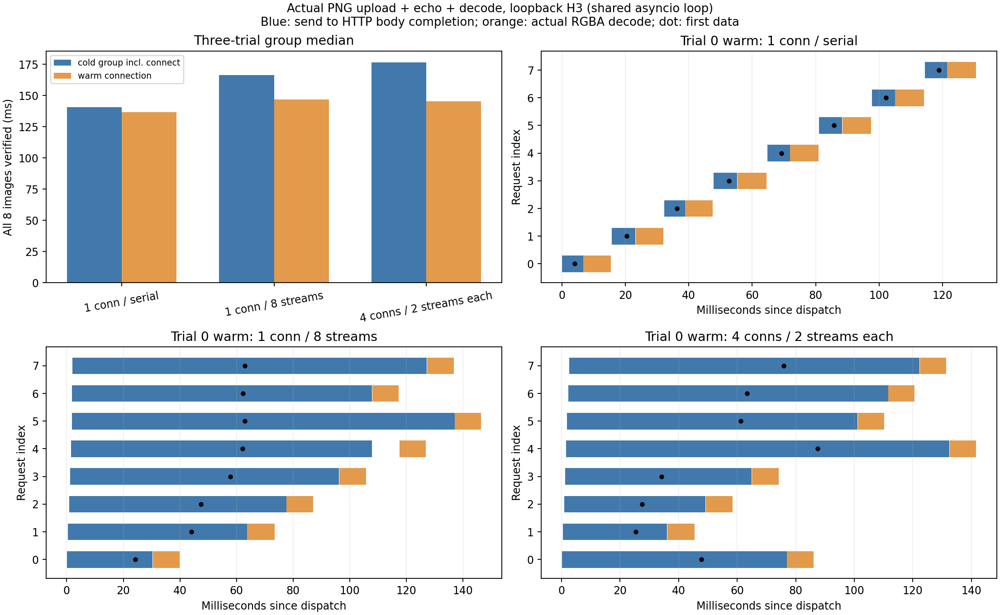

# 12-4：HTTP/3 单连接多流真实PNG传输

正式批次144次请求与18次连接预热共162次响应全部通过PNG字节及RGBA像素校验；此前独立smoke的48次请求与6次预热也全部通过。主agent接管后复算两批，未重复传输。并发条件的客户端在途与服务端接收重叠峰值均实际达到8，串行条件均为1。

## 实际比较与结果

固定同一68166字节PNG，解码1700×765像素。客户端POST上传，服务器完整接收后原样echo，客户端每次实际Pillow解码并核验尺寸、像素hash。载荷来自上一轮已封存图的只读副本，不需要模型；这是图片交付与解码，不是图片精修、ASR/TTS或设备播放。

aioquic1.3.0在本机127.0.0.1上实际执行QUIC/HTTP3，所有条件启用qlog与证书验证。三种拓扑分别为一连接依次处理8请求、一连接并发8个流、四连接各并发2流。冷组时间包括建连；热组每连接先完成一次真实PNG预热，再开始计时。热组的拥塞和流控历史也不同，不能当纯握手消融。

| 拓扑 | 冷组完成8张图中位 | 热组完成8张图中位 | 客户端／服务端重叠峰 |
|---|---:|---:|---:|
| 一连接串行 | 140.589ms | 136.822ms | 1／1 |
| 一连接8流 | 166.403ms | 146.859ms | 8／8 |
| 四连接各2流 | 176.638ms | 145.536ms | 8／8 |

每格三trial。组结束包含全部响应实际解码和校验，连接关闭、qlog落盘在组计时外；summary另列dispatch至全部校验、各流send至完整响应以及解码时间。并发增加了实际在途重叠，本批没有缩短整组完成时间；这不是QUIC在真实网络上的普遍排名。



图展示全部条件三轮中位数及固定trial0热组的真实时序。蓝色为发送至响应体完整，黑点为首个数据，橙色为实际RGBA解码。空白间隔也保留，不把协议完成与应用获得执行机会混为一谈。

## 证据与限制

客户端和服务端处于同一asyncio事件循环，PNG解码同步执行，Python处理和qlog也在路径内；主机同期有Mac32K实验，不声称主机独占或纯网络代价。仅本地环回，无人工延迟、限速、丢包或网络模拟，网络丢包率保持null。没有HTTP2/TCP匹配对照，不与上一轮不同payload直接计算协议加速比。

每条响应按连接ODCID与stream ID对应实际服务端记录，单独核验接收起止与完整上传hash；握手ALPN为h3，实际对端证书fingerprint匹配，均无session resumption/0RTT。正式36连接36份qlog，预检12连接12份qlog。两批各有每连接一次header_parse_error记录（36／12），保留原件；不是已测链路丢包，具体原因未由本批定位。

completion和全部逐请求、连接、服务端、组记录齐全。cleanup-check.json记录两批UDP监听端口可重新独占绑定。接管时原执行句柄34658不可查询，原进程退出码未知，不编造exit0；完整输出与端口清理可以独立验证。证书与私钥只用于本地夹具，重新运行会现场生成新的测试证书。

## 独立复现

在本目录创建私有环境：

```sh
python3 -m venv .venv
.venv/bin/python -m pip install -r requirements-lock.txt
.venv/bin/python run.py --output new-smoke --smoke
.venv/bin/python run.py --output new-results
python3 analyze.py --folder new-smoke
python3 analyze.py --folder new-results
```

输出目录存在则拒绝覆盖。分析脚本只需标准库；本次原件分别位于smoke和results，使用对应--folder复算。plot.py读取results-summary.json，绘图需Matplotlib，输出PNG/SVG。每次源码身份、版本、载荷、像素、证书、完整时序均独立保存；sources/payload.png已经随目录提供，不依赖相邻实验代码。

本次requirements-lock、源载荷出处、完整运行日志、两批原始数据、独立分析及图一并封存。第12-4项仍需真实业务、受控网络、窗口/分块/恢复与首播等原要求；本轮未进入最终跨session论文审计，也未操作calculations。
