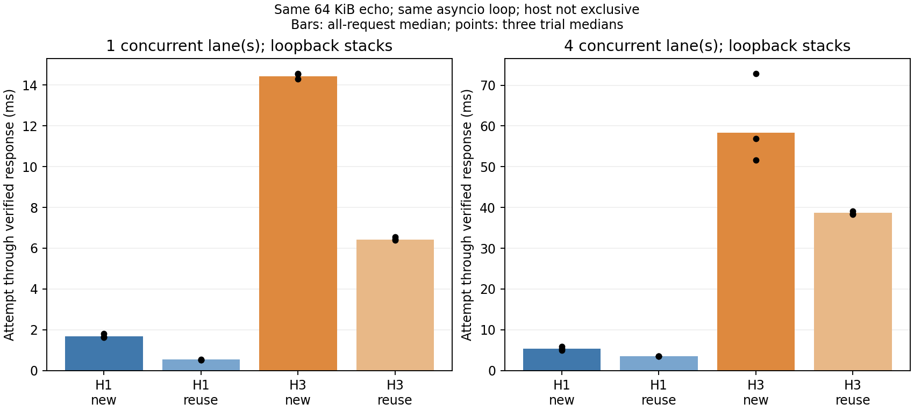

# 12-4：真实 loopback HTTP/1.1 与 HTTP/3 传输

第一轮实际完成 **192 个正式请求 + 2 个单独预热请求，194/194 上传与回传字节校验通过**。HTTP/1.1 over TCP+TLS1.3 与 HTTP/3 over QUIC 都走本地真实 sockets，证书验证开启；不是用计时模拟协议。状态为第12-4项的基础传输部分，原需求的图片成片、ASR/TTS、Computer Use结果及固定广域网络条件仍未完成。

## 这次执行了什么

本地 Mac arm64、Python3.14.7、h11 0.16.0、aioquic1.3.0，完整依赖在 requirements-lock.txt。两路径共享64KiB固定载荷和同一现场生成的自签测试证书，客户端将其作为可信CA验证localhost SAN。HTTP1.1 实际协商 TLSv1.3/ALPN http/1.1；HTTP3 实际握手为 ALPN h3，97个成功HTTP3响应头和DATA帧由原始qlog复核。没有HTTP2，也没有0RTT/session resumption。

三个trial，每trial八条件（协议×新建/复用×并发1/4）、每条件8请求；组内固定lane分配，trial内顺序按seed1204+trial打乱。正式前每协议一次独立真实预热，不进入主统计。服务器收齐POST后原样echo，不生成图片、识别文本或音频。客户端和服务端位于**同一个asyncio事件循环**；四lane是四个异步请求序列，不是四个进程。

首条运行命令的输出目录取名 smoke，却遗漏 --smoke，所以该目录实际保存完整194请求，environment.smoke=false。没有先完成小规模smoke。原协议写smoke每条件2请求，代码实现4以覆盖4lane；该模式本次未执行。两处偏差保留在 EXECUTION-NOTE.md，协议原文未改，未为改名或补前置步骤重复正式运行。

## 原始观测结果

每格24个正式请求；“尝试”从客户端本次开始至响应校验完成，首次连接时包括建连。下表均为这批具体实现的中位数。

| 路径 | 连接方式 | 并发lane | 24请求使用的连接数 | 尝试完成中位数 |
|---|---|---:|---:|---:|
| HTTP1.1+TLS | 每请求新建 | 1 | 24 | 1.680 ms |
| HTTP1.1+TLS | lane内复用 | 1 | 3 | 0.530 ms |
| HTTP1.1+TLS | 每请求新建 | 4 | 24 | 5.413 ms |
| HTTP1.1+TLS | lane内复用 | 4 | 12 | 3.502 ms |
| HTTP3 | 每请求新建 | 1 | 24 | 14.432 ms |
| HTTP3 | lane内复用 | 1 | 3 | 6.434 ms |
| HTTP3 | 每请求新建 | 4 | 24 | 58.331 ms |
| HTTP3 | lane内复用 | 4 | 12 | 38.645 ms |

复用条件仍包含每lane首请求建连：并发1时每组1次新建+7次复用，并发4时每组4次新建+4次复用，不能称全部热连接。两协议并发4条件都用四个连接，**没有测HTTP3单连接多流收益**。新连接模式旧连接暂留到组末统一关闭，所以打开的连接数随组增加；其与复用模式的差别不能解释成纯握手消融。

本次复用条件的观测中位数较低，但协议栈、TLS实现、Python用户态处理和记录开销也在测量内。HTTP3开启详细qlog，HTTP1.1没有同级逐包日志，仪器开销不对称；不据这些数字宣称TCP优于QUIC本体。summary中的握手中位数混合不同并发条件和预热，只是原始描述，不能作为协议握手常数或RTT。



## 网络、主机共存与异常边界

仅使用127.0.0.1，不注入延迟、限速或丢包，也未测量固定有效带宽/RTT/网络丢包率。相关字段保持null。首个响应数据字节不是首次播放、成片完成或截图业务轮时；没有WAN/mobile推论。应用层载荷hash也不代表实际链路字节数。

主机同期有 PID50035 的MLX32K实验进程，后续只读ps/cwd记录在 coexisting-process.txt；不能声称主机独占或归因某项资源竞争。没有使用RTX，没有终止其他进程或安装系统服务。自建监听器结束后，TCP连接返回拒绝码61、UDP端口可重新独占bind，cleanup-check.json保存检查。

qlog内有64次 `header_parse_error`，每个HTTP3连接一次，全部位于首个HTTP响应之前，事件raw.length为366–369。安装实现中该事件对应接收buffer的 `pull_quic_header` 抛ValueError，不是操作系统报告的链路丢包。qlog-drop-review.json保存64处上下文与实际源码哈希/带行号摘录。未保存原始UDP包字节，具体解析原因仍未知；不能称“无丢包”或把64作为丢包数。尽管出现这些记录，97个HTTP3请求均完整校验通过；服务端应用异常列表为空。

## 实现来源、复算与原件

[aioquic 1.3.0官方实现](https://github.com/aiortc/aioquic/tree/1.3.0)提供实际QUIC连接和HTTP3帧处理，使用其[asyncio连接API](https://aioquic.readthedocs.io/en/latest/asyncio.html)；TCP端使用[h11 HTTP1.1事件API](https://h11.readthedocs.io/en/latest/basic-usage.html)。official-sources.json记录固定tag源文件下载，三个文件均与实际安装模块逐字节相同，副本保存在sources。此处自己编写echo应用和计时，不实现或假冒底层协议。

本目录离线 `python3 analyze.py` 只需标准库，核验源码/载荷hash、194条客户端记录、两协议各97条服务端hash、连接数、时序、TLS/ALPN、无恢复/0RTT、97条qlog响应帧。`python3 plot.py`需要Matplotlib；图已渲染检查。

重新运行使用隔离环境（本次为 experiments/tools/http3-venv）：

```sh
python3 -m venv /path/to/private-venv
/path/to/private-venv/bin/pip install -r requirements-lock.txt
/path/to/private-venv/bin/python run.py --output NEW_OUTPUT --smoke
/path/to/private-venv/bin/python run.py --output ANOTHER_NEW_OUTPUT
```

已有输出目录拒绝覆盖。分析脚本默认核验本次历史命名的smoke目录；新的完整结果应在独立副本中放入该位置再复算。新执行会生成新的短期测试证书；本次证书和仅用于夹具的私钥作为原始记录保留，不是外部服务凭据。smoke目录包含载荷、证书、全部逐请求记录、128连接记录、26组时序、64压缩qlog及服务端原件。install.log、requirements-lock.txt、源码来源、执行偏差、共存/清理检查和manifest一并保留。

没有修改calculations、原封存实验、正文、PROGRESS或inventory。后续仍需真实业务轨迹、受控网络、窗口/分块/恢复、多流和设备播放观测，才能完成原第12-4项；本轮不开始最终跨session论文复核。
