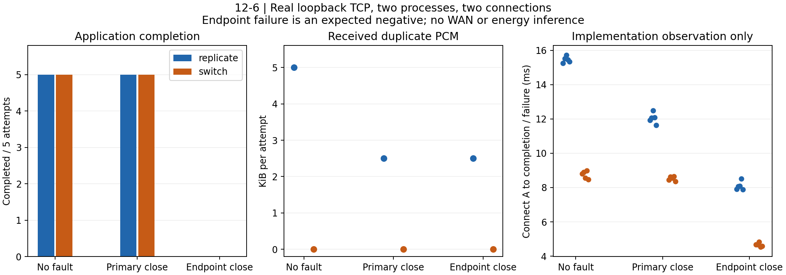

# 12-6：真实本机双路径传输与取消

本有界实验完成 **6 次预检 + 30 次正式尝试**。正式实验中，复制和故障后切换在无故障、主连接关闭条件下各完成 5/5；共同端点关闭时各完成 0/5，10 条失败作为负例保留。离线独立验收接受全部30条预期结果，另拒绝重复消费、缺失取消 ACK、损坏 payload 三种日志变异。这里的“接受”包含正确识别失败，不等于30次业务成功。

只读核对了章节大纲、extensions 的实验12-6及12-04/loopback、h3-multistream README。本次为独立客户端/服务端进程、两个真实 TCP 连接、自定义音频与控制消息，不复跑 HTTP 或图片回显基准，不执行 calculations 的计算或轨迹任务。

## 实际协议与应用行为

[事前协议](PROTOCOL.md)在运行前固定。客户端主进程与单独服务器进程各单线程；服务端在127.0.0.1动态分配两个监听端口。两条逻辑路径共享本机网络栈和服务端状态，并非两条独立无线链路。复制向两个活跃连接发送同一请求；切换只发A，收到 EOF 后通过事先建立的B重试。请求、音频响应、打断通知、取消确认和工具结果均经真实 socket。

固定PCM为16kHz、单声道、16-bit LE，24帧×640 bytes=15360 bytes（480ms音频内容）。SHA256为 `3b7aa192de57bd9f75eb0f22164e9a37b424be6c021e617bb27e8e40ae07542a`。客户端实际解码样本并计算平方和，按序消费0–7共8帧（5120 bytes，160ms内容），发出 cancel-1，验证 ACK 后再请求帧8，必须只收到 cancelled 确认，然后获取56-byte固定工具JSON并仅应用一次。复制的工具结果会收到两份但应用一次；取消为幂等操作。

这是拉取式PCM夹具消费和服务端取消状态检查，无实时播放节拍、TTS模型、声卡或物理播放，也未证明取消在途推理/清空设备播放缓冲。后16帧明确因取消未传输。工具结果为固定数据而非外部工具执行。

每批按奇数帧、偶数帧发送，客户端记录乱序、缓存和有序消费。正常完成每次观察4次应用乱序，负例为2次；TCP本身仍可靠有序，这是应用发送顺序夹具，不是网络包乱序测量。每批排空所请求路径响应后进入消费，所以复制并非 first-wins，不能用本实现比较复制的尾延迟优势。

主路径故障在收到帧4/5的请求后、响应前真实 shutdown+close A；共同端点故障在同一触发点关闭A/B及监听器、退出服务进程。取消阶段在故障恢复后执行；没有覆盖“取消 ACK 正在传输时又断连”的额外时点。没有 sleep 模拟网络、限速或丢包注入。

## 正式结果

每格5次；每轮6条件按固定种子打乱顺序。重复PCM列为客户端实际收到后丢弃的重复载荷，不含JSON/base64封装。帧字节列包含双方成功sendall的所有JSONL应用帧；它不等于对端已接收字节，尤其共同端点关闭时备路重试可能只进入本机内核。

|策略|故障|应用完成|每次重复PCM bytes|每次双向应用帧 bytes|完成或失败时间中位 ms|
|---|---|---:|---:|---:|---:|
|复制|无|5/5|5120|16884|15.444|
|切换|无|5/5|0|8442|8.816|
|复制|主连接关闭|5/5|2560|12482|12.054|
|切换|主连接关闭|5/5|0|8478|8.556|
|复制|共同端点关闭|0/5|2560|8080|8.066|
|切换|共同端点关闭|0/5|0|4076|4.674|

时间从A连接建立记录至客户端完成或失败记录，不含服务端启动及清理。无故障/主路关闭的取消通知至首个ACK中位：复制0.180/0.155ms，切换0.182/0.134ms。都是这批实现观测，含Python夹具生成、日志、调度和本机socket处理；同期其他CPU worker共存，未隔离性能，不作策略或协议因果排名。负例时间是发现失败的时间，不能当作更快完成。

复制无故障每次收到工具载荷112 bytes，其中额外副本56 bytes；主路关闭后仅收到56 bytes。取消请求与ACK、取消后探测也会在双路仍活跃时重复，精确封装字节及路径见原始记录。应用字节没有TCP/IP头、ACK、重传、无线空口开销，因此不能称蜂窝流量或电量。



## 证据、验收及失败

[run.py](run.py)执行真实传输；[analyze.py](analyze.py)不导入传输程序，从原始帧重建夹具、检查双方收发匹配、SHA、唯一有序消费与平方和、去重数量、取消和取消后无音频、工具、实际关闭/EOF/重试、失败边界、端口清理、PID及RSS。[results-summary.json](results-summary.json)逐条列出正式验收和分组统计；[smoke-summary.json](smoke-summary.json)单列预检。

[results/](results/)与[smoke/](smoke/)逐次保存 client.jsonl、server.jsonl、server.stderr、result.json；环境包含Python/系统版本、源码hash和fixture hash。所有36个服务端退出码均为0，72个监听端口结束时connect_ex均为61（连接拒绝）。每次完整保留成功sendall与对端recv的区别；共同端点负例允许客户端已send但服务器未recv的请求，不能伪造交付。

正式负例中8次最终报告 no_response，2次备路重试收到errno54 TCP reset。初版验收把错误文本限定为前者而失败；修订仅扩大为这两种已由双方关闭日志证实的断连结果，没有改传输或复跑。原版源码保存在[sources-v1/](sources-v1/)，运行源hash可匹配该快照，最终源码hash另见manifest。验收口径及原验收证据见 [EXECUTION-NOTE.md](EXECUTION-NOTE.md) 和 analysis.log。最终验收在analysis-v2.log，绘图在plot-v3.log；图已目视QA，见plot-QA.md。

实际正式客户端峰值RSS 28000256 bytes，单个服务端最大28606464 bytes，两进程峰值之和约54MiB；无额外计算线程。实际采用RSS检查和固定对象大小，非硬内存隔离。目录约1.6MB，远低于500MB；标准库传输不依赖共享venv。绘图使用已有experiments/.venv的Matplotlib3.10.6，线程环境变量设1，未改共享环境。

## 复验与重跑

在仓库根目录：

```sh
python3 experiments/ch12/12-06/analyze.py --folder smoke
python3 experiments/ch12/12-06/analyze.py --folder results
OMP_NUM_THREADS=1 OPENBLAS_NUM_THREADS=1 VECLIB_MAXIMUM_THREADS=1 experiments/.venv/bin/python experiments/ch12/12-06/plot.py
```

需要新的真实传输时，用新目录名（现有目录拒绝覆盖）：

```sh
python3 experiments/ch12/12-06/run.py --output new-smoke --smoke
python3 experiments/ch12/12-06/analyze.py --folder new-smoke
python3 experiments/ch12/12-06/run.py --output new-results
python3 experiments/ch12/12-06/analyze.py --folder new-results
```

plot.py固定读取已封存results-summary.json；新批次不会自动取代本批图。run.py需Mac，独立验收明确检查本次Mac errno61；未声称跨平台验收。无需安装、联网或启动其他服务。

## 可由主session回填的候选句

> 本机双进程、双TCP连接的30次尝试中，复制和故障后切换在无故障及单连接关闭时均完成有序PCM消费、取消确认和工具结果交付；共同端点关闭的10次均未完成。复制在无故障时每次额外收到5120字节PCM，副本被去重；这说明该实现的恢复与重复成本，不代表真实无线链路的时延或电量收益。

未覆盖RAW整图分流、汇合端瓶颈扫描、真实Wi-Fi/蜂窝/WAN、相关故障概率、蜂窝字节/电量、MPTCP/QUIC、冗余编码、TTS推理或物理播放。这里只完成授权的12-6本机传输子实验，不宣称完成12-6全部要求，不做跨session审计。未修改正文、总进展、inventory、research、references、skeleton或calculations，也未提交git、联系其他作者或启动agent/Codex。
