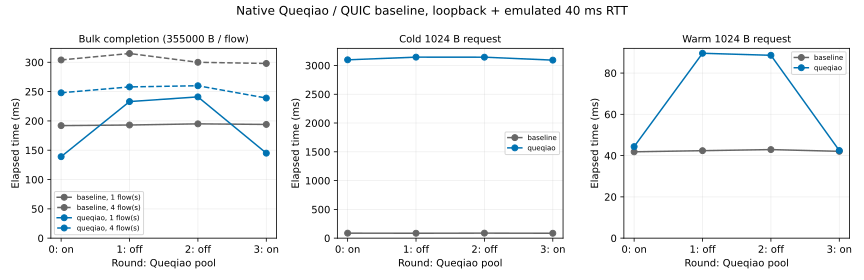

# 12-7：Queqiao 连接池单因素实跑

状态：**partial measurement**。实际运行固定版本 Queqiao 和原生 TUICTransport 基线，连接池开启时本轮 warm 小请求与单流传输较快；Queqiao cold 小请求仍约 3.1 秒。全部原件保留，不以慢样本为执行失败。这里只补新传输实验，没有重算 C70 的历史记录。



## 实际条件

本地 M2 Max、macOS 26.6.2 arm64；实际构建 Go 1.25.13。源自作者本地 Queqiao 仓库提交 `496ca6278e359c02b5107dfab77c6a3db585f80d`，读取时工作树干净，266 个 Go／模块／许可证文件逐字固定在 `source/`，清单为 `source-lock.json`。没有改动原生传输或计时实现；复制模块用 `-buildvcs=false`，故 raw.json 的 revision 不作为源提交证明，以 source-lock 与构建记录为准。模块版本与校验见原始 JSON、go.sum 和 runs/environment.json。

原生 loopback TCP/UDP socket，userspace pathsim 模拟 40 ms RTT、100 Mbit/s、500000 byte 队列、零配置丢包，seed 1207；每个内部 trial 使用 seed+1000。实际主机调度和计时误差仍在，并非物理 WAN、带宽隔离或实时系统。355000 byte 对象是原生生成字节流，不是语音录音，长度也不代表执行了 ASR。小请求为 1024 byte。

按事前 [协议](PROTOCOL.md) 执行 on/off/off/on 四轮，每轮固定 baseline 然后 queqiao，1 流和 4 流各一组，另有 cold/warm 请求各一对。仅改变 `--quic-pool`；baseline 不读取此开关。两者拥塞参数均为 bbr-tuic，baseline 实际为源码中的 TUICTransport，不是 HTTP 默认客户端，也不是全部调优协议的最优代表。每组重建模拟器和代理，bulk 先执行一次小请求预热；cold/warm 用新建的独立 harness。

## 全部结果

下表 bulk 是整组完成时间；4 流每流 355000 byte。原始 seconds 与 goodput 独立取三位小数，不能据舍入差异认定数据错误。

|轮次／池|基线 1 流 ms|Queqiao 1 流 ms|基线 4 流 ms|Queqiao 4 流 ms|基线 cold/warm ms|Queqiao cold/warm ms|
|---|---:|---:|---:|---:|---|---|
|0／on|192|139|304|248|86.856 / 41.847|3098.066 / 44.363|
|1／off|193|233|315|258|85.292 / 42.388|3144.407 / 89.590|
|2／off|195|241|300|260|87.256 / 42.918|3143.793 / 88.609|
|3／on|194|145|298|239|85.222 / 42.076|3092.650 / 42.466|

四次进程 exit 0，16 个 bulk cell 和 8 个 latency pair 全部 complete。bulk 共 40 个对象传输；complete 在原生 fetchTimed 中意味着读到预期字节数并且无错误，没有 payload hash 或语音质量验证。ABBA 缓解顺序漂移但只有两次/条件、同主机同 seed，不能据此作显著性或普遍优势结论。

原生 cold/warm 从调用 fetch 前到读完 1024 byte 计时，包括 SOCKS 和外层连接路径；不是 TTFT，更不是首段音频可播放。约 3 秒 cold 耗时未做内部归因，不能当作 RTT、链路损失或声音生成时间。关闭 pool 后 note 中 source 数量改变是原生记录，未把它直接当成连接数或机制因果证明。

## 复现与原件

在此独立目录运行（需要 Go，可由 GOTOOLCHAIN=auto 获取 go.mod 所需工具链及模块；不需要原 Queqiao 仓库、GPU、账号或外部服务器）：

```sh
python3 run.py
python3 analyze.py
python3 plot.py
```

`run.py` 要求 runs 不存在，避免覆盖正式原件；复现实验请复制本目录到新目录并移除副本的 runs。plot.py 需要 Matplotlib。构建二进制在四轮正常结束后移除，SHA 与完整 Go build info 留在 environment.json。程序自己的临时身份目录由 harness 关闭时清理，不保存凭据。

每轮 runs/* 包含 raw.json、execution.json、stdout.log、stderr.log；构建日志与空 stderr 也是最终成功执行的原件。analyze.py 检查全部源码 SHA、执行时序/退出、唯一变量、条件和样本数量、complete 与舍入吞吐关系。analysis.json 明确保留 first_playable_ms、audio_stall_count、cancel_latency_ms、voice_quality 为 null。绘图展示全部样本，不画不存在的分位数或误差条。

## 尚缺

真实语音端到端的首次可播放、连续播放停顿与主动取消；真实 WAN 的单因素条件和路径记录。当前记录不能完成这些要求，也不替代作者旧语音实验或 C70 统计。
